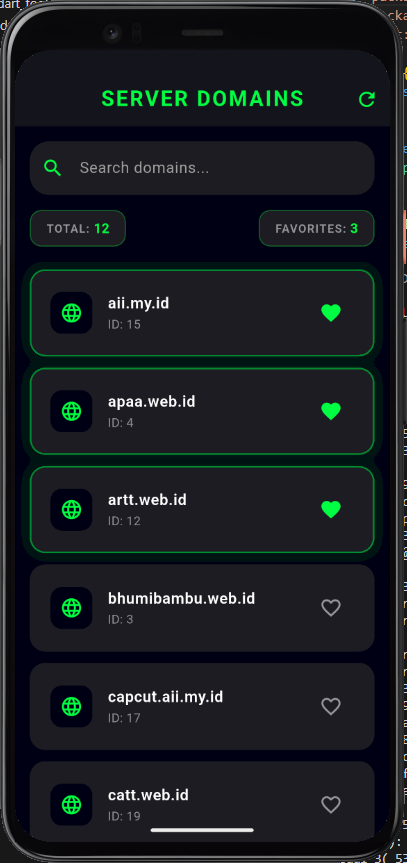

<div align="center">
    <br />
    <h1>LAPORAN PRAKTIKUM <br> APLIKASI BERBASIS PLATFORM </h1>
    <br />
    <h3>MODUL 5 & 6 <br> ANTARMUKA PENGGUNA & INTERAKSI PENGGUNA </h3>
    <br />
    
    <br />
    <br />
    <br />
    <h3>Disusun Oleh :</h3>
    <p>
        <strong>Willyan Hyuga Pratama</strong>
        <br>
        <strong>2211102129</strong>
        <br>
        <strong>S1 IF-11-REG05</strong>
    </p>
    <br />
    <h3>Dosen Pengampu :</h3>
    <p>
        <strong>Dedi Agung Prabowo, S.Kom., M.Kom</strong>
    </p>
    <br />
    <br />
    <h4>Asisten Praktikum :</h4>
    <strong>Apri Pandu Wicaksono </strong>
    <br>
    <strong>Hamka Zaenul Ardi</strong>
    <br />
    <h3>LABORATORIUM HIGH PERFORMANCE <br>FAKULTAS INFORMATIKA <br>UNIVERSITAS TELKOM PURWOKERTO <br>2026 </h3>
</div>
<hr>

## Dasar Teori

1. Pengembangan Antarmuka Pengguna (User Interface) ModernAntarmuka Pengguna (User Interface) berperan sebagai media interaksi visual yang menjembatani sistem perangkat lunak dengan pengguna (User Experience). Framework modern seperti Flutter mengadopsi pendekatan Declarative UI Architecture. Pada arsitektur deklaratif, tampilan visual aplikasi (view) merupakan fungsi langsung dari kondisi data saat itu (state). Flutter menggunakan prinsip dasar “Everything is a Widget”, di mana elemen tata letak (Column, Padding), elemen kontainer struktural (Container, Scaffold), hingga elemen fungsional (TextField, ListTile) disusun secara hierarkis membentuk struktur pohon komponen (Widget Tree).

2. Konsep State Management Lokal (StatefulWidget)State adalah data atau informasi yang dapat dibaca saat widget dibuat dan dapat berubah selama masa hidup (lifecycle) aplikasi berjalan.StatefulWidget: Digunakan ketika halaman memiliki elemen visual yang harus berubah secara dinamis merespons tindakan pengguna atau unduhan data latar belakang.Fungsi setState(): Merupakan metode inti dalam kelas State yang berfungsi untuk memberitahu framework bahwa ada perubahan data internal. Pemicuan setState() akan menjadwalkan ulang proses penggambaran ulang (rebuild) pada Widget Tree sehingga perubahan data langsung tecermin pada layar secara real-time (misalnya memperbarui status loading, memfilter teks, atau mengubah ikon favorit).

3. Pemrosesan Data Asinkronus & Integrasi HTTP APIAplikasi mobile modern sangat bergantung pada pertukaran data eksternal melalui internet menggunakan arsitektur REST API dan protokol HTTP. Karena operasi jaringan memiliki jeda waktu (network latency), komputasi harus dilakukan secara Asynchronous (menggunakan objek Future dan mekanisme async/await) agar proses pengambilan data tidak memblokir jalur utama antarmuka (UI thread/Main thread). Data yang diterima dari peladen (server) umumnya berformat JSON (JavaScript Object Notation), yang kemudian diurai (parsing) menggunakan pustaka bawaan dart:convert (fungsi json.decode) menjadi struktur data lokal (seperti List``<dynamic>`` atau Map) sebelum dipetakan ke dalam komponen visual.

4. Interaksi Pengguna Dinamis & Kontrol InputInteraksi pengguna (User Interaction) mencakup manipulasi masukan data dan respons balik dari sistem. Beberapa komponen utama dalam menangani interaksi dinamis meliputi:TextEditingController: Objek pengontrol yang berfungsi untuk membaca, memodifikasi, dan memantau setiap perubahan teks input secara langsung (real-time listener). Komponen ini sangat krusial dalam pembuatan fitur penyaringan data (live filtering).Collection/Set untuk Manajemen Aksi: Penggunaan struktur data Set sangat efisien untuk mengelola status interaksi unik (seperti ID Favorite), karena memiliki performa pencarian data ($O(1)$) yang optimal saat mendeteksi apakah suatu item telah dipilih atau belum.Umpan Balik Visual (Visual Feedback): Modifikasi properti dekoratif widget seperti perubahan warna pembatas (focusedBorder), penambahan bayangan visual (BoxShadow), serta penampilan indikator progres (CircularProgressIndicator) berfungsi memberikan kepastian kepada pengguna mengenai status operasi yang sedang berjalan di dalam sistem.

## Tugas Modul 5 & 6 

### 1. Source Code

```dart
/// Willyan Hyuga Pratama
import 'package:flutter/material.dart';
import 'package:http/http.dart' as http;
import 'dart:convert';

void main() {
  runApp(const MyApp());
}

class MyApp extends StatelessWidget {
  const MyApp({super.key});

  @override
  Widget build(BuildContext context) {
    return MaterialApp(
      title: 'Domain Search & Favorite',
      debugShowCheckedModeBanner: false,
      theme: ThemeData(
        brightness: Brightness.dark,
        scaffoldBackgroundColor: const Color(0xFF0D0D12), // Dark Background
        primaryColor: const Color(0xFF00FF41), // Neon Green
        appBarTheme: const AppBarTheme(
          backgroundColor: Color(0xFF15161E),
          elevation: 0,
        ),
        cardColor: const Color(0xFF1A1B23),
        useMaterial3: true,
      ),
      home: const DomainDashboard(),
    );
  }
}

class DomainDashboard extends StatefulWidget {
  const DomainDashboard({super.key});

  @override
  State<DomainDashboard> createState() => _DomainDashboardState();
}

class _DomainDashboardState extends State<DomainDashboard> {
  // State variables
  List<dynamic> _allDomains = [];
  List<dynamic> _filteredDomains = [];
  final Set<String> _favoriteIds = {};
  
  bool _isLoading = true;
  String _errorMessage = '';
  final TextEditingController _searchController = TextEditingController();

  @override
  void initState() {
    super.initState();
    _fetchDomains();
    // Add listener for realtime search filtering
    _searchController.addListener(_filterDomains);
  }

  @override
  void dispose() {
    _searchController.dispose();
    super.dispose();
  }

  // Method to fetch data from API
  Future<void> _fetchDomains() async {
    setState(() {
      _isLoading = true;
      _errorMessage = '';
    });

    try {
      final response = await http.get(Uri.parse('https://api.qemail.web.id/v1/email/domains'));
      
      if (response.statusCode == 200) {
        final data = json.decode(response.body);
        setState(() {
          // Adjust based on the actual API JSON structure
          if (data is List) {
            _allDomains = data;
          } else if (data['data'] != null) {
            _allDomains = data['data'];
          }
          _filteredDomains = _allDomains;
          _isLoading = false;
        });
      } else {
        setState(() {
          _errorMessage = 'Gagal memuat data (Status: ${response.statusCode})';
          _isLoading = false;
        });
      }
    } catch (e) {
      setState(() {
        _errorMessage = 'Terjadi kesalahan koneksi.\nPastikan Anda terhubung ke internet.';
        _isLoading = false;
      });
    }
  }
```

**Kode Lengkap:** [lib/main.dart](lib/main.dart)

### 2. Penjelasan

Proyek Flutter bernama Domain Search & Favorite ini merupakan aplikasi dasbor interaktif yang mengambil data nama domain dari API pihak ketiga untuk ditampilkan dalam tema gelap bernuansa cyberpunk neon green. Aplikasi ini mengimplementasikan fitur pencarian dinamis secara real-time menggunakan TextEditingController serta manajemen status lokal untuk menandai dan menghitung jumlah domain favorit pengguna.

### 3. Output

