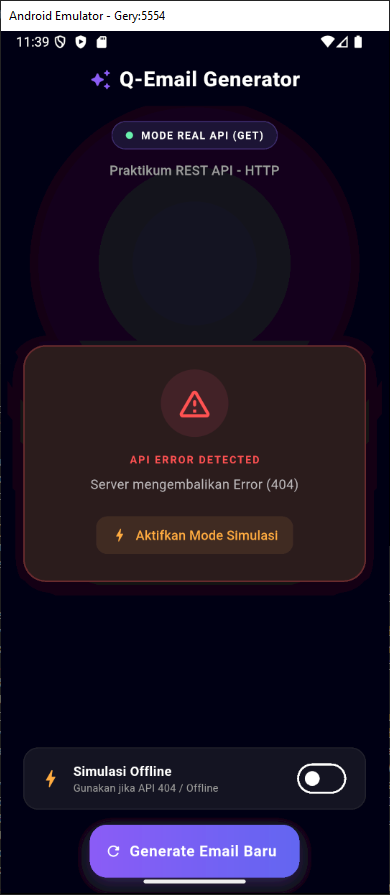
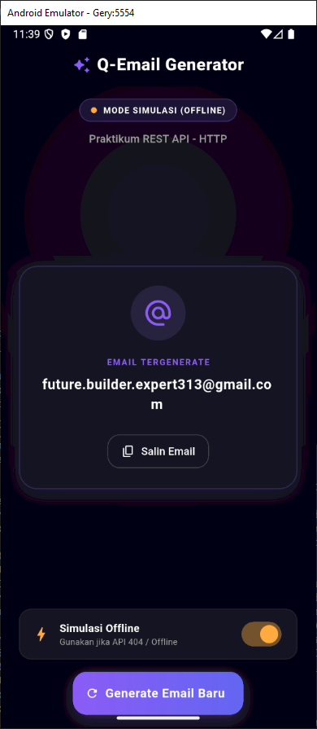

<div align="center">
    <br />
    <h1>LAPORAN PRAKTIKUM <br> APLIKASI BERBASIS PLATFORM </h1>
    <br />
    <h3>MODUL 5 & 6 <br> ANTARMUKA PENGGUNA & INTERAKSI PENGGUNA </h3>
    <br />
    
    <br />
    <br />
    <br />
    <h3>Disusun Oleh :</h3>
    <p>
        <strong>Geranada Saputra Priambudi</strong>
        <br>
        <strong>2311102008</strong>
        <br>
        <strong>S1 IF-11-REG05</strong>
    </p>
    <br />
    <h3>Dosen Pengampu :</h3>
    <p>
        <strong>Dedi Agung Prabowo, S.Kom., M.Kom</strong>
    </p>
    <br />
    <br />
    <h4>Asisten Praktikum :</h4>
    <strong>Apri Pandu Wicaksono </strong>
    <br>
    <strong>Hamka Zaenul Ardi</strong>
    <br />
    <h3>LABORATORIUM HIGH PERFORMANCE <br>FAKULTAS INFORMATIKA <br>UNIVERSITAS TELKOM PURWOKERTO <br>2026 </h3>
</div>
<hr>

## Dasar Teori

1. Konseptualisasi Antarmuka Pengguna (User Interface)
Antarmuka Pengguna atau User Interface (UI) merupakan komponen struktural sistem komputer yang berfungsi sebagai jembatan komunikasi visual antara pengguna (human) dengan sistem operasi atau aplikasi. Secara operasional, UI mencakup seluruh elemen mekanis dan estetis yang tampak pada layar, seperti tata letak (layout), tombol, ikon, tipografi, skema warna, hingga visualisasi transisi halaman. Fokus utama dari perancangan antarmuka ini terletak pada kejelasan visual (visual clarity) dan konsistensi desain, di mana setiap komponen harus disusun secara intuitif guna memastikan pengguna dapat mengenali fungsi dan navigasi sistem secara langsung tanpa melalui proses pembelajaran yang repetitif.

2. Dimensi Interaksi Pengguna (User Experience)
Di sisi lain, Interaksi Pengguna atau User Experience (UX) berfokus pada dimensi fungsional, behavioral, dan persepsi psikologis yang dirasakan oleh pengguna ketika mengoperasikan sistem tersebut. Aspek UX tidak sekadar menilai keindahan visual, melainkan mengukur tingkat kemudahan penggunaan (usability), efisiensi alur kerja (workflow), aksesibilitas, serta kepuasan emosional yang diperoleh selama interaksi berlangsung. Karakteristik perancangan interaksi yang ideal ditandai dengan minimalnya beban kognitif pengguna (cognitive load), adanya umpan balik (feedback) yang responsif terhadap setiap aksi, dan kemampuan sistem dalam memandu pengguna mencapai tujuannya dengan rute yang paling efektif.

3. Integrasi Desain Berpusat pada Manusia (Human-Centered Design)
Sinergi yang harmonis antara UI dan UX merupakan fondasi utama dalam implementasi metode Human-Centered Design (HCD) pada pengembangan produk digital. Komponen visual (UI) yang estetis tidak akan memberikan nilai retensi yang tinggi jika tidak didukung oleh arsitektur informasi dan logika sistem (UX) yang matang; begitu pula sebaliknya, sebuah algoritma sistem yang canggih akan kehilangan aksesibilitasnya jika disajikan dalam antarmuka yang membingungkan. Oleh karena itu, integrasi kedua disiplin ini menuntut pemahaman mendalam terhadap karakteristik, kebutuhan, konteks lingkungan, serta kebiasaan psikologis dari target pengguna agar sistem yang dibangun mampu beroperasi secara optimal dan relevan.

## Tugas Modul 5 & 6 - Email

### 1. Source Code

```dart
//Geranada Saputra Priambudi - 2311102008
import 'package:flutter/material.dart';
import 'package:flutter/services.dart';
import 'email_service.dart';

void main() {
  runApp(const MyApp());
}

class MyApp extends StatelessWidget {
  const MyApp({super.key});

  @override
  Widget build(BuildContext context) {
    return MaterialApp(
      title: 'Random Email Generator',
      debugShowCheckedModeBanner: false,
      // Konfigurasi Tema Dark Mode Modern Premium
      theme: ThemeData(
        brightness: Brightness.dark,
        scaffoldBackgroundColor: const Color(0xFF0C0C12), // Hitam Kebiruan Sangat Gelap
        colorScheme: const ColorScheme.dark(
          primary: Color(0xFF8B5CF6), // Ungu Violet Neon
          secondary: Color(0xFF6366F1), // Indigo Accent
          surface: Color(0xFF181824), // Slate Abu Gelap untuk Card
        ),
        useMaterial3: true,
      ),
      home: const EmailGeneratorScreen(),
    );
  }
}
```

**Kode Lengkap:** [lib/main.dart](lib/main.dart)

```dart
//Geranada Saputra Priambudi 2311102008
import 'dart:convert';
import 'package:http/http.dart' as http;

class EmailService {
  // Base URL endpoint sesuai ketentuan praktikum
  static const String _apiUrl = 'https://api.qemail.web.id/v1/email/random';

  /// Mengambil email acak dari API.
  /// Method: GET
  Future<String> fetchRandomEmail() async {
    final url = Uri.parse(_apiUrl);

    try {
      // Melakukan request GET ke API
      final response = await http.get(url);

      // Jika server mengembalikan response sukses (HTTP 200)
      if (response.statusCode == 200) {
        final Map<String, dynamic> data = json.decode(response.body);
        
        // Cek beberapa kemungkinan struktur JSON agar kode tidak mudah crash
        if (data.containsKey('email')) {
          return data['email'] as String;
        } else if (data.containsKey('data')) {
          final nestedData = data['data'];
          if (nestedData is Map && nestedData.containsKey('email')) {
            return nestedData['email'] as String;
          } else if (nestedData is String) {
            return nestedData;
          }
        }
```

**Kode Lengkap:** [lib/email_service.dart](lib/email_service.dart)

### 2. Penjelasan

Proyek Flutter ini merupakan aplikasi pembuat email acak (Random Email Generator) yang mengintegrasikan pengambilan data dari REST API secara real-time menggunakan package http. Aplikasi ini menampilkan hasil email ke antarmuka pengguna (User Interface) bertema gelap modern menggunakan widget FutureBuilder untuk menangani kondisi loading, error, dan penyalinan email secara responsif.

### 3. Output


