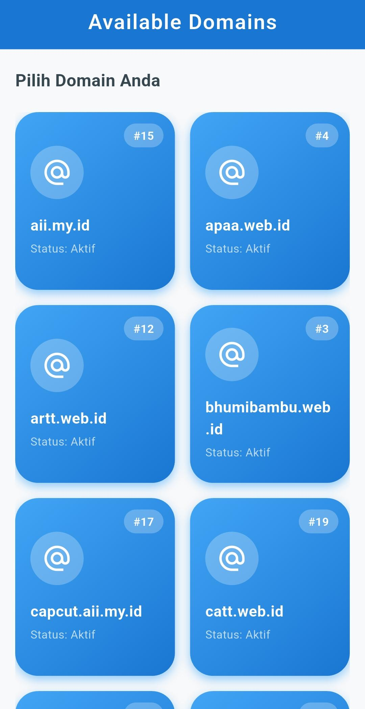

<div align="center">
  <br />
  <h1>LAPORAN PRAKTIKUM <br> APLIKASI BERBASIS PLATFORM </h1>
  <br />
  <h3>MODUL 5 & 6 <br> Flutter </h3>
  <br />
  
  <br />
  <br />
  <br />
  <h3>Disusun Oleh :</h3>
  <p>
    <strong>Rakha Yudhistira</strong>
    <br>
    <strong>2311102010</strong>
    <br>
    <strong>S1 IF-11-REG05</strong>
  </p>
  <br />
  <h3>Dosen Pengampu :</h3>
  <p>
    <strong>Dedi Agung Prabowo, S.Kom., M.Kom</strong>
  </p>
  <br />
  <br />
  <h4>Asisten Praktikum :</h4>
  <strong>Apri Pandu Wicaksono </strong>
  <br>
  <strong>Hamka Zaenul Ardi</strong>
  <br />
  <h3>LABORATORIUM HIGH PERFORMANCE <br>FAKULTAS INFORMATIKA <br>UNIVERSITAS TELKOM PURWOKERTO <br>2026 </h3>
</div>

<hr>


# Dasar Teori

<p align="justify">
API (Application Programming Interface) merupakan sebuah antarmuka yang digunakan untuk menghubungkan aplikasi dengan server sehingga aplikasi dapat mengambil maupun mengirim data melalui internet. Dalam pengembangan aplikasi mobile, API sering digunakan untuk menampilkan data secara dinamis dari database server. Data yang dikirim oleh API umumnya menggunakan format JSON (JavaScript Object Notation) karena lebih ringan dan mudah diproses oleh aplikasi.
</p>

# Task 3
## Source Code
```dart
import 'dart:convert';
import 'package:flutter/material.dart';
import 'package:http/http.dart' as http;

void main() {
  runApp(const DomainApp());
}

// Model Data
class DomainModel {
  final int id;
  final String name;

  DomainModel({
    required this.id,
    required this.name,
  });

  factory DomainModel.fromJson(Map<String, dynamic> json) {
    return DomainModel(
      id: json['id'],
      name: json['name'],
    );
  }
}

// Entry Point Aplikasi
class DomainApp extends StatelessWidget {
  const DomainApp({super.key});

  @override
  Widget build(BuildContext context) {
    return MaterialApp(
      debugShowCheckedModeBanner: false,
      title: 'Domain API',
      theme: ThemeData(
        primarySwatch: Colors.blue,
        fontFamily: 'Roboto',
      ),
      home: const HomePage(),
    );
  }
}

// Halaman Utama
class HomePage extends StatefulWidget {
  const HomePage({super.key});

  @override
  State<HomePage> createState() => _HomePageState();
}

class _HomePageState extends State<HomePage> {
  List<DomainModel> domainList = [];
  bool isLoading = true;
  String errorMessage = '';

  @override
  void initState() {
    super.initState();
    getDomains();
  }

  Future<void> getDomains() async {
    final url = Uri.parse('https://api.qemail.web.id/v1/email/domains');

    try {
      final response = await http.get(url);

      if (response.statusCode == 200) {
        final data = jsonDecode(response.body);

        setState(() {
          domainList = (data as List)
              .map((item) => DomainModel.fromJson(item))
              .toList();

          isLoading = false;
        });
      } else {
        setState(() {
          errorMessage = 'Gagal mengambil data (${response.statusCode})';
          isLoading = false;
        });
      }
    } catch (e) {
      setState(() {
        errorMessage = 'Terjadi kesalahan: $e';
        isLoading = false;
      });
    }
  }

  @override
  Widget build(BuildContext context) {
    return Scaffold(
      // Background putih keabu-abuan terang agar nyaman di mata
      backgroundColor: const Color(0xFFF8F9FA), 
      
      appBar: AppBar(
        title: const Text(
          "Available Domains",
          style: TextStyle(fontWeight: FontWeight.w600, letterSpacing: 1.0),
        ),
        centerTitle: true,
        backgroundColor: Colors.blue.shade700, // AppBar biru gelap
        foregroundColor: Colors.white,
        elevation: 0,
      ),
      
      body: isLoading
          ? Center(
              child: CircularProgressIndicator(color: Colors.blue.shade700),
            )
          : errorMessage.isNotEmpty
              ? Center(
                  child: Container(
                    padding: const EdgeInsets.all(20),
                    decoration: BoxDecoration(
                      color: Colors.red.shade50,
                      borderRadius: BorderRadius.circular(15),
                    ),
                    child: Text(
                      errorMessage,
                      style: TextStyle(color: Colors.red.shade700, fontSize: 16),
                      textAlign: TextAlign.center,
                    ),
                  ),
                )
              : Padding(
                  padding: const EdgeInsets.symmetric(horizontal: 16.0, vertical: 20.0),
                  child: Column(
                    crossAxisAlignment: CrossAxisAlignment.start,
                    children: [
                      Text(
                        "Pilih Domain Anda",
                        style: TextStyle(
                          color: Colors.blueGrey.shade800, // Teks gelap untuk background putih
                          fontSize: 18,
                          fontWeight: FontWeight.bold,
                        ),
                      ),
                      const SizedBox(height: 20),
                      Expanded(
                        child: GridView.builder(
                          gridDelegate: const SliverGridDelegateWithFixedCrossAxisCount(
                            crossAxisCount: 2, // 2 Kolom
                            crossAxisSpacing: 16,
                            mainAxisSpacing: 16,
                            childAspectRatio: 0.9,
                          ),
                          itemCount: domainList.length,
                          itemBuilder: (context, index) {
                            final domain = domainList[index];
                            return _buildDomainCard(domain);
                          },
                        ),
                      ),
                    ],
                  ),
                ),
    );
  }

  // Widget Card dengan Tema Biru
  Widget _buildDomainCard(DomainModel domain) {
    return Container(
      decoration: BoxDecoration(
        borderRadius: BorderRadius.circular(24),
        // Gradient Biru yang segar
        gradient: LinearGradient(
          colors: [Colors.blue.shade400, Colors.blue.shade700],
          begin: Alignment.topLeft,
          end: Alignment.bottomRight,
        ),
        boxShadow: [
          BoxShadow(
            color: Colors.blue.shade200,
            blurRadius: 8,
            offset: const Offset(0, 4),
          ),
        ],
      ),
      child: Stack(
        children: [
          // Badge ID di pojok kanan atas
          Positioned(
            top: 12,
            right: 12,
            child: Container(
              padding: const EdgeInsets.symmetric(horizontal: 10, vertical: 4),
              decoration: BoxDecoration(
                color: Colors.white.withOpacity(0.25),
                borderRadius: BorderRadius.circular(20),
              ),
              child: Text(
                "#${domain.id}",
                style: const TextStyle(
                  color: Colors.white,
                  fontWeight: FontWeight.bold,
                  fontSize: 12,
                ),
              ),
            ),
          ),
          
          // Konten Utama Card
          Padding(
            padding: const EdgeInsets.all(16.0),
            child: Column(
              mainAxisAlignment: MainAxisAlignment.center,
              crossAxisAlignment: CrossAxisAlignment.start,
              children: [
                const Spacer(),
                Container(
                  padding: const EdgeInsets.all(12),
                  decoration: BoxDecoration(
                    color: Colors.white.withOpacity(0.25),
                    shape: BoxShape.circle,
                  ),
                  child: const Icon(
                    Icons.alternate_email,
                    color: Colors.white,
                    size: 32,
                  ),
                ),
                const SizedBox(height: 16),
                Text(
                  domain.name,
                  style: const TextStyle(
                    color: Colors.white,
                    fontWeight: FontWeight.bold,
                    fontSize: 16,
                  ),
                  maxLines: 2,
                  overflow: TextOverflow.ellipsis,
                ),
                const SizedBox(height: 4),
                const Text(
                  "Status: Aktif",
                  style: TextStyle(
                    color: Colors.white70,
                    fontSize: 12,
                  ),
                ),
                const Spacer(),
              ],
            ),
          ),
        ],
      ),
    );
  }
}
```


# Screenshots Output


# Penjelasan
<p align="justify">
Program di atas merupakan aplikasi Flutter sederhana yang digunakan untuk menampilkan data domain email dari API menggunakan library HTTP. Aplikasi melakukan request data ke endpoint Endpoint Domains, kemudian response berformat JSON diubah menjadi object DomainModel yang berisi id dan name. Data tersebut disimpan ke dalam list lalu ditampilkan pada halaman utama menggunakan GridView.builder dalam bentuk card dengan desain bertema biru. Selain itu, program juga menerapkan fitur loading menggunakan CircularProgressIndicator saat proses pengambilan data berlangsung dan menampilkan pesan error apabila terjadi kegagalan saat fetch API.
</p>