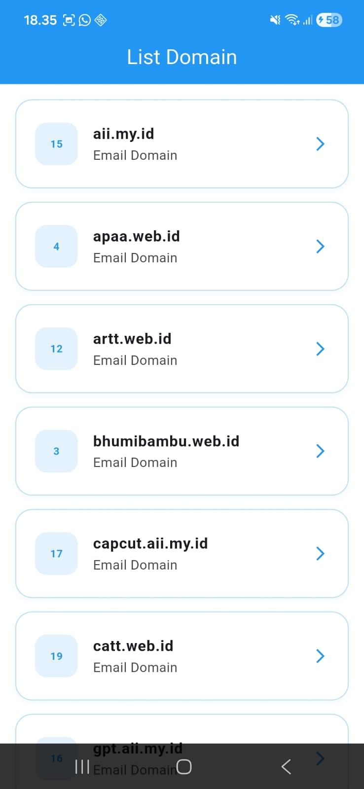

<div align="center">
  <br />
  <h1>LAPORAN PRAKTIKUM <br> APLIKASI BERBASIS PLATFORM </h1>
  <br />
  <h3>MODUL 5 & 6 <br> Flutter </h3>
  <br />
  
  <br />
  <br />
  <br />
  <h3>Disusun Oleh :</h3>
  <p>
    <strong>Wisnu Rananta Raditya Putra</strong>
    <br>
    <strong>2311102013</strong>
    <br>
    <strong>S1 IF-11-REG05</strong>
  </p>
  <br />
  <h3>Dosen Pengampu :</h3>
  <p>
    <strong>Dedi Agung Prabowo, S.Kom., M.Kom</strong>
  </p>
  <br />
  <br />
  <h4>Asisten Praktikum :</h4>
  <strong>Apri Pandu Wicaksono </strong>
  <br>
  <strong>Hamka Zaenul Ardi</strong>
  <br />
  <h3>LABORATORIUM HIGH PERFORMANCE <br>FAKULTAS INFORMATIKA <br>UNIVERSITAS TELKOM PURWOKERTO <br>2026 </h3>
</div>

<hr>


# Dasar Teori

<p align="justify">
Application Programming Interface (API) merupakan sekumpulan aturan dan protokol yang digunakan agar aplikasi dapat saling berkomunikasi dan bertukar data melalui internet. Dengan adanya API, aplikasi dapat mengambil data dari server tanpa harus menyimpan seluruh data secara manual di dalam aplikasi. Pada tugas ini, API digunakan untuk mengambil data domain email yang nantinya akan ditampilkan pada aplikasi Flutter. Proses pengambilan data dilakukan menggunakan library <code>http</code> yang berfungsi untuk melakukan request ke server menggunakan method HTTP GET. Setelah request berhasil dilakukan, server akan memberikan response berupa data dengan format JSON (JavaScript Object Notation). JSON merupakan format pertukaran data yang ringan, terstruktur, dan mudah dipahami baik oleh manusia maupun sistem, sehingga sering digunakan dalam pengembangan aplikasi berbasis web maupun mobile. Flutter sebagai framework pengembangan aplikasi berbasis bahasa Dart menyediakan berbagai widget seperti <code>Column</code>, <code>Row</code>, dan <code>ListView</code> yang dapat digunakan untuk menampilkan data hasil fetch API ke dalam antarmuka aplikasi. Dengan memanfaatkan API dan library <code>http</code>, aplikasi dapat menampilkan informasi secara dinamis, lebih efisien, dan terhubung langsung dengan data dari server.
</p>

# Task 3 - Mobile Flutter
## Source Code main.dart
```dart
<!-- 2311102013
Wisnu Rananta Raditya Putra
S1IF-11-05 -->
import 'dart:convert';
import 'package:flutter/material.dart';
import 'package:http/http.dart' as http;

void main() {
  runApp(const DomainApp());
}

class DomainModel {
  final int id;
  final String name;

  DomainModel({
    required this.id,
    required this.name,
  });

  factory DomainModel.fromJson(Map<String, dynamic> json) {
    return DomainModel(
      id: json['id'],
      name: json['name'],
    );
  }
}

class DomainApp extends StatelessWidget {
  const DomainApp({super.key});

  @override
  Widget build(BuildContext context) {
    return MaterialApp(
      debugShowCheckedModeBanner: false,
      title: 'Domain API',
      theme: ThemeData(
        primarySwatch: Colors.blue,
      ),
      home: const HomePage(),
    );
  }
}

class HomePage extends StatefulWidget {
  const HomePage({super.key});

  @override
  State<HomePage> createState() => _HomePageState();
}

class _HomePageState extends State<HomePage> {
  List<DomainModel> domainList = [];
  bool isLoading = true;
  String errorMessage = '';

  @override
  void initState() {
    super.initState();
    getDomains();
  }

  Future<void> getDomains() async {
    final url = Uri.parse('https://api.qemail.web.id/v1/email/domains');

    try {
      final response = await http.get(url);

      if (response.statusCode == 200) {
        final data = jsonDecode(response.body);

        setState(() {
          domainList = (data as List)
              .map((item) => DomainModel.fromJson(item))
              .toList();

          isLoading = false;
        });
      } else {
        setState(() {
          errorMessage = 'Gagal mengambil data (${response.statusCode})';
          isLoading = false;
        });
      }
    } catch (e) {
      setState(() {
        errorMessage = e.toString();
        isLoading = false;
      });
    }
  }

  @override
  Widget build(BuildContext context) {
    return Scaffold(
      backgroundColor: Colors.white, // Background tetap putih

      appBar: AppBar(
        title: const Text("List Domain"),
        centerTitle: true,
        backgroundColor: Colors.blue, // AppBar Biru
        foregroundColor: Colors.white,
      ),

      body: isLoading
          ? const Center(
              child: CircularProgressIndicator(color: Colors.blue),
            )
          : errorMessage.isNotEmpty
              ? Center(
                  child: Text(
                    errorMessage,
                    style: const TextStyle(fontSize: 16),
                  ),
                )
              : ListView.builder(
                  padding: const EdgeInsets.all(16),
                  itemCount: domainList.length,
                  itemBuilder: (context, index) {
                    final domain = domainList[index];

                    return Container(
                      margin: const EdgeInsets.only(bottom: 14),
                      decoration: BoxDecoration(
                        color: Colors.white,
                        borderRadius: BorderRadius.circular(18),
                        border: Border.all(color: Colors.blue.shade100), // Border agar tidak menyatu dengan background
                        boxShadow: [
                          BoxShadow(
                            color: Colors.blue.withOpacity(0.05),
                            blurRadius: 6,
                            offset: const Offset(0, 3),
                          ),
                        ],
                      ),
                      child: ListTile(
                        contentPadding: const EdgeInsets.symmetric(
                          horizontal: 20,
                          vertical: 10,
                        ),
                        leading: Container(
                          width: 45,
                          height: 45,
                          decoration: BoxDecoration(
                            color: Colors.blue.shade50, // Biru sangat muda untuk kotak ID
                            borderRadius: BorderRadius.circular(12),
                          ),
                          child: Center(
                            child: Text(
                              domain.id.toString(),
                              style: const TextStyle(
                                fontWeight: FontWeight.bold,
                                color: Colors.blue, // Teks ID Biru
                              ),
                            ),
                          ),
                        ),
                        title: Text(
                          domain.name,
                          style: const TextStyle(
                            fontWeight: FontWeight.bold,
                            fontSize: 16,
                          ),
                        ),
                        subtitle: const Text(
                          "Email Domain",
                        ),
                        trailing: const Icon(
                          Icons.arrow_forward_ios,
                          size: 18,
                          color: Colors.blue, // Ikon panah Biru
                        ),
                      ),
                    );
                  },
                ),
    );
  }
}
```


# Screenshots Output


# Penjelasan
<p align="justify">
Kode di atas merupakan aplikasi Flutter sederhana yang digunakan untuk mengambil dan menampilkan data domain email dari API <code>https://api.qemail.web.id/v1/email/domains</code> menggunakan library <code>http</code>. Program melakukan request HTTP GET untuk mengambil data dalam format JSON, kemudian data diubah menjadi object Dart menggunakan <code>jsonDecode()</code> dan class <code>DomainModel</code> yang berisi <code>id</code> dan <code>name</code>. Widget <code>StatefulWidget</code> digunakan agar tampilan dapat diperbarui setelah data berhasil diambil dari API. Pada method <code>initState()</code>, fungsi <code>getDomains()</code> dipanggil untuk melakukan fetch data, lalu hasilnya disimpan ke dalam <code>domainList</code>. Tampilan aplikasi dibuat menggunakan <code>Scaffold</code>, <code>AppBar</code>, dan <code>ListView.builder</code> untuk menampilkan daftar domain secara dinamis. Setiap data ditampilkan menggunakan <code>ListTile</code> yang menampilkan ID dan nama domain, serta dilengkapi loading indicator dan penanganan error agar aplikasi lebih interaktif dan responsif.
</p>
