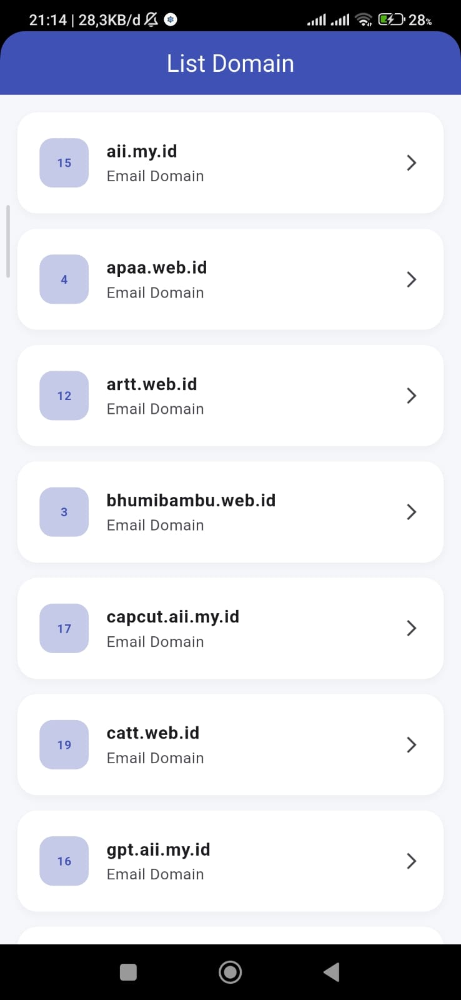

<div align="center">
  <br />
  <h1>LAPORAN PRAKTIKUM <br> APLIKASI BERBASIS PLATFORM </h1>
  <br />
  <h3>MODUL 5-6 <br> FLUTTER </h3>
  <br />
  
  <br />
  <br />
  <br />
  <h3>Disusun Oleh :</h3>
  <p>
    <strong>Fattah Rizqy Adhipratama</strong>
    <br>
    <strong>2311102019</strong>
    <br>
    <strong>S1 IF-11-REG05</strong>
  </p>
  <br />
  <h3>Dosen Pengampu :</h3>
  <p>
    <strong>Dedi Agung Prabowo, S.Kom., M.Kom</strong>
  </p>
  <br />
  <br />
  <h4>Asisten Praktikum :</h4>
  <strong>Apri Pandu Wicaksono </strong>
  <br>
  <strong>Hamka Zaenul Ardi</strong>
  <br />
  <h3>LABORATORIUM HIGH PERFORMANCE <br>FAKULTAS INFORMATIKA <br>UNIVERSITAS TELKOM PURWOKERTO <br>2026 </h3>
</div>

<hr>


# Dasar Teori

<p align="justify">
Aplikasi dikembangkan menggunakan framework Flutter untuk menampilkan data hasil pengambilan API dari internet. Flutter merupakan framework open-source yang dikembangkan oleh Google dan digunakan untuk membangun aplikasi mobile berbasis Android maupun iOS dengan satu basis kode (single codebase). Pada implementasinya, Flutter menggunakan bahasa pemrograman Dart dan menyediakan berbagai widget yang memudahkan pengembangan antarmuka aplikasi. Pada praktikum ini, tampilan data dibuat sederhana menggunakan widget seperti Column atau Row untuk menampilkan informasi berupa id dan name yang diperoleh dari API.
</p>


# Tugas 5,6 - Flutter
## 1. Source Code main.dart
```
<!-- 2311102019
Fattah Rizqy Adhipratama
S1IF-11-05 -->
import 'dart:convert';
import 'package:flutter/material.dart';
import 'package:http/http.dart' as http;

void main() {
  runApp(const DomainApp());
}

class DomainModel {
  final int id;
  final String name;

  DomainModel({
    required this.id,
    required this.name,
  });

  factory DomainModel.fromJson(Map<String, dynamic> json) {
    return DomainModel(
      id: json['id'],
      name: json['name'],
    );
  }
}

class DomainApp extends StatelessWidget {
  const DomainApp({super.key});

  @override
  Widget build(BuildContext context) {
    return MaterialApp(
      debugShowCheckedModeBanner: false,
      title: 'Domain API',
      theme: ThemeData(
        primarySwatch: Colors.indigo,
      ),
      home: const HomePage(),
    );
  }
}

class HomePage extends StatefulWidget {
  const HomePage({super.key});

  @override
  State<HomePage> createState() => _HomePageState();
}

class _HomePageState extends State<HomePage> {
  List<DomainModel> domainList = [];
  bool isLoading = true;
  String errorMessage = '';

  @override
  void initState() {
    super.initState();
    getDomains();
  }

  Future<void> getDomains() async {
  final url =
      Uri.parse('https://api.qemail.web.id/v1/email/domains');

  try {
    final response = await http.get(url);

    if (response.statusCode == 200) {
      final data = jsonDecode(response.body);

      setState(() {
        domainList = (data as List)
            .map((item) => DomainModel.fromJson(item))
            .toList();

        isLoading = false;
      });
    } else {
      setState(() {
        errorMessage =
            'Gagal mengambil data (${response.statusCode})';
        isLoading = false;
      });
    }
  } catch (e) {
    setState(() {
      errorMessage = e.toString();
      isLoading = false;
    });
  }
  }

  @override
  Widget build(BuildContext context) {
    return Scaffold(
      backgroundColor: const Color(0xffF5F7FB),

      appBar: AppBar(
        title: const Text("List Domain"),
        centerTitle: true,
        backgroundColor: Colors.indigo,
        foregroundColor: Colors.white,
      ),

      body: isLoading
          ? const Center(
              child: CircularProgressIndicator(),
            )

          : errorMessage.isNotEmpty
              ? Center(
                  child: Text(
                    errorMessage,
                    style: const TextStyle(fontSize: 16),
                  ),
                )

              : ListView.builder(
                  padding: const EdgeInsets.all(16),
                  itemCount: domainList.length,
                  itemBuilder: (context, index) {
                    final domain = domainList[index];

                    return Container(
                      margin: const EdgeInsets.only(bottom: 14),

                      decoration: BoxDecoration(
                        color: Colors.white,
                        borderRadius: BorderRadius.circular(18),
                        boxShadow: [
                          BoxShadow(
                            color: Colors.grey.withOpacity(0.1),
                            blurRadius: 6,
                            offset: const Offset(0, 3),
                          ),
                        ],
                      ),

                      child: ListTile(
                        contentPadding:
                            const EdgeInsets.symmetric(
                          horizontal: 20,
                          vertical: 10,
                        ),

                        leading: Container(
                          width: 45,
                          height: 45,

                          decoration: BoxDecoration(
                            color: Colors.indigo.shade100,
                            borderRadius:
                                BorderRadius.circular(12),
                          ),

                          child: Center(
                            child: Text(
                              domain.id.toString(),
                              style: const TextStyle(
                                fontWeight: FontWeight.bold,
                                color: Colors.indigo,
                              ),
                            ),
                          ),
                        ),

                        title: Text(
                          domain.name,
                          style: const TextStyle(
                            fontWeight: FontWeight.bold,
                            fontSize: 16,
                          ),
                        ),

                        subtitle: const Text(
                          "Email Domain",
                        ),

                        trailing: const Icon(
                          Icons.arrow_forward_ios,
                          size: 18,
                        ),
                      ),
                    );
                  },
                ),
    );
  }
}
```

# Output


# Penjelasan
<p align="justify">
Program Flutter tersebut digunakan untuk mengambil dan menampilkan data domain email dari API https://api.qemail.web.id/v1/email/domains menggunakan library http. Program diawali dengan pembuatan model DomainModel yang berfungsi untuk menyimpan data id dan name dari response API. Pada bagian HomePage, aplikasi melakukan proses fetch data menggunakan method GET di dalam fungsi getDomains(), kemudian data JSON yang diterima diubah menjadi list object dan disimpan ke dalam variabel domainList. Selanjutnya data ditampilkan menggunakan widget ListView.builder dalam bentuk card yang berisi ID dan nama domain. Program juga menerapkan kondisi loading menggunakan CircularProgressIndicator saat data sedang diambil, serta menampilkan pesan error apabila terjadi kegagalan koneksi atau masalah saat mengambil data dari server. Tampilan aplikasi dibuat sederhana dengan kombinasi warna biru dan putih agar terlihat rapi dan mudah digunakan.
</p>