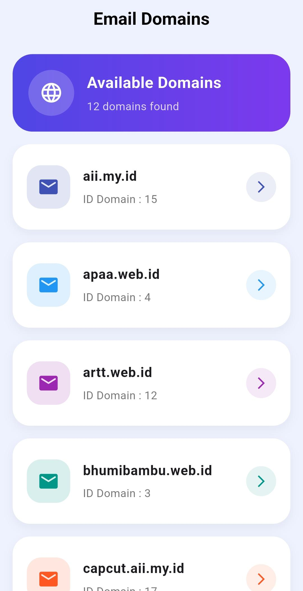

<div align="center">
  <br />
  <h1>LAPORAN PRAKTIKUM <br> APLIKASI BERBASIS PLATFORM </h1>
  <br />
  <h3>MODUL 5 & 6 <br> Flutter </h3>
  <br />
  
  <br />
  <br />
  <br />
  <h3>Disusun Oleh :</h3>
  <p>
    <strong>Tegar Aji Pangestu</strong>
    <br>
    <strong>2311102021</strong>
    <br>
    <strong>S1 IF-11-REG05</strong>
  </p>
  <br />
  <h3>Dosen Pengampu :</h3>
  <p>
    <strong>Dedi Agung Prabowo, S.Kom., M.Kom</strong>
  </p>
  <br />
  <br />
  <h4>Asisten Praktikum :</h4>
  <strong>Apri Pandu Wicaksono </strong>
  <br>
  <strong>Hamka Zaenul Ardi</strong>
  <br />
  <h3>LABORATORIUM HIGH PERFORMANCE <br>FAKULTAS INFORMATIKA <br>UNIVERSITAS TELKOM PURWOKERTO <br>2026 </h3>
</div>

<hr>


# Dasar Teori

<p align="justify">
Flutter merupakan framework open-source yang dikembangkan oleh Google Flutter untuk membangun aplikasi mobile menggunakan bahasa pemrograman Dart. Flutter menyediakan berbagai widget seperti Column dan Row untuk menyusun tampilan antarmuka aplikasi secara fleksibel. Dalam pengembangan aplikasi modern, API (Application Programming Interface) digunakan sebagai media pertukaran data antara aplikasi dan server melalui internet. Pada praktikum ini proses pengambilan data dilakukan menggunakan metode HTTP GET dengan bantuan library http package Flutter untuk melakukan fetch API dari QEmail API Documentation menggunakan endpoint Domains Endpoint. Data yang diterima dari server berupa format JSON berisi id dan name kemudian diubah menjadi object model pada Flutter agar dapat ditampilkan pada aplikasi secara dinamis dan real-time.
</p>

## Source Code 
```dart
import 'dart:convert';
import 'package:flutter/material.dart';
import 'package:http/http.dart' as http;

void main() {
  runApp(const DomainApp());
}

// MODEL
class DomainModel {
  final int id;
  final String name;

  DomainModel({
    required this.id,
    required this.name,
  });

  factory DomainModel.fromJson(Map<String, dynamic> json) {
    return DomainModel(
      id: json['id'],
      name: json['name'],
    );
  }
}

class DomainApp extends StatelessWidget {
  const DomainApp({super.key});

  @override
  Widget build(BuildContext context) {
    return MaterialApp(
      debugShowCheckedModeBanner: false,
      title: 'Domain API',
      theme: ThemeData(
        fontFamily: 'Poppins',
        scaffoldBackgroundColor: const Color(0xffEEF2FF),
      ),
      home: const HomePage(),
    );
  }
}

class HomePage extends StatefulWidget {
  const HomePage({super.key});

  @override
  State<HomePage> createState() => _HomePageState();
}

class _HomePageState extends State<HomePage> {
  List<DomainModel> domainList = [];
  bool isLoading = true;
  String errorMessage = '';

  @override
  void initState() {
    super.initState();
    getDomains();
  }

  Future<void> getDomains() async {
    final url =
        Uri.parse('https://api.qemail.web.id/v1/email/domains');

    try {
      final response = await http.get(url);

      if (response.statusCode == 200) {
        final data = jsonDecode(response.body);

        setState(() {
          domainList = (data as List)
              .map((item) => DomainModel.fromJson(item))
              .toList();

          isLoading = false;
        });
      } else {
        setState(() {
          errorMessage =
              'Gagal mengambil data (${response.statusCode})';
          isLoading = false;
        });
      }
    } catch (e) {
      setState(() {
        errorMessage = e.toString();
        isLoading = false;
      });
    }
  }

  Color randomColor(int index) {
    List<Color> colors = [
      Colors.indigo,
      Colors.blue,
      Colors.purple,
      Colors.teal,
      Colors.deepOrange,
    ];

    return colors[index % colors.length];
  }

  @override
  Widget build(BuildContext context) {
    return Scaffold(
      appBar: AppBar(
        elevation: 0,
        backgroundColor: Colors.transparent,
        title: const Text(
          "Email Domains",
          style: TextStyle(
            color: Colors.black,
            fontWeight: FontWeight.bold,
          ),
        ),
        centerTitle: true,
      ),

      body: isLoading
          ? const Center(
              child: CircularProgressIndicator(),
            )

          : errorMessage.isNotEmpty
              ? Center(
                  child: Text(
                    errorMessage,
                    style: const TextStyle(fontSize: 16),
                  ),
                )

              : Column(
                  children: [
                    // HEADER
                    Container(
                      margin: const EdgeInsets.all(16),
                      padding: const EdgeInsets.all(20),
                      decoration: BoxDecoration(
                        gradient: const LinearGradient(
                          colors: [
                            Color(0xff4F46E5),
                            Color(0xff7C3AED),
                          ],
                        ),
                        borderRadius: BorderRadius.circular(25),
                      ),

                      child: Row(
                        children: [
                          Container(
                            padding: const EdgeInsets.all(14),
                            decoration: BoxDecoration(
                              color: Colors.white.withOpacity(0.2),
                              shape: BoxShape.circle,
                            ),
                            child: const Icon(
                              Icons.language,
                              color: Colors.white,
                              size: 30,
                            ),
                          ),

                          const SizedBox(width: 16),

                          Expanded(
                            child: Column(
                              crossAxisAlignment:
                                  CrossAxisAlignment.start,
                              children: [
                                const Text(
                                  "Available Domains",
                                  style: TextStyle(
                                    color: Colors.white,
                                    fontSize: 20,
                                    fontWeight: FontWeight.bold,
                                  ),
                                ),

                                const SizedBox(height: 5),

                                Text(
                                  "${domainList.length} domains found",
                                  style: TextStyle(
                                    color: Colors.white
                                        .withOpacity(0.8),
                                  ),
                                ),
                              ],
                            ),
                          ),
                        ],
                      ),
                    ),

                    // LIST
                    Expanded(
                      child: ListView.builder(
                        padding:
                            const EdgeInsets.symmetric(
                          horizontal: 16,
                        ),
                        itemCount: domainList.length,

                        itemBuilder: (context, index) {
                          final domain = domainList[index];
                          final color = randomColor(index);

                          return Container(
                            margin:
                                const EdgeInsets.only(bottom: 16),

                            decoration: BoxDecoration(
                              color: Colors.white,
                              borderRadius:
                                  BorderRadius.circular(22),
                              boxShadow: [
                                BoxShadow(
                                  color:
                                      Colors.black.withOpacity(0.05),
                                  blurRadius: 10,
                                  offset: const Offset(0, 5),
                                ),
                              ],
                            ),

                            child: ListTile(
                              contentPadding:
                                  const EdgeInsets.all(18),

                              leading: Container(
                                width: 55,
                                height: 55,

                                decoration: BoxDecoration(
                                  color:
                                      color.withOpacity(0.15),
                                  borderRadius:
                                      BorderRadius.circular(18),
                                ),

                                child: Icon(
                                  Icons.email_rounded,
                                  color: color,
                                  size: 28,
                                ),
                              ),

                              title: Text(
                                domain.name,
                                style: const TextStyle(
                                  fontSize: 17,
                                  fontWeight: FontWeight.bold,
                                ),
                              ),

                              subtitle: Padding(
                                padding:
                                    const EdgeInsets.only(
                                  top: 6,
                                ),
                                child: Text(
                                  "ID Domain : ${domain.id}",
                                  style: TextStyle(
                                    color: Colors.grey[600],
                                  ),
                                ),
                              ),

                              trailing: Container(
                                padding:
                                    const EdgeInsets.all(10),
                                decoration: BoxDecoration(
                                  color:
                                      color.withOpacity(0.1),
                                  shape: BoxShape.circle,
                                ),
                                child: Icon(
                                  Icons.arrow_forward_ios,
                                  color: color,
                                  size: 18,
                                ),
                              ),
                            ),
                          );
                        },
                      ),
                    ),
                  ],
                ),
    );
  }
}
```


# Screenshots Output


# Penjelasan
<p align="justify">
Program Flutter tersebut digunakan untuk menampilkan daftar domain email dari API QEmail API menggunakan library http package Flutter. Data diambil dengan metode HTTP GET kemudian diubah dari format JSON menjadi object DomainModel yang berisi id dan name. Setelah data berhasil diambil, aplikasi menampilkan daftar domain menggunakan ListView.builder dengan desain card modern, sedangkan jika proses masih berjalan akan muncul CircularProgressIndicator dan jika terjadi kesalahan akan menampilkan pesan error pada layar.
</p>