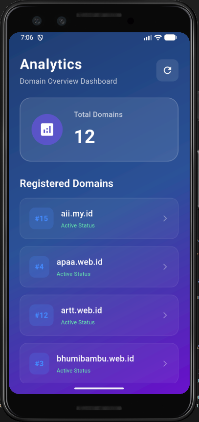

<div align="center">
    <br />
    <h1>LAPORAN PRAKTIKUM <br> APLIKASI BERBASIS PLATFORM </h1>
    <br />
    <h3>MODUL 5 & 6 <br> ANTARMUKA PENGGUNA & INTERAKSI PENGGUNA </h3>
    <br />
    
    <br />
    <br />
    <br />
    <h3>Disusun Oleh :</h3>
    <p>
        <strong>Reza Alvonzo</strong>
        <br>
        <strong>2311102026</strong>
        <br>
        <strong>S1 IF-11-REG05</strong>
    </p>
    <br />
    <h3>Dosen Pengampu :</h3>
    <p>
        <strong>Dedi Agung Prabowo, S.Kom., M.Kom</strong>
    </p>
    <br />
    <br />
    <h4>Asisten Praktikum :</h4>
    <strong>Apri Pandu Wicaksono </strong>
    <br>
    <strong>Hamka Zaenul Ardi</strong>
    <br />
    <h3>LABORATORIUM HIGH PERFORMANCE <br>FAKULTAS INFORMATIKA <br>UNIVERSITAS TELKOM PURWOKERTO <br>2026 </h3>
</div>
<hr>

## Dasar Teori

1. Antarmuka Pengguna (User Interface - UI) di Flutter
Di dalam framework Flutter, antarmuka pengguna dibangun berdasarkan satu prinsip utama: "Everything is a Widget" (Semua hal adalah widget). UI pada Flutter tidak menggunakan komponen bawaan dari sistem operasi (seperti Button bawaan Android atau iOS), melainkan menggambar setiap pikselnya sendiri menggunakan mesin render grafis berkinerja tinggi.

Komponen Utama Arsitektur UI Flutter:
Widget Tree (Pohon Widget): UI dibentuk melalui hierarki visual yang saling bersarang (nesting). Widget induk (parent) akan mengatur susunan, ukuran, dan posisi dari widget anak (child atau children).

Widget Struktural & Tata Letak: Flutter menyediakan widget khusus untuk mengatur tata letak seperti Row (horizontal), Column (vertikal), Stack (elemen yang menumpuk), dan Container (kotak dekoratif dengan margin dan padding).

Widget Visual & Konten: Komponen yang langsung berinteraksi dengan indra penglihatan pengguna, seperti Text, Image, Icon, serta elemen input seperti TextField.

Desain Sistem Berstandar Tinggi: Flutter menyediakan pustaka siap pakai yang matang, yaitu Material Design (gaya desain khas Google/Android) dan Cupertino (gaya desain khas iOS).

2. Interaksi Pengguna (User Interaction) di Flutter
Interaksi Pengguna dalam Flutter adalah proses bagaimana aplikasi mendeteksi, merespons, dan mengomunikasikan perubahan balik kepada pengguna setelah mereka melakukan aksi fisik di layar (seperti menyentuh, menggeser, atau mengetik).

Mekanisme Pendeteksian Aksi:
Untuk menangkap interaksi fisik dari jari pengguna, Flutter mengandalkan widget detektor khusus yang membungkus komponen visual:

GestureDetector: Widget non-visual yang sangat kuat untuk mendeteksi berbagai macam gerakan (gestures), seperti ketukan tunggal (onTap), ketukan ganda (onDoubleTap), tekan lama (onLongPress), hingga geseran layar (onPanUpdate).

InkWell: Kembaran dari GestureDetector yang memberikan respons visual tambahan berupa efek riak air (ripple effect) khas Material Design saat komponen tersebut disentuh.

3. Menghubungkan UI dan Interaksi: Manajemen Status (State)
UI dan Interaksi Pengguna dihubungkan secara erat oleh konsep bernama State (Status/Kondisi aplikasi). Flutter menganut paradigma Declarative UI, yang berarti bentuk visual UI adalah cerminan langsung dari kondisi data saat itu.

Ketika pengguna berinteraksi (misalnya menekan tombol "Coba Lagi" saat menemui Error 404 atau menarik layar untuk refresh), alur kerja yang terjadi adalah:

Aksi Pengguna: Pengguna memicu event interaksi pada antarmuka.

Pembaruan State: Aplikasi mengubah data internalnya di dalam fungsi setState().

Membangun Ulang UI (Rebuild): Flutter mendeteksi adanya perubahan status dan langsung menggambar ulang (rebuild) komponen UI yang terpengaruh untuk menampilkan visual baru (misalnya, mengubah ikon error menjadi indikator pemuatan data).

## Tugas Modul 5 & 6 

### 1. Source Code

```dart
// Reza Alvonzo 2311102026 IF-11-05
import 'dart:convert';
import 'dart:ui';
import 'package:flutter/material.dart';
import 'package:http/http.dart' as http;

void main() {
  runApp(const MyApp());
}

class MyApp extends StatelessWidget {
  const MyApp({super.key});

  @override
  Widget build(BuildContext context) {
    return MaterialApp(
      title: 'Domain Analytics Dashboard',
      debugShowCheckedModeBanner: false,
      theme: ThemeData(
        colorScheme: ColorScheme.fromSeed(
            seedColor: Colors.deepPurple, brightness: Brightness.dark),
        useMaterial3: true,
      ),
      home: const DashboardScreen(),
    );
  }
}

class DashboardScreen extends StatefulWidget {
  const DashboardScreen({super.key});

  @override
  State<DashboardScreen> createState() => _DashboardScreenState();
}

class _DashboardScreenState extends State<DashboardScreen> {
  List<dynamic> domains = [];
  bool isLoading = true;
  String? errorMessage;

  @override
  void initState() {
    super.initState();
    fetchDomains();
  }

  Future<void> fetchDomains() async {
    setState(() {
      isLoading = true;
      errorMessage = null;
    });

    try {
      final response = await http.get(
        Uri.parse('https://api.qemail.web.id/v1/email/domains'),
      );

      if (response.statusCode == 200) {
        setState(() {
          domains = json.decode(response.body);
          isLoading = false;
        });
      } else {
        setState(() {
          errorMessage = 'Failed to load domains: ${response.statusCode}';
          isLoading = false;
        });
      }
    } catch (e) {
      setState(() {
        errorMessage = 'An error occurred: $e';
        isLoading = false;
      });
    }
  }
```

**Kode Lengkap:** [lib/main.dart](lib/main.dart)

### 2. Penjelasan
Proyek ini adalah sebuah aplikasi Domain Analytics Dashboard berbasis Flutter yang berfungsi untuk mengambil dan menampilkan daftar domain terdaftar secara asynchronous dari REST API. Aplikasi ini mengimplementasikan dekorasi modern berupa efek transparan (glassmorphic visual style) menggunakan komponen BackdropFilter serta dilengkapi manajemen status (state) untuk menangani pemuatan data, interaksi penyegaran (refreshing), dan penanganan pesan kesalahan.


### 3. Output

