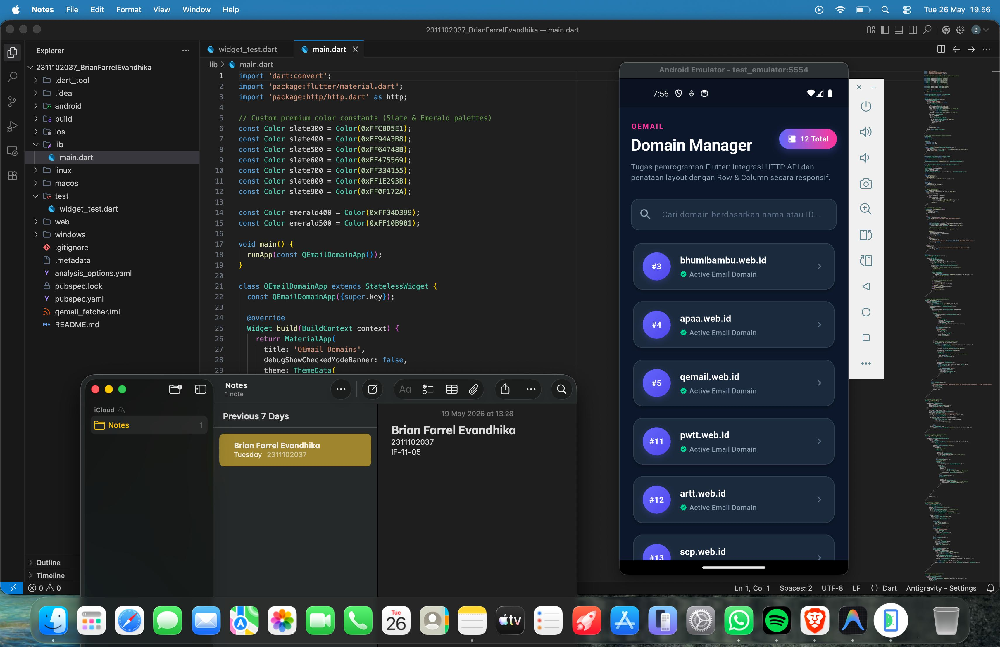

<div align="center">
  <br />
  <h1>LAPORAN PRAKTIKUM <br> APLIKASI BERBASIS PLATFORM </h1>
  <br />
  <h3>MODUL 5 & 6 <br> Flutter </h3>
  <br />
  
  <br />
  <br />
  <br />
  <h3>Disusun Oleh :</h3>
  <p>
    <strong>Brian Farrel Evandhika</strong>
    <br>
    <strong>2311102037</strong>
    <br>
    <strong>S1 IF-11-REG05</strong>
  </p>
  <br />
  <h3>Dosen Pengampu :</h3>
  <p>
    <strong>Dedi Agung Prabowo, S.Kom., M.Kom</strong>
  </p>
  <br />
  <br />
  <h4>Asisten Praktikum :</h4>
  <strong>Apri Pandu Wicaksono </strong>
  <br>
  <strong>Hamka Zaenul Ardi</strong>
  <br />
  <h3>LABORATORIUM HIGH PERFORMANCE <br>FAKULTAS INFORMATIKA <br>UNIVERSITAS TELKOM PURWOKERTO <br>2026 </h3>
</div>

<hr>


# Dasar Teori

<p align="justify">
<strong>Application Programming Interface (API)</strong> adalah sekumpulan aturan dan protokol yang memungkinkan beberapa perangkat lunak untuk saling terhubung dan bertukar data. Pada pengembangan perangkat lunak modern, khususnya mobile platform, API digunakan oleh client (aplikasi Flutter) untuk berkomunikasi secara asinkron dengan server melalui protokol HTTP menggunakan metode <code>GET</code> untuk mengambil data dinamis tanpa harus menyimpannya secara manual di dalam aplikasi secara statis.
</p>

<p align="justify">
Data yang diperoleh dari web API umumnya bertipe <strong>JSON (JavaScript Object Notation)</strong>. JSON adalah standar pertukaran data berbasis teks terstruktur yang ringan dan mudah dibaca baik oleh komputer maupun manusia. Di dalam bahasa pemrograman Dart, representasi JSON berupa string harus didekodekan terlebih dahulu menjadi struktur data dinamis menggunakan modul pustaka bawaan <code>dart:convert</code> melalui fungsi <code>jsonDecode()</code>, lalu dipetakan ke dalam bentuk objek model data (data model class) dengan bantuan <i>factory constructor</i> untuk menjamin ketepatan tipe data (type-safety).
</p>

<p align="justify">
Flutter menyediakan library resmi bernama <code>http</code> untuk menangani seluruh transaksi jaringan secara modular dan tangguh. Pustaka ini memproses request ke server dengan memanfaatkan mekanisme asinkron berbasis objek <code>Future</code>, serta kata kunci pendukung <code>async</code> dan <code>await</code>, sehingga proses transaksi jaringan tidak membebani performa utama (UI thread) aplikasi Anda.
</p>

<p align="justify">
Untuk menyusun dan menata visual data hasil fetch API di layar aplikasi, Flutter menyediakan beragam widget tata letak serbaguna yang disusun dalam diagram pohon widget (widget tree):
<ul>
  <li><strong>Row:</strong> Mengatur dan meratakan elemen-elemen anak secara horizontal (sejajar dari kiri ke kanan).</li>
  <li><strong>Column:</strong> Mengatur elemen anak secara vertikal (bertumpuk dari atas ke bawah).</li>
  <li><strong>ListView / CustomScrollView:</strong> Menyediakan container yang dapat digulir secara vertikal dengan efisien untuk menampung data list berukuran dinamis.</li>
</ul>
Dengan memadukan pustaka komunikasi jaringan <code>http</code> dan tata letak modular (Row & Column) di dalam manajemen status <code>StatefulWidget</code>, aplikasi dapat menyajikan status interaksi antarmuka yang sangat responsif, mulai dari memuat data (loading), kegagalan sistem (error handling), hingga pencarian dinamis secara real-time.
</p>

# Task 3 - Mobile Flutter
## Source Code main.dart
```dart
/* 
   NIM: 2311102037
   Nama: Brian Farrel Evandhika
   Kelas: S1 IF-11-REG05
*/
import 'dart:convert';
import 'package:flutter/material.dart';
import 'package:http/http.dart' as http;

// Custom premium color constants (Slate & Emerald palettes)
const Color slate300 = Color(0xFFCBD5E1);
const Color slate400 = Color(0xFF94A3B8);
const Color slate500 = Color(0xFF64748B);
const Color slate600 = Color(0xFF475569);
const Color slate700 = Color(0xFF334155);
const Color slate800 = Color(0xFF1E293B);
const Color slate900 = Color(0xFF0F172A);

const Color emerald400 = Color(0xFF34D399);
const Color emerald500 = Color(0xFF10B981);

void main() {
  runApp(const QEmailDomainApp());
}

class QEmailDomainApp extends StatelessWidget {
  const QEmailDomainApp({super.key});

  @override
  Widget build(BuildContext context) {
    return MaterialApp(
      title: 'QEmail Domains',
      debugShowCheckedModeBanner: false,
      theme: ThemeData(
        brightness: Brightness.dark,
        scaffoldBackgroundColor: slate900,
        colorScheme: ColorScheme.fromSeed(
          seedColor: const Color(0xFF6366F1), // Indigo 500
          brightness: Brightness.dark,
          primary: const Color(0xFF6366F1),
          secondary: const Color(0xFFEC4899), // Pink 500
        ),
        cardTheme: CardThemeData(
          color: slate800,
          elevation: 4,
          shape: RoundedRectangleBorder(
            borderRadius: BorderRadius.circular(16),
            side: const BorderSide(
              color: slate700,
              width: 1,
            ),
          ),
        ),
        useMaterial3: true,
      ),
      home: const DomainListScreen(),
    );
  }
}

// Data Model matching QEmail Domains response
class Domain {
  final int id;
  final String name;

  Domain({
    required this.id,
    required this.name,
  });

  factory Domain.fromJson(Map<String, dynamic> json) {
    return Domain(
      id: json['id'] is int ? json['id'] : int.parse(json['id'].toString()),
      name: json['name'] as String,
    );
  }
}

class DomainListScreen extends StatefulWidget {
  const DomainListScreen({super.key});

  @override
  State<DomainListScreen> createState() => _DomainListScreenState();
}

class _DomainListScreenState extends State<DomainListScreen> {
  // States
  List<Domain> _domains = [];
  List<Domain> _filteredDomains = [];
  bool _isLoading = true;
  String _errorMessage = '';
  final TextEditingController _searchController = TextEditingController();

  @override
  void initState() {
    super.initState();
    _fetchDomains();
    _searchController.addListener(_onSearchChanged);
  }

  @override
  void dispose() {
    _searchController.dispose();
    super.dispose();
  }

  // Handle Search Input
  void _onSearchChanged() {
    final query = _searchController.text.toLowerCase();
    setState(() {
      if (query.isEmpty) {
        _filteredDomains = _domains;
      } else {
        _filteredDomains = _domains
            .where((domain) =>
                domain.name.toLowerCase().contains(query) ||
                domain.id.toString().contains(query))
            .toList();
      }
    });
  }

  // Fetch QEmail Domains API
  Future<void> _fetchDomains() async {
    setState(() {
      _isLoading = true;
      _errorMessage = '';
    });

    try {
      final response = await http.get(
        Uri.parse('https://api.qemail.web.id/v1/email/domains'),
      );

      if (response.statusCode == 200) {
        final List<dynamic> jsonList = json.decode(response.body);
        final List<Domain> loadedDomains =
            jsonList.map((json) => Domain.fromJson(json)).toList();

        // Sort domains by ID ascending
        loadedDomains.sort((a, b) => a.id.compareTo(b.id));

        setState(() {
          _domains = loadedDomains;
          _filteredDomains = loadedDomains;
          _isLoading = false;
        });
      } else {
        setState(() {
          _errorMessage =
              'Server returned error: ${response.statusCode}\nFailed to fetch domains.';
          _isLoading = false;
        });
      }
    } catch (e) {
      setState(() {
        _errorMessage = 'An error occurred while connecting to the server:\n$e';
        _isLoading = false;
      });
    }
  }

  @override
  Widget build(BuildContext context) {
    return Scaffold(
      body: SafeArea(
        child: RefreshIndicator(
          onRefresh: _fetchDomains,
          color: Theme.of(context).colorScheme.primary,
          backgroundColor: slate800,
          child: CustomScrollView(
            physics: const AlwaysScrollableScrollPhysics(),
            slivers: [
              // Premium Gradient Header (App Bar custom style)
              _buildHeader(),

              // Search Bar Area
              SliverToBoxAdapter(
                child: Padding(
                  padding: const EdgeInsets.symmetric(horizontal: 20, vertical: 12),
                  child: _buildSearchBar(),
                ),
              ),

              // Dynamic content based on states
              if (_isLoading)
                _buildLoadingState()
              else if (_errorMessage.isNotEmpty)
                _buildErrorState()
              else if (_filteredDomains.isEmpty)
                _buildEmptyState()
              else
                _buildDomainList(),
            ],
          ),
        ),
      ),
    );
  }

  // Header UI with Premium Neon Gradients
  Widget _buildHeader() {
    return SliverToBoxAdapter(
      child: Container(
        padding: const EdgeInsets.fromLTRB(20, 24, 20, 16),
        child: Column(
          crossAxisAlignment: CrossAxisAlignment.start,
          children: [
            Row(
              mainAxisAlignment: MainAxisAlignment.spaceBetween,
              children: [
                // Text Column
                Column(
                  crossAxisAlignment: CrossAxisAlignment.start,
                  children: [
                    Text(
                      'QEMAIL',
                      style: TextStyle(
                        fontSize: 12,
                        fontWeight: FontWeight.w800,
                        letterSpacing: 2.0,
                        color: Theme.of(context).colorScheme.secondary,
                      ),
                    ),
                    const SizedBox(height: 4),
                    const Text(
                      'Domain Manager',
                      style: TextStyle(
                        fontSize: 28,
                        fontWeight: FontWeight.bold,
                        letterSpacing: -0.5,
                        color: Colors.white,
                      ),
                    ),
                  ],
                ),
                // Badge showcasing the total domain count
                if (!_isLoading && _errorMessage.isEmpty)
                  Container(
                    padding: const EdgeInsets.symmetric(horizontal: 14, vertical: 8),
                    decoration: BoxDecoration(
                      gradient: const LinearGradient(
                        colors: [Color(0xFF6366F1), Color(0xFFEC4899)],
                      ),
                      borderRadius: BorderRadius.circular(20),
                      boxShadow: [
                        BoxShadow(
                          color: const Color(0x4D6366F1), // Hex 30% opacity
                          blurRadius: 10,
                          offset: const Offset(0, 4),
                        ),
                      ],
                    ),
                    child: Row(
                      mainAxisSize: MainAxisSize.min,
                      children: [
                        const Icon(Icons.dns, size: 16, color: Colors.white),
                        const SizedBox(width: 6),
                        Text(
                          '${_domains.length} Total',
                          style: const TextStyle(
                            fontSize: 13,
                            fontWeight: FontWeight.bold,
                            color: Colors.white,
                          ),
                        ),
                      ],
                    ),
                  ),
              ],
            ),
            const SizedBox(height: 8),
            Text(
              'Tugas pemrograman Flutter: Integrasi HTTP API dan penataan layout dengan Row & Column secara responsif.',
              style: TextStyle(
                fontSize: 13,
                color: slate400,
                height: 1.4,
              ),
            ),
          ],
        ),
      ),
    );
  }

  // Premium styled search bar
  Widget _buildSearchBar() {
    return Container(
      decoration: BoxDecoration(
        color: slate800,
        borderRadius: BorderRadius.circular(14),
        border: Border.all(color: slate700),
      ),
      child: TextField(
        controller: _searchController,
        style: const TextStyle(color: Colors.white),
        decoration: InputDecoration(
          hintText: 'Cari domain berdasarkan nama atau ID...',
          hintStyle: const TextStyle(color: slate500, fontSize: 14),
          prefixIcon: const Icon(Icons.search, color: slate400),
          suffixIcon: _searchController.text.isNotEmpty
              ? IconButton(
                  icon: const Icon(Icons.clear, color: slate400),
                  onPressed: () {
                    _searchController.clear();
                  },
                )
              : null,
          border: InputBorder.none,
          contentPadding: const EdgeInsets.symmetric(vertical: 14, horizontal: 16),
        ),
      ),
    );
  }

  // Loading skeleton placeholder state
  Widget _buildLoadingState() {
    return SliverList(
      delegate: SliverChildBuilderDelegate(
        (context, index) {
          return Padding(
            padding: const EdgeInsets.symmetric(horizontal: 20, vertical: 8),
            child: Card(
              child: Padding(
                padding: const EdgeInsets.all(16.0),
                child: Row(
                  children: [
                    // Skeleton badge
                    Container(
                      width: 50,
                      height: 50,
                      decoration: BoxDecoration(
                        color: slate700.withAlpha(102), // 40% opacity
                        shape: BoxShape.circle,
                      ),
                    ),
                    const SizedBox(width: 16),
                    // Skeleton texts
                    Expanded(
                      child: Column(
                        crossAxisAlignment: CrossAxisAlignment.start,
                        children: [
                          Container(
                            width: 150,
                            height: 16,
                            decoration: BoxDecoration(
                              color: slate700.withAlpha(102), // 40% opacity
                              borderRadius: BorderRadius.circular(4),
                            ),
                          ),
                          const SizedBox(height: 8),
                          Container(
                            width: 80,
                            height: 12,
                            decoration: BoxDecoration(
                              color: slate700.withAlpha(77), // 30% opacity
                              borderRadius: BorderRadius.circular(4),
                            ),
                          ),
                        ],
                      ),
                    ),
                  ],
                ),
              ),
            ),
          );
        },
        childCount: 4,
      ),
    );
  }

  // Error State Component
  Widget _buildErrorState() {
    return SliverToBoxAdapter(
      child: Padding(
        padding: const EdgeInsets.all(24.0),
        child: Card(
          color: const Color(0xFF3B0712), // Deep red tint
          shape: RoundedRectangleBorder(
            borderRadius: BorderRadius.circular(16),
            side: const BorderSide(color: Color(0xFF991B1B)),
          ),
          child: Padding(
            padding: const EdgeInsets.all(24.0),
            child: Column(
              mainAxisSize: MainAxisSize.min,
              children: [
                const Icon(
                  Icons.error_outline,
                  color: Color(0xFFF87171),
                  size: 48,
                ),
                const SizedBox(height: 16),
                const Text(
                  'Gagal Mengambil Data',
                  style: TextStyle(
                    fontSize: 18,
                    fontWeight: FontWeight.bold,
                    color: Colors.white,
                  ),
                ),
                const SizedBox(height: 8),
                Text(
                  _errorMessage,
                  textAlign: TextAlign.center,
                  style: const TextStyle(
                    fontSize: 13,
                    color: Color(0xFFFECACA),
                  ),
                ),
                const SizedBox(height: 20),
                ElevatedButton.icon(
                  onPressed: _fetchDomains,
                  style: ElevatedButton.styleFrom(
                    backgroundColor: const Color(0xFF991B1B),
                    foregroundColor: Colors.white,
                    shape: RoundedRectangleBorder(
                      borderRadius: BorderRadius.circular(10),
                    ),
                    padding: const EdgeInsets.symmetric(horizontal: 20, vertical: 12),
                  ),
                  icon: const Icon(Icons.refresh, size: 18),
                  label: const Text('Coba Lagi', style: TextStyle(fontWeight: FontWeight.bold)),
                ),
              ],
            ),
          ),
        ),
      ),
    );
  }

  // Empty State (No domain match)
  Widget _buildEmptyState() {
    return SliverToBoxAdapter(
      child: Padding(
        padding: const EdgeInsets.symmetric(vertical: 60, horizontal: 24),
        child: Column(
          children: [
            const Icon(
              Icons.search_off_rounded,
              color: slate500,
              size: 64,
            ),
            const SizedBox(height: 16),
            const Text(
              'Domain Tidak Ditemukan',
              style: TextStyle(
                fontSize: 18,
                fontWeight: FontWeight.bold,
                color: Colors.white,
              ),
            ),
            const SizedBox(height: 8),
            Text(
              'Tidak ada domain yang cocok dengan "${_searchController.text}". Coba cari kata kunci lain.',
              textAlign: TextAlign.center,
              style: const TextStyle(
                fontSize: 14,
                color: slate400,
              ),
            ),
            const SizedBox(height: 16),
            TextButton(
              onPressed: () {
                _searchController.clear();
              },
              child: const Text('Reset Pencarian'),
            ),
          ],
        ),
      ),
    );
  }

  // Main list of domains with beautiful premium design
  Widget _buildDomainList() {
    return SliverList(
      delegate: SliverChildBuilderDelegate(
        (context, index) {
          final domain = _filteredDomains[index];

          // Domain Card Item using Row and Column layout
          return Padding(
            padding: const EdgeInsets.symmetric(horizontal: 20, vertical: 6),
            child: InkWell(
              borderRadius: BorderRadius.circular(16),
              onTap: () => _showDomainDetails(domain),
              child: Card(
                child: Padding(
                  padding: const EdgeInsets.all(16.0),
                  child: Row(
                    // Layout 1: ROW (Main layout to arrange the ID badge and info)
                    children: [
                      // ID badge container with nice gradient
                      Container(
                        width: 48,
                        height: 48,
                        decoration: BoxDecoration(
                          shape: BoxShape.circle,
                          gradient: const LinearGradient(
                            colors: [Color(0xFF6366F1), Color(0xFF4F46E5)],
                            begin: Alignment.topLeft,
                            end: Alignment.bottomRight,
                          ),
                          boxShadow: [
                            BoxShadow(
                              color: const Color(0x406366F1), // Hex 25% opacity
                              blurRadius: 8,
                              offset: const Offset(0, 3),
                            ),
                          ],
                        ),
                        alignment: Alignment.center,
                        child: Text(
                          '#${domain.id}',
                          style: const TextStyle(
                            color: Colors.white,
                            fontSize: 14,
                            fontWeight: FontWeight.w800,
                          ),
                        ),
                      ),
                      const SizedBox(width: 16),

                      // Layout 2: COLUMN (Stacked details inside the row)
                      Expanded(
                        child: Column(
                          crossAxisAlignment: CrossAxisAlignment.start,
                          children: [
                            Text(
                              domain.name,
                              style: const TextStyle(
                                fontSize: 16,
                                fontWeight: FontWeight.bold,
                                color: Colors.white,
                                letterSpacing: 0.1,
                              ),
                            ),
                            const SizedBox(height: 4),
                            Row(
                              children: [
                                const Icon(Icons.verified, size: 12, color: emerald400),
                                const SizedBox(width: 4),
                                Text(
                                  'Active Email Domain',
                                  style: TextStyle(
                                    fontSize: 12,
                                    color: slate400,
                                    fontWeight: FontWeight.w500,
                                  ),
                                ),
                              ],
                            ),
                          ],
                        ),
                      ),

                      // Chevron right to show interaction indicator
                      const Icon(
                        Icons.chevron_right_rounded,
                        color: slate500,
                        size: 20,
                      ),
                    ],
                  ),
                ),
              ),
            ),
          );
        },
        childCount: _filteredDomains.length,
      ),
    );
  }

  // Interactive Bottom Sheet detailing selected domain
  void _showDomainDetails(Domain domain) {
    showModalBottomSheet(
      context: context,
      backgroundColor: slate800,
      shape: const RoundedRectangleBorder(
        borderRadius: BorderRadius.vertical(top: Radius.circular(24)),
      ),
      builder: (context) {
        return Padding(
          padding: const EdgeInsets.fromLTRB(24, 16, 24, 32),
          child: Column(
            mainAxisSize: MainAxisSize.min,
            children: [
              // Bottom sheet drag handle
              Container(
                width: 40,
                height: 4,
                decoration: BoxDecoration(
                  color: slate600,
                  borderRadius: BorderRadius.circular(2),
                ),
              ),
              const SizedBox(height: 24),
              
              // Animated icon/badge in details
              Container(
                width: 72,
                height: 72,
                decoration: BoxDecoration(
                  shape: BoxShape.circle,
                  gradient: const LinearGradient(
                    colors: [Color(0xFF6366F1), Color(0xFFEC4899)],
                  ),
                  boxShadow: [
                    BoxShadow(
                      color: const Color(0x33EC4899), // Hex 20% opacity
                      blurRadius: 16,
                      offset: const Offset(0, 6),
                    ),
                  ],
                ),
                alignment: Alignment.center,
                child: const Icon(
                  Icons.dns,
                  color: Colors.white,
                  size: 32,
                ),
              ),
              const SizedBox(height: 16),
              const Text(
                'Detail Domain',
                style: TextStyle(
                  fontSize: 20,
                  fontWeight: FontWeight.bold,
                  color: Colors.white,
                ),
              ),
              const SizedBox(height: 24),

              // Info Row (using Row + Column components inside the bottom sheet)
              Container(
                padding: const EdgeInsets.all(16),
                decoration: BoxDecoration(
                  color: slate900,
                  borderRadius: BorderRadius.circular(16),
                  border: Border.all(color: slate700),
                ),
                child: Column(
                  children: [
                    Row(
                      mainAxisAlignment: MainAxisAlignment.spaceBetween,
                      children: [
                        const Text(
                          'ID Database',
                          style: TextStyle(color: slate500, fontSize: 14),
                        ),
                        Text(
                          '${domain.id}',
                          style: const TextStyle(
                            color: Colors.white,
                            fontSize: 14,
                            fontWeight: FontWeight.bold,
                          ),
                        ),
                      ],
                    ),
                    const Divider(color: slate700, height: 24),
                    Row(
                      mainAxisAlignment: MainAxisAlignment.spaceBetween,
                      children: [
                        const Text(
                          'Nama Domain',
                          style: TextStyle(color: slate500, fontSize: 14),
                        ),
                        Text(
                          domain.name,
                          style: TextStyle(
                            color: Theme.of(context).colorScheme.primary,
                            fontSize: 14,
                            fontWeight: FontWeight.bold,
                          ),
                        ),
                      ],
                    ),
                    const Divider(color: slate700, height: 24),
                    Row(
                      mainAxisAlignment: MainAxisAlignment.spaceBetween,
                      children: [
                        const Text(
                          'Provider Layanan',
                          style: TextStyle(color: slate500, fontSize: 14),
                        ),
                        const Text(
                          'QEmail Premium DNS',
                          style: TextStyle(
                            color: Colors.white,
                            fontSize: 14,
                            fontWeight: FontWeight.bold,
                          ),
                        ),
                      ],
                    ),
                  ],
                ),
              ),
              const SizedBox(height: 24),

              // Close Button
              SizedBox(
                width: double.infinity,
                child: ElevatedButton(
                  onPressed: () => Navigator.pop(context),
                  style: ElevatedButton.styleFrom(
                    backgroundColor: slate700,
                    foregroundColor: Colors.white,
                    shape: RoundedRectangleBorder(
                      borderRadius: BorderRadius.circular(12),
                    ),
                    padding: const EdgeInsets.symmetric(vertical: 14),
                  ),
                  child: const Text(
                    'Tutup',
                    style: TextStyle(fontWeight: FontWeight.bold),
                  ),
                ),
              ),
            ],
          ),
        );
      },
    );
  }
}
```


# Screenshots Output


# Penjelasan

<p align="justify">
Program di atas merupakan aplikasi Flutter berstandar premium dengan tema visual modern <i>deep dark-mode</i> yang digunakan untuk melakukan fetch (sinkronisasi) data domain dari REST API QEmail dan menampilkannya dalam bentuk daftar kartu interaktif yang responsif.
</p>

<p align="justify">
Berikut adalah rincian fungsionalitas dan alur kerja utama dari kode sumber tersebut:
</p>

<ol>
  <li>
    <strong>Model Data (Domain Class):</strong> 
    Memetakan response payload dari API menjadi objek typed-safe Dart. Factory constructor <code>fromJson</code> digunakan untuk mengonversi entitas JSON berupa pasangan <code>id</code> (integer) dan <code>name</code> (string) dengan perlindungan tambahan dari <i>parsing error</i>.
  </li>
  <li>
    <strong>Inisialisasi & Asynchronous Fetching:</strong>
    Di dalam <code>initState()</code>, fungsi <code>_fetchDomains()</code> dipanggil. Fungsi ini mengirimkan HTTP GET request secara asinkron ke endpoint menggunakan library <code>http</code>. Ketika server mengembalikan status sukses (200 OK), string JSON didekodekan menggunakan <code>json.decode()</code> dan dipetakan ke dalam array objek, yang kemudian diurutkan secara ascending (dari ID terkecil ke terbesar).
  </li>
  <li>
    <strong>Responsive Layout Widget (Row & Column):</strong>
    Implementasi tata letak widget diwujudkan secara estetis di dalam komponen daftar <code>SliverList</code>:
    <ul>
      <li>Setiap item daftar dibungkus oleh widget <code>InkWell</code> (memberikan efek ripple interaktif ketika ditekan) dan <code>Card</code>.</li>
      <li>Di dalam Card, widget <strong>Row</strong> menyusun tata letak horizontal untuk menyejajarkan badge bundar bergradasi ID domain (sisi kiri), detail informasi domain (sisi tengah), dan ikon indikator arah panah kanan (sisi kanan).</li>
      <li>Di dalam bagian tengah Row, widget <strong>Column</strong> menyusun tata letak vertikal untuk menampilkan teks nama domain (teks tebal putih berukuran 16px) di atas baris status pelabelan mini berikon centang hijau bertuliskan <i>"Active Email Domain"</i>.</li>
    </ul>
  </li>
  <li>
    <strong>Fitur Pencarian Dinamis:</strong>
    Menggunakan <code>TextEditingController</code> yang dipantau melalui listener <code>_onSearchChanged</code>. Pengguna dapat mengetikkan teks pencarian, dan secara langsung (real-time) menyaring koleksi list domain yang ditampilkan berdasarkan kecocokan nama ataupun ID.
  </li>
  <li>
    <strong>Detail Bottom Sheet:</strong>
    Saat pengguna mengetuk salah satu kartu domain, fungsi <code>_showDomainDetails</code> akan dipicu untuk menampilkan <code>showModalBottomSheet</code> interaktif berisi kartu informasi detail data domain yang disajikan secara rapi menggunakan kombinasi tata letak Row dan Column.
  </li>
</ol>