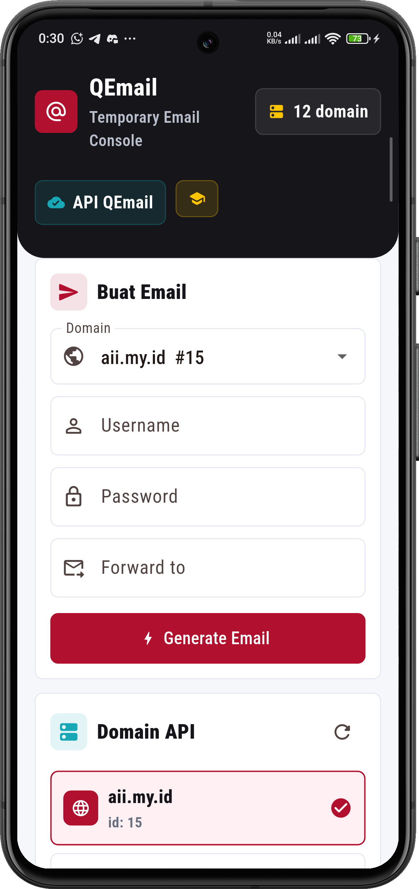
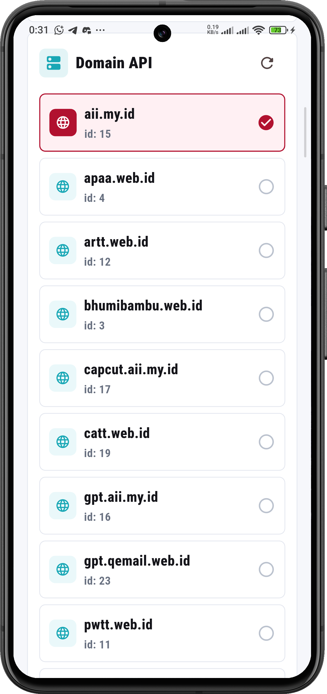
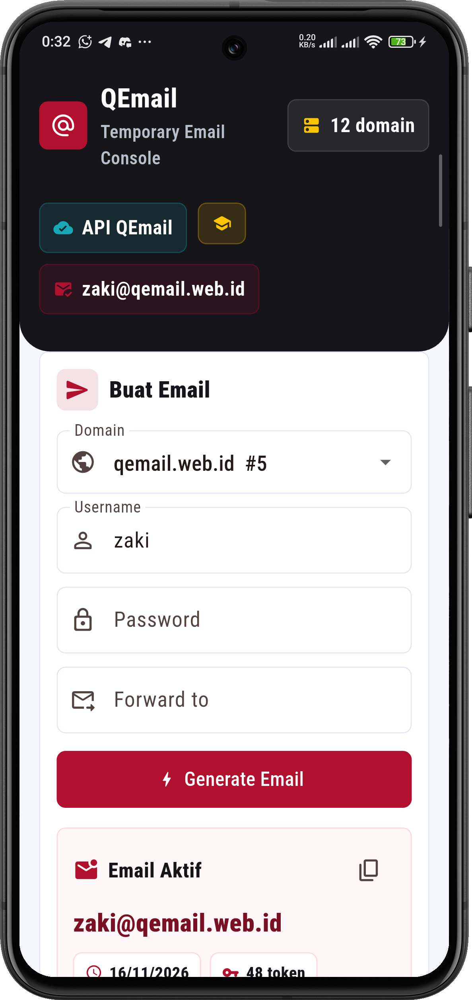
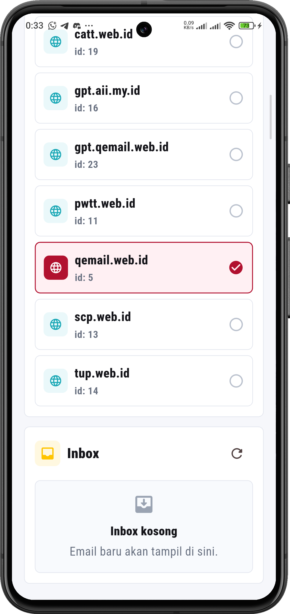

<div align="center">
  <br />
  <h1>LAPORAN PRAKTIKUM <br> APLIKASI BERBASIS PLATFORM </h1>
  <br />
  <h3>MODUL 5-6<br> FLUTTER </h3>
  <br />
  
  <br />
  <br />
  <br />
  <h3>Disusun Oleh :</h3>
  <p>
    <strong>Muhammad Aulia Muzzaki Nugraha</strong>
    <br>
    <strong>2311102051</strong>
    <br>
    <strong>S1 IF-11-REG05</strong>
  </p>
  <br />
  <h3>Dosen Pengampu :</h3>
  <p>
    <strong>Dedi Agung Prabowo, S.Kom., M.Kom</strong>
  </p>
  <br />
  <br />
  <h4>Asisten Praktikum :</h4>
  <strong>Apri Pandu Wicaksono </strong>
  <br>
  <strong>Hamka Zaenul Ardi</strong>
  <br />
  <h3>LABORATORIUM HIGH PERFORMANCE <br>FAKULTAS INFORMATIKA <br>UNIVERSITAS TELKOM PURWOKERTO <br>2026 </h3>
</div>

<hr>

## Dasar Teori

- Flutter adalah framework UI lintas platform berbasis widget. Tampilan disusun sebagai widget tree dan dapat dirender di Android, iOS, web, dan desktop.
- StatefulWidget menyimpan state yang berubah, sedangkan StatelessWidget bersifat statis. Perubahan state dipicu dengan `setState()` agar UI ter-render ulang.
- Akses data dari REST API dilakukan secara asynchronous memakai `Future`, `async/await`, dan package `http`. Data JSON di-decode menjadi model agar mudah diolah.
- Validasi input penting untuk menjaga kualitas data, seperti pengecekan pola username, panjang password, dan format email.
- Tata letak responsif dapat dibuat dengan `LayoutBuilder`, `Row`/`Column`, dan `CustomScrollView` agar adaptif di ukuran layar berbeda.


## Task Mobile Flutter
### Deskripsi Singkat
Aplikasi QEmail digunakan untuk membuat email sementara melalui API, menampilkan daftar domain, menghasilkan email baru, serta menampilkan inbox terbaru secara realtime.

### Source code
Berikut sebagian source code penting yang merepresentasikan program.

```dart
class QEmailApi {
  QEmailApi({http.Client? client}) : _client = client ?? http.Client();

  static const _baseUrl = 'https://api.qemail.web.id';
  final http.Client _client;

  Future<List<EmailDomain>> fetchDomains() async {
    final response = await _client.get(Uri.parse('$_baseUrl/v1/email/domains'));
    final body = _decode(response);

    if (response.statusCode != 200) {
      throw QEmailException('Gagal memuat domain (${response.statusCode}).');
    }

    if (body is! List) {
      throw const QEmailException('Format data domain tidak sesuai.');
    }

    return body
        .whereType<Map<String, dynamic>>()
        .map(EmailDomain.fromJson)
        .toList();
  }

  Future<GeneratedEmail> generateEmail({
    required int domainId,
    String? username,
    String? password,
    String? forwardTo,
  }) async {
    final payload = <String, Object?>{'domain_id': domainId};
    if (username != null) payload['username'] = username;
    if (password != null) payload['password'] = password;
    if (forwardTo != null) payload['forward_to'] = forwardTo;

    final response = await _client.post(
      Uri.parse('$_baseUrl/v1/email/generate'),
      headers: const {'Content-Type': 'application/json'},
      body: jsonEncode(payload),
    );
    final body = _decode(response);

    if (response.statusCode != 200 && response.statusCode != 201) {
      throw QEmailException(
        _messageFromBody(body) ??
            'Gagal membuat email (${response.statusCode}).',
      );
    }

    if (body is! Map<String, dynamic>) {
      throw const QEmailException('Format data email tidak sesuai.');
    }

    return GeneratedEmail.fromJson(body);
  }
}
```

```dart
Future<void> _generateEmail() async {
  final domain = _selectedDomain;
  if (domain == null || _generatingEmail) return;

  final username = _usernameController.text.trim();
  final password = _passwordController.text.trim();
  final forwardTo = _forwardController.text.trim();

  if (username.isNotEmpty && !_isValidUsername(username)) {
    setState(() {
      _emailError =
          'Username 3-30 karakter dan hanya huruf, angka, titik, garis bawah, atau strip.';
    });
    return;
  }

  if (password.isNotEmpty && password.length < 8) {
    setState(() => _emailError = 'Password minimal 8 karakter.');
    return;
  }

  if (forwardTo.isNotEmpty && !_isValidEmail(forwardTo)) {
    setState(() => _emailError = 'Format email forward belum valid.');
    return;
  }

  setState(() {
    _generatingEmail = true;
    _emailError = null;
    _inboxError = null;
    _messages = const [];
  });

  try {
    final generated = await _api.generateEmail(
      domainId: domain.id,
      username: username.isEmpty ? null : username,
      password: password.isEmpty ? null : password,
      forwardTo: forwardTo.isEmpty ? null : forwardTo,
    );

    if (!mounted) return;
    setState(() => _generatedEmail = generated);
    await _refreshInbox();
  } on Object catch (error) {
    if (!mounted) return;
    setState(() => _emailError = _readableError(error));
  } finally {
    if (mounted) {
      setState(() => _generatingEmail = false);
    }
  }
}
```


### Screenshot Output
<table>
  <tr>
    <td width="50%">
      
    </td>
    <td width="50%">
      
    </td>
  </tr>
  <tr>
    <td width="50%">
      
    </td>
    <td width="50%">
      
    </td>
  </tr>
</table>

### Penjelasan Code
- `QEmailApi` menangani komunikasi REST API: mengambil domain dan membuat email baru dengan payload JSON serta error handling.
- `_generateEmail()` memvalidasi input, mengatur state loading, memanggil API, lalu memperbarui UI dan inbox jika berhasil.
- Model `EmailDomain`, `GeneratedEmail`, dan `InboxMessage` memetakan JSON menjadi objek agar data mudah ditampilkan.
- UI dibangun dari beberapa panel: form pembuatan email, daftar domain, dan inbox. Layout diatur responsif menggunakan `LayoutBuilder`.
- `RefreshIndicator` dan tombol refresh digunakan untuk memperbarui domain dan inbox secara manual.
