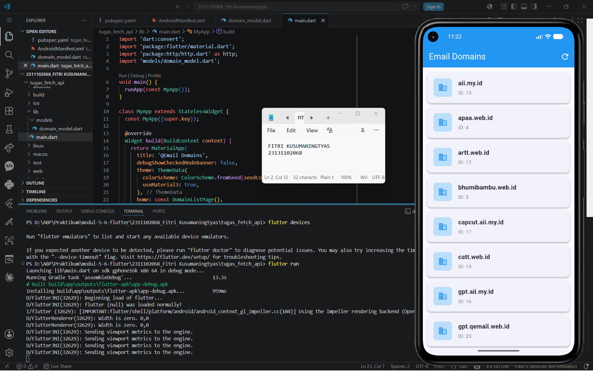

<div align="center">
  <br />
  <h1>LAPORAN PRAKTIKUM <br> APLIKASI BERBASIS PLATFORM </h1>
  <br />
  <h3>MODUL 5-6 <br> FLUTTER </h3>
  <br />
  
  <br />
  <br />
  <br />
  <h3>Disusun Oleh :</h3>
  <p>
    <strong>Fitri Kusumaningtyas</strong>
    <br>
    <strong>2311102068</strong>
    <br>
    <strong>S1 IF-11-REG05</strong>
  </p>
  <br />
  <h3>Dosen Pengampu :</h3>
  <p>
    <strong>Dedi Agung Prabowo, S.Kom., M.Kom</strong>
  </p>
  <br />
  <br />
  <h4>Asisten Praktikum :</h4>
  <strong>Apri Pandu Wicaksono </strong>
  <br>
  <strong>Hamka Zaenul Ardi</strong>
  <br />
  <h3>LABORATORIUM HIGH PERFORMANCE <br>FAKULTAS INFORMATIKA <br>UNIVERSITAS TELKOM PURWOKERTO <br>2026 </h3>
</div>

<hr>

## Dasar Teori

Dalam pengembangan aplikasi modern, penggunaan `Application Programming Interface* (API)` menjadi salah satu komponen penting untuk pertukaran data antara aplikasi dan server. API memungkinkan aplikasi mengambil maupun mengirim data secara otomatis melalui jaringan internet menggunakan protokol HTTP. Pada tugas ini, digunakan metode *fetch API* untuk mengambil data dari endpoint yang telah disediakan, yaitu endpoint domain email pada layanan QEmail API. Data yang diambil berupa informasi `id` dan `name` dari setiap domain yang tersedia, kemudian ditampilkan pada antarmuka aplikasi menggunakan komponen tata letak seperti `Column` atau `Row`.

Selain itu, implementasi HTTP pada aplikasi bertujuan untuk mempermudah proses komunikasi data dengan server secara `real-time`. Dengan memanfaatkan library HTTP, aplikasi dapat melakukan permintaan (`request`) ke server dan menerima respons dalam format JSON. Format JSON dipilih karena ringan, mudah dibaca, dan umum digunakan dalam pengembangan aplikasi berbasis web maupun mobile. Pada proses ini, aplikasi akan melakukan `fetching data` dari URL API, lalu mengubah data JSON menjadi tampilan yang dapat dibaca pengguna.

Penggunaan layout seperti `Column` dan `Row` juga merupakan bagian penting dalam perancangan antarmuka aplikasi. `Column` digunakan untuk menyusun komponen secara vertikal, sedangkan `Row` digunakan untuk menyusun komponen secara horizontal. Dengan memanfaatkan kedua layout tersebut, data hasil respons API dapat ditampilkan dengan lebih terstruktur dan mudah dipahami oleh pengguna. Implementasi sederhana ini bertujuan untuk melatih pemahaman dasar mengenai integrasi API, penggunaan HTTP request, pengolahan data JSON, serta penyusunan tampilan antarmuka dalam pengembangan aplikasi.


##  TASK 5-6 Fetch API
### Source code pubspec.yaml
``` yaml
dependencies:
  flutter:
    sdk: flutter

  # The following adds the Cupertino Icons font to your application.
  # Use with the CupertinoIcons class for iOS style icons.
  cupertino_icons: ^1.0.8
  http: ^1.2.1
```
### Source code AndroidManifest.xml
``` xml
<uses-permission android:name="android.permission.INTERNET"/>
```

### Source code domain_model.dart
``` dart
class Domain {
  final String id;
  final String name;

  Domain({required this.id, required this.name});

  factory Domain.fromJson(Map<String, dynamic> json) {
    return Domain(
      id: json['id'].toString(),
      name: json['name'].toString(),
    );
  }
}
```

### Source code main.dart
``` dart
import 'dart:convert';
import 'package:flutter/material.dart';
import 'package:http/http.dart' as http;
import 'models/domain_model.dart';

void main() {
  runApp(const MyApp());
}

class MyApp extends StatelessWidget {
  const MyApp({super.key});

  @override
  Widget build(BuildContext context) {
    return MaterialApp(
      title: 'QEmail Domains',
      debugShowCheckedModeBanner: false,
      theme: ThemeData(
        colorScheme: ColorScheme.fromSeed(seedColor: Colors.blue),
        useMaterial3: true,
      ),
      home: const DomainListPage(),
    );
  }
}

class DomainListPage extends StatefulWidget {
  const DomainListPage({super.key});

  @override
  State<DomainListPage> createState() => _DomainListPageState();
}

class _DomainListPageState extends State<DomainListPage> {
  List<Domain> _domains = [];
  bool _isLoading = true;
  String _errorMessage = '';

  @override
  void initState() {
    super.initState();
    fetchDomains();
  }

  Future<void> fetchDomains() async {
    setState(() {
      _isLoading = true;
      _errorMessage = '';
    });

    try {
      final response = await http.get(
        Uri.parse('https://api.qemail.web.id/v1/email/domains'),
      );

      if (response.statusCode == 200) {
        final dynamic jsonData = jsonDecode(response.body);
        List<dynamic> list;
        if (jsonData is List) {
          list = jsonData;
        } else if (jsonData is Map && jsonData.containsKey('data')) {
          list = jsonData['data'];
        } else {
          list = [];
        }

        setState(() {
          _domains = list.map((e) => Domain.fromJson(e)).toList();
          _isLoading = false;
        });
      } else {
        setState(() {
          _errorMessage = 'Error: ${response.statusCode}';
          _isLoading = false;
        });
      }
    } catch (e) {
      setState(() {
        _errorMessage = 'Gagal konek: $e';
        _isLoading = false;
      });
    }
  }

  @override
  Widget build(BuildContext context) {
    return Scaffold(
      appBar: AppBar(
        title: const Text('Email Domains'),
        backgroundColor: Colors.blue,
        foregroundColor: Colors.white,
        actions: [
          IconButton(
            icon: const Icon(Icons.refresh),
            onPressed: fetchDomains,
          ),
        ],
      ),
      body: _buildBody(),
    );
  }

  Widget _buildBody() {
    if (_isLoading) {
      return const Center(child: CircularProgressIndicator());
    }

    if (_errorMessage.isNotEmpty) {
      return Center(
        child: Column(
          mainAxisAlignment: MainAxisAlignment.center,
          children: [
            const Icon(Icons.error, color: Colors.red, size: 60),
            const SizedBox(height: 12),
            Text(_errorMessage, style: const TextStyle(color: Colors.red)),
            const SizedBox(height: 12),
            ElevatedButton(
              onPressed: fetchDomains,
              child: const Text('Coba Lagi'),
            ),
          ],
        ),
      );
    }

    if (_domains.isEmpty) {
      return const Center(child: Text('Tidak ada data.'));
    }

    return ListView.builder(
      padding: const EdgeInsets.all(12),
      itemCount: _domains.length,
      itemBuilder: (context, index) {
        final domain = _domains[index];
        return Card(
          margin: const EdgeInsets.only(bottom: 10),
          elevation: 3,
          shape: RoundedRectangleBorder(
            borderRadius: BorderRadius.circular(10),
          ),
          child: Padding(
            padding: const EdgeInsets.all(16),
            child: Row(                        
              children: [
                Container(
                  width: 48,
                  height: 48,
                  decoration: BoxDecoration(
                    color: Colors.blue.shade100,
                    borderRadius: BorderRadius.circular(8),
                  ),
                  child: const Icon(Icons.domain, color: Colors.blue),
                ),
                const SizedBox(width: 16),
                Expanded(
                  child: Column(               
                    crossAxisAlignment: CrossAxisAlignment.start,
                    children: [
                      Text(
                        domain.name,
                        style: const TextStyle(
                          fontSize: 16,
                          fontWeight: FontWeight.bold,
                        ),
                      ),
                      const SizedBox(height: 4),
                      Text(
                        'ID: ${domain.id}',
                        style: TextStyle(
                          fontSize: 13,
                          color: Colors.grey.shade600,
                        ),
                      ),
                    ],
                  ),
                ),
              ],
            ),
          ),
        );
      },
    );
  }
}
```
### Screenshot Output


### Penjelasan Code

Kode pada file `pubspec.yaml` digunakan untuk menambahkan library atau *dependencies* yang dibutuhkan dalam aplikasi Flutter. Pada kode tersebut ditambahkan library `http: ^1.2.1` yang berfungsi untuk melakukan komunikasi dengan API melalui metode HTTP seperti GET, POST, PUT, dan DELETE. Library ini memungkinkan aplikasi mengambil data dari server secara online. Selain itu, terdapat juga `cupertino_icons` yang digunakan untuk menyediakan ikon bergaya iOS pada aplikasi Flutter.

Pada file `AndroidManifest.xml`, ditambahkan permission `<uses-permission android:name="android.permission.INTERNET"/>` yang berfungsi untuk memberikan izin akses internet pada aplikasi Android. Permission ini wajib ditambahkan karena aplikasi melakukan pengambilan data dari API melalui koneksi internet. Tanpa permission tersebut, aplikasi tidak dapat melakukan request ke server sehingga data dari API tidak bisa ditampilkan.

File `domain_model.dart` digunakan sebagai model data untuk menampung hasil response dari API. Pada kode tersebut dibuat class `Domain` yang memiliki dua atribut yaitu `id` dan `name`. Constructor `Domain({required this.id, required this.name})` digunakan untuk memastikan kedua data wajib diisi saat objek dibuat. Selain itu terdapat factory method `fromJson()` yang berfungsi untuk mengubah data JSON dari API menjadi objek `Domain`. Dengan adanya model ini, proses pengolahan data menjadi lebih terstruktur dan mudah digunakan di dalam aplikasi.

Pada file `main.dart`, aplikasi dimulai dari fungsi `main()` yang menjalankan widget `MyApp`. Widget `MyApp` merupakan `StatelessWidget` yang berfungsi sebagai konfigurasi utama aplikasi, seperti pengaturan tema, judul aplikasi, serta halaman utama (`home`) yang diarahkan ke `DomainListPage`. Halaman `DomainListPage` dibuat menggunakan `StatefulWidget` karena data yang ditampilkan dapat berubah setelah proses pengambilan data dari API selesai dilakukan.

Di dalam class `_DomainListPageState`, terdapat beberapa variabel seperti `_domains` untuk menyimpan daftar domain dari API, `_isLoading` untuk menampilkan status loading, dan `_errorMessage` untuk menyimpan pesan error apabila terjadi kegagalan saat mengambil data. Pada method `initState()`, fungsi `fetchDomains()` dipanggil secara otomatis ketika halaman pertama kali dibuka agar data langsung diambil dari API.

Method `fetchDomains()` digunakan untuk mengambil data dari endpoint `https://api.qemail.web.id/v1/email/domains` menggunakan `http.get()`. Jika response berhasil dengan status code 200, maka data JSON akan di-*decode* menggunakan `jsonDecode()`. Selanjutnya data diubah menjadi list objek `Domain` menggunakan `Domain.fromJson()`. Namun apabila terjadi error atau gagal terhubung ke server, maka aplikasi akan menampilkan pesan kesalahan kepada pengguna.

Pada bagian tampilan, widget `Scaffold` digunakan sebagai struktur dasar halaman yang terdiri dari `AppBar` dan `body`. Di dalam `AppBar` terdapat tombol refresh yang dapat digunakan untuk mengambil ulang data API. Sementara itu, method `_buildBody()` berfungsi untuk menentukan tampilan berdasarkan kondisi aplikasi, seperti loading, error, data kosong, atau data berhasil ditampilkan.

Data domain ditampilkan menggunakan `ListView.builder` agar daftar dapat dibuat secara dinamis sesuai jumlah data dari API. Setiap item ditampilkan dalam bentuk `Card` untuk mempercantik tampilan. Pada bagian isi card digunakan widget `Row` untuk menyusun komponen secara horizontal, yaitu ikon di sebelah kiri dan informasi domain di sebelah kanan. Di dalam `Row` terdapat widget `Column` yang digunakan untuk menyusun teks `name` dan `id` secara vertikal. Dengan demikian, kode ini telah mengimplementasikan penggunaan `Row` dan `Column` sekaligus dalam pembuatan antarmuka aplikasi Flutter berbasis API.
