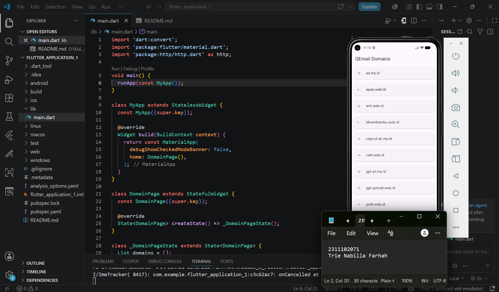

<div align="center">
  <br />
  <h1>LAPORAN PRAKTIKUM <br> APLIKASI BERBASIS PLATFORM </h1>
  <br />
  <h3>MODUL 5-6 <br> FLUTTER </h3>
  <br />
  
  <br />
  <br />
  <br />
  <h3>Disusun Oleh :</h3>
  <p>
    <strong>Trie Nabilla Farhah</strong>
    <br>
    <strong>2311102071</strong>
    <br>
    <strong>S1 IF-11-REG05</strong>
  </p>
  <br />
  <h3>Dosen Pengampu :</h3>
  <p>
    <strong>Dedi Agung Prabowo, S.Kom., M.Kom</strong>
  </p>
  <br />
  <br />
  <h4>Asisten Praktikum :</h4>
  <strong>Apri Pandu Wicaksono </strong>
  <br>
  <strong>Hamka Zaenul Ardi</strong>
  <br />
  <h3>LABORATORIUM HIGH PERFORMANCE <br>FAKULTAS INFORMATIKA <br>UNIVERSITAS TELKOM PURWOKERTO <br>2026 </h3>
</div>

<hr>

## Dasar Teori

Flutter merupakan framework open-source yang dikembangkan oleh Google untuk membangun aplikasi mobile, web, desktop, dan embedded hanya dengan satu basis kode (single codebase). Flutter menggunakan bahasa pemrograman Dart dan menyediakan berbagai widget yang digunakan untuk membuat antarmuka pengguna (User Interface/UI) secara cepat, responsif, dan menarik. Dengan konsep cross-platform, developer dapat membuat aplikasi yang dapat berjalan di sistem operasi Android maupun iOS tanpa perlu menulis kode secara terpisah untuk masing-masing platform.

Flutter bekerja menggunakan konsep widget sebagai komponen utama dalam pembuatan tampilan aplikasi. Semua elemen pada Flutter, seperti teks, tombol, gambar, layout, hingga halaman aplikasi, merupakan widget. Widget pada Flutter dibagi menjadi dua jenis utama, yaitu `StatelessWidget` dan `StatefulWidget`. `StatelessWidget` digunakan untuk tampilan yang bersifat tetap dan tidak berubah, sedangkan `StatefulWidget` digunakan untuk tampilan yang datanya dapat berubah selama aplikasi berjalan. Flutter juga menggunakan framework Material Design sehingga memudahkan pengembang dalam membuat tampilan aplikasi yang modern dan konsisten.

Salah satu keunggulan Flutter adalah fitur hot reload yang memungkinkan developer melihat perubahan kode secara langsung tanpa harus menjalankan ulang aplikasi dari awal. Selain itu, Flutter memiliki performa yang baik karena menggunakan rendering engine sendiri dan dikompilasi langsung ke native code. Flutter juga mendukung integrasi API, database, serta berbagai package tambahan melalui pub.dev sehingga memudahkan pengembangan aplikasi yang lebih kompleks. Dengan berbagai keunggulan tersebut, Flutter menjadi salah satu framework populer dalam pengembangan aplikasi modern saat ini.

##  Tugas Modul 5-6 Flutter
### Source code

```
import 'dart:convert';
import 'package:flutter/material.dart';
import 'package:http/http.dart' as http;

void main() {
  runApp(const MyApp());
}

class MyApp extends StatelessWidget {
  const MyApp({super.key});

  @override
  Widget build(BuildContext context) {
    return const MaterialApp(
      debugShowCheckedModeBanner: false,
      home: DomainPage(),
    );
  }
}

class DomainPage extends StatefulWidget {
  const DomainPage({super.key});

  @override
  State<DomainPage> createState() => _DomainPageState();
}

class _DomainPageState extends State<DomainPage> {
  List domains = [];

  Future<void> fetchDomains() async {
    final response = await http.get(
      Uri.parse('https://api.qemail.web.id/v1/email/domains'),
    );

    if (response.statusCode == 200) {
      final data = jsonDecode(response.body);

      setState(() {
        domains = data;
      });
    } else {
      throw Exception('Gagal mengambil data');
    }
  }

  @override
  void initState() {
    super.initState();
    fetchDomains();
  }

  @override
  Widget build(BuildContext context) {
    return Scaffold(
      appBar: AppBar(title: const Text("QEmail Domains")),

      body: ListView.builder(
        itemCount: domains.length,

        itemBuilder: (context, index) {
          return Card(
            margin: const EdgeInsets.all(10),

            child: ListTile(
              leading: Text(domains[index]['id'].toString()),

              title: Text(domains[index]['name']),
            ),
          );
        },
      ),
    );
  }
}

```
### Screenshot Output


### Penjelasan Code

Program Flutter tersebut digunakan untuk mengambil dan menampilkan data domain email dari API QEmail menggunakan library `http`. Pada bagian awal program dilakukan import beberapa package, yaitu `dart:convert` untuk mengubah data JSON menjadi objek Dart, `material.dart` untuk membuat antarmuka aplikasi Flutter, dan `http.dart` untuk melakukan request API. Fungsi `main()` berfungsi menjalankan aplikasi dengan memanggil widget `MyApp`. Selanjutnya, widget `MyApp` menggunakan `MaterialApp` sebagai struktur utama aplikasi dan mengarahkan halaman utama ke `DomainPage`.

Class `DomainPage` dibuat menggunakan `StatefulWidget` karena data yang ditampilkan dapat berubah setelah proses pengambilan data dari API selesai dilakukan. Pada class `_DomainPageState` terdapat variabel `domains` bertipe `List` yang digunakan untuk menyimpan data hasil response API. Fungsi `fetchDomains()` digunakan untuk mengambil data dari endpoint `https://api.qemail.web.id/v1/email/domains` menggunakan method `http.get()`. Jika status response bernilai `200`, maka data JSON akan diubah menjadi objek Dart menggunakan `jsonDecode(response.body)`, kemudian data disimpan ke dalam variabel `domains` melalui `setState()` agar tampilan aplikasi diperbarui secara otomatis. Jika request gagal, program akan menampilkan pesan error berupa exception.

Tampilan aplikasi dibuat menggunakan widget `Scaffold` yang memiliki `AppBar` dengan judul “QEmail Domains”. Isi halaman menggunakan `ListView.builder` untuk menampilkan data domain secara dinamis sesuai jumlah data yang diperoleh dari API. Setiap data ditampilkan menggunakan widget `Card` dan `ListTile`. Nilai `id` domain ditampilkan pada bagian `leading`, sedangkan nilai `name` ditampilkan pada bagian `title`. Dengan demikian, aplikasi dapat menampilkan daftar domain email secara otomatis berdasarkan data yang diambil langsung dari API.
