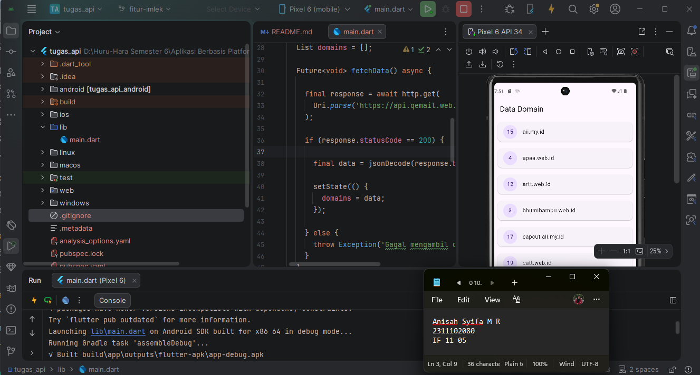

<div align="center">
  <br />
  <h1>LAPORAN PRAKTIKUM <br> APLIKASI BERBASIS PLATFORM </h1>
  <br />
  <h3>MODUL 5-6 <br> FLUTTER </h3>
  <br />
  
  <br />
  <br />
  <br />
  <h3>Disusun Oleh :</h3>
  <p>
    <strong>Anisah Syifa Mustika Riyanto</strong>
    <br>
    <strong>2311102080</strong>
    <br>
    <strong>S1 IF-11-REG05</strong>
  </p>
  <br />
  <h3>Dosen Pengampu :</h3>
  <p>
    <strong>Dedi Agung Prabowo, S.Kom., M.Kom</strong>
  </p>
  <br />
  <br />
  <h4>Asisten Praktikum :</h4>
  <strong>Apri Pandu Wicaksono </strong>
  <br>
  <strong>Hamka Zaenul Ardi</strong>
  <br />
  <h3>LABORATORIUM HIGH PERFORMANCE <br>FAKULTAS INFORMATIKA <br>UNIVERSITAS TELKOM PURWOKERTO <br>2026 </h3>
</div>

<hr>

## Dasar Teori

Flutter adalah sebuah kerangka kerja (framework) sumber terbuka yang dikembangkan oleh Google untuk membangun aplikasi lintas platform hanya dengan satu basis kode, sehingga dapat berjalan di berbagai sistem operasi seperti Android, iOS, web, maupun desktop. Flutter menggunakan bahasa pemrograman Dart dan mengusung konsep widget sebagai komponen utama penyusun antarmuka aplikasi. Setiap elemen tampilan, mulai dari teks, ikon, gambar, hingga tata letak (layout), direpresentasikan dalam bentuk widget, sehingga proses pembangunan antarmuka menjadi lebih terstruktur dan fleksibel.

Dalam proses pengembangan aplikasi, data tidak selalu disimpan secara lokal, melainkan bisa diperoleh dari server melalui API (Application Programming Interface). API berperan sebagai perantara antara aplikasi dengan sumber data eksternal, memungkinkan terjadinya pertukaran informasi. Di Flutter, pengambilan data dari API pada umumnya menggunakan paket `http`, sedangkan data dalam format JSON diubah menjadi objek Dart dengan fungsi `jsonDecode()` agar dapat diolah dan ditampilkan di dalam aplikasi.

Flutter juga mendukung pemrograman asinkron untuk menangani proses yang membutuhkan waktu, seperti pengambilan data dari internet. Konsep asinkron di Flutter dapat diimplementasikan dengan `Future` untuk mewakili proses yang berjalan di latar belakang, serta `FutureBuilder` untuk menampilkan hasil dari proses tersebut pada antarmuka aplikasi. Selain itu, `StatefulWidget` digunakan ketika tampilan perlu diperbarui secara dinamis sesuai perubahan data, sehingga informasi yang didapat dari API dapat ditampilkan dengan baik di halaman aplikasi.

### Source Code Tugas

```
import 'dart:convert';
import 'package:flutter/material.dart';
import 'package:http/http.dart' as http;

void main() {
  runApp(const MyApp());
}

class MyApp extends StatelessWidget {
  const MyApp({super.key});

  @override
  Widget build(BuildContext context) {
    return MaterialApp(
      debugShowCheckedModeBanner: false,
      home: DomainPage(),
    );
  }
}

class DomainPage extends StatefulWidget {
  @override
  State<DomainPage> createState() => _DomainPageState();
}

class _DomainPageState extends State<DomainPage> {

  List domains = [];

  Future<void> fetchData() async {

    final response = await http.get(
      Uri.parse('https://api.qemail.web.id/v1/email/domains'),
    );

    if (response.statusCode == 200) {

      final data = jsonDecode(response.body);

      setState(() {
        domains = data;
      });

    } else {
      throw Exception('Gagal mengambil data');
    }
  }

  @override
  void initState() {
    super.initState();
    fetchData();
  }

  @override
  Widget build(BuildContext context) {

    return Scaffold(
      appBar: AppBar(
        title: const Text('Data Domain'),
      ),

      body: ListView.builder(
        itemCount: domains.length,
        itemBuilder: (context, index) {

          final item = domains[index];

          return Card(
            margin: const EdgeInsets.all(10),

            child: ListTile(
              leading: CircleAvatar(
                child: Text(item['id'].toString()),
              ),

              title: Text(item['name']),
            ),
          );
        },
      ),
    );
  }
}
```

### Output



### Deskripsi

Pada praktikum ini dilakukan pembuatan aplikasi sederhana menggunakan Flutter dengan memanfaatkan library `http` untuk mengambil data dari REST API. API yang digunakan berasal dari QEmail dengan endpoint `https://api.qemail.web.id/v1/email/domains`. Data yang diambil dari API berupa daftar domain email yang kemudian ditampilkan pada aplikasi dalam bentuk list. Data yang ditampilkan meliputi `id` dan `name` dari setiap domain. Proses pengerjaan dimulai dengan membuat project Flutter, menambahkan dependency `http`, lalu membuat tampilan sederhana menggunakan widget `ListView.builder`. Selanjutnya dilakukan proses fetch data menggunakan method `GET` melalui fungsi `http.get()`. Response dari API yang masih berbentuk JSON kemudian diubah menjadi object Dart menggunakan `jsonDecode()`, lalu disimpan ke dalam variabel list menggunakan `setState()` agar tampilan aplikasi dapat diperbarui secara otomatis. Pada tampilan aplikasi digunakan widget `Scaffold` sebagai struktur utama halaman, `AppBar` untuk judul aplikasi, serta `Card` dan `ListTile` untuk menampilkan data domain secara rapi. Dengan implementasi ini aplikasi berhasil mengambil dan menampilkan data domain email dari API secara dinamis.
