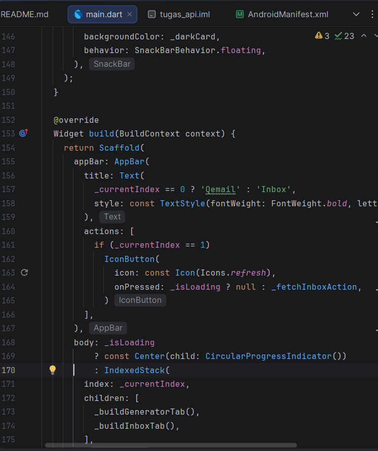
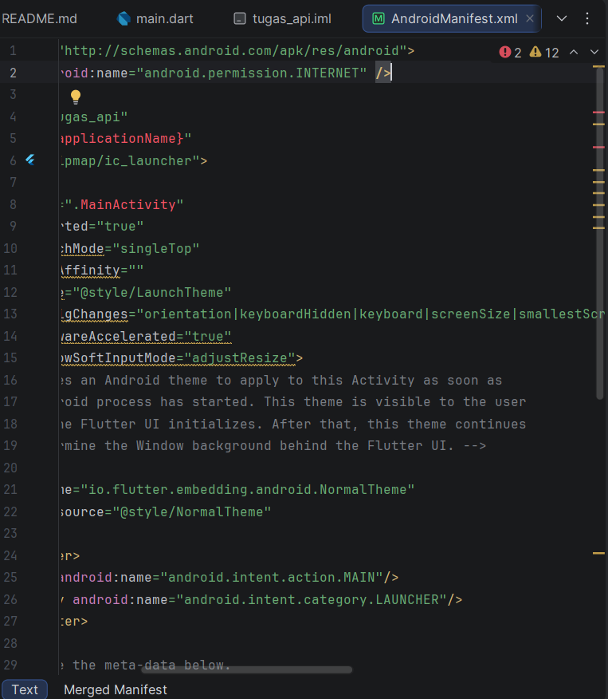
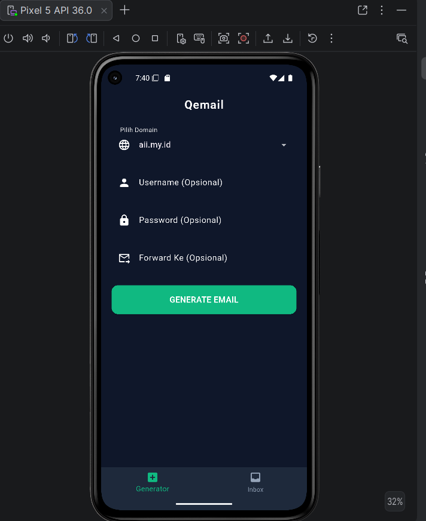
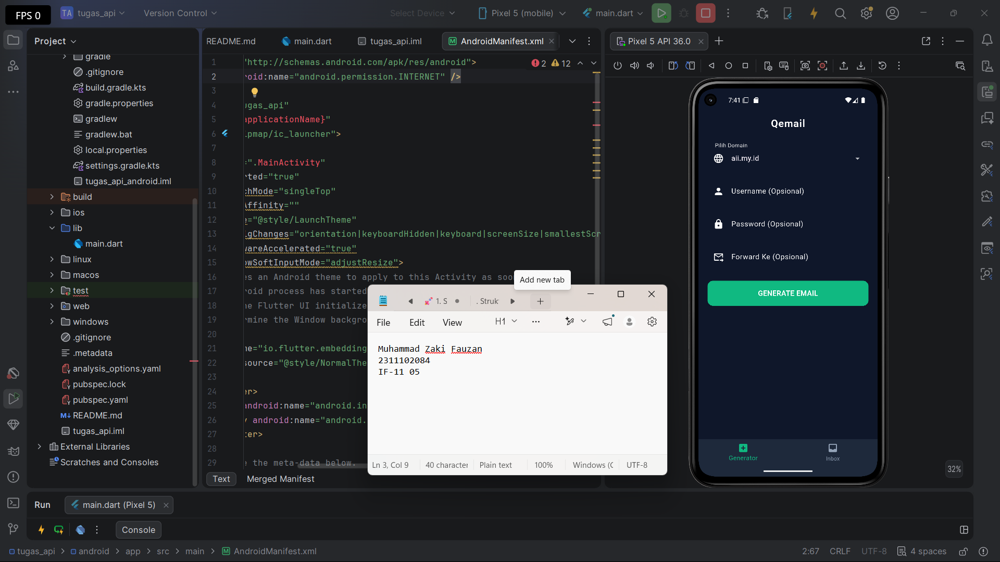

<div align="center">
  <br />
  <h1>LAPORAN PRAKTIKUM <br> APLIKASI BERBASIS PLATFORM </h1>
  <br />
  <h3>MODUL 5-6<br> FLUTTER </h3>
  <br />
  
  <br />
  <br />
  <br />
  <h3>Disusun Oleh :</h3>
  <p>
    <strong>Muhammad Zaki Fauzan</strong>
    <br>
    <strong>23111020</strong>
    <br>
    <strong>S1 IF-11-REG05</strong>
  </p>
  <br />
  <h3>Dosen Pengampu :</h3>
  <p>
    <strong>Dedi Agung Prabowo, S.Kom., M.Kom</strong>
  </p>
  <br />
  <br />
  <h4>Asisten Praktikum :</h4>
  <strong>Apri Pandu Wicaksono </strong>
  <br>
  <strong>Hamka Zaenul Ardi</strong>
  <br />
  <h3>LABORATORIUM HIGH PERFORMANCE <br>FAKULTAS INFORMATIKA <br>UNIVERSITAS TELKOM PURWOKERTO <br>2026 </h3>
</div>

<hr>

## Dasar Teori

Aplikasi ini dikembangkan menggunakan framework Flutter yang menyusun antarmuka berbasis widget tree agar dapat menyesuaikan tata letak secara responsif di berbagai ukuran layar. Perubahan data yang dinamis pada antarmuka dikelola melalui StatefulWidget dengan memanggil fungsi setState(). Untuk komunikasi dengan server, aplikasi mengambil data dari REST API secara asynchronous memanfaatkan Future, async/await, dan package http, di mana respons berformat JSON kemudian di-decode untuk ditampilkan. Selain itu, aplikasi juga menerapkan sistem validasi input, seperti pengecekan panjang password dan format email, guna memastikan kualitas data sebelum dikirim dan diproses oleh sistem.


## Task Mobile Flutter
### Deskripsi Singkat
Aplikasi QEmail digunakan untuk membuat email sementara melalui API, menampilkan daftar domain, menghasilkan email baru, serta menampilkan inbox terbaru secara realtime.

### Source code
Berikut sebagian source code penting yang merepresentasikan program.

```dart
import 'dart:convert';
import 'package:flutter/material.dart';
import 'package:flutter/services.dart';
import 'package:http/http.dart' as http;

void main() {
  runApp(const BurnerMailApp());
}

const Color _darkBg = Color(0xFF0F172A);
const Color _darkCard = Color(0xFF1E293B);
const Color _accent = Color(0xFF10B981);
const Color _textMain = Color(0xFFF8FAFC);
const Color _textMuted = Color(0xFF94A3B8);

class BurnerMailApp extends StatelessWidget {
  const BurnerMailApp({super.key});

  @override
  Widget build(BuildContext context) {
    return MaterialApp(
      debugShowCheckedModeBanner: false,
      title: 'Burner Mail',
      theme: ThemeData.dark().copyWith(
        scaffoldBackgroundColor: _darkBg,
        colorScheme: const ColorScheme.dark(
          primary: _accent,
          surface: _darkCard,
        ),
        appBarTheme: const AppBarTheme(
          backgroundColor: _darkBg,
          elevation: 0,
          centerTitle: true,
        ),
        cardTheme: CardThemeData(
          color: _darkCard,
          shape: RoundedRectangleBorder(
            borderRadius: BorderRadius.circular(16),
          ),
          elevation: 4,
        ),
        inputDecorationTheme: InputDecorationTheme(
          filled: true,
          fillColor: _darkBg,
          border: OutlineInputBorder(
            borderRadius: BorderRadius.circular(12),
            borderSide: BorderSide.none,
          ),
          focusedBorder: OutlineInputBorder(
            borderRadius: BorderRadius.circular(12),
            borderSide: const BorderSide(color: _accent, width: 1.5),
          ),
        ),
      ),
      home: const MainScreen(),
    );
  }
}
```
Lengkap nya ada disni [lib/main.dart](lib/main.dart)

### Screenshot Output
<table>
  <tr>
    <td width="50%">
      
    </td>
    <td width="50%">
      
    </td>
  </tr>
  <tr>
    <td width="50%">
      
    </td>
    <td width="50%">
      
    </td>
  </tr>
</table>

### Penjelasan Code
- `ApiService` bertugas mengelola request ke REST API, mulai dari mengambil daftar domain hingga melakukan post data untuk membuat email baru, lengkap dengan error handling.

- `_generateAction()` berfungsi mengeksekusi inputan user, mengatur indikator loading, dan otomatis memindahkan layar (switch tab) ke kotak masuk jika email sukses di-generate.

- Model kelas seperti `DomainData`, `ActiveEmail`, dan `MailMessage` digunakan untuk memetakan response JSON dari server agar datanya rapi dan mudah ditampilkan ke layar.

- Antarmuka UI tidak menggunakan panel responsif, melainkan dibagi menjadi dua halaman fungsional (Generator dan Inbox) yang dikontrol menggunakan BottomNavigationBar dan `IndexedStack.`

- Pembaruan data pada kotak masuk dilakukan secara manual melalui tombol refresh yang diletakkan di dalam `AppBar` khusus pada tab Inbox.