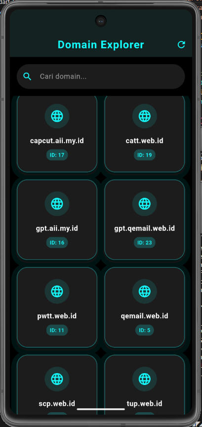

<div align="center">
    <br />
    <h1>LAPORAN PRAKTIKUM <br> APLIKASI BERBASIS PLATFORM </h1>
    <br />
    <h3>MODUL 5 & 6 <br> ANTARMUKA PENGGUNA & INTERAKSI PENGGUNA </h3>
    <br />
    
    <br />
    <br />
    <br />
    <h3>Disusun Oleh :</h3>
    <p>
        <strong>Galih Crismaningtyas</strong>
        <br>
        <strong>2311102085</strong>
        <br>
        <strong>S1 IF-11-REG05</strong>
    </p>
    <br />
    <h3>Dosen Pengampu :</h3>
    <p>
        <strong>Dedi Agung Prabowo, S.Kom., M.Kom</strong>
    </p>
    <br />
    <br />
    <h4>Asisten Praktikum :</h4>
    <strong>Apri Pandu Wicaksono </strong>
    <br>
    <strong>Hamka Zaenul Ardi</strong>
    <br />
    <h3>LABORATORIUM HIGH PERFORMANCE <br>FAKULTAS INFORMATIKA <br>UNIVERSITAS TELKOM PURWOKERTO <br>2026 </h3>
</div>
<hr>

## Dasar Teori

Antarmuka Pengguna (User Interface atau UI) secara esensial merupakan ruang batas fisik di mana interaksi antara manusia dan mesin terjadi. Dari sudut pandang psikologi kognitif, UI bukan sekadar persoalan estetika visual, melainkan sebuah sistem penyusunan hierarki informasi yang bertujuan meminimalkan beban mental (cognitive load) pengguna saat mencerna data di layar gawai yang terbatas. Struktur visual yang baik memanfaatkan prinsip-prinsip Gestalt—seperti kedekatan posisi (proximity), kesamaan bentuk (similarity), dan kontras—untuk mengelompokkan elemen analitik (misalnya kartu status domain atau daftar pesan masuk) sehingga pengguna dapat langsung memahami arti data tersebut secara instan tanpa perlu membaca teks penjelas secara mendalam.

Di sisi lain, Interaksi Pengguna (User Interaction) bertindak sebagai sistem komunikasi dinamis yang menerjemahkan niat mental pengguna menjadi instruksi digital yang dapat dieksekusi oleh aplikasi. Ketika pengguna melakukan tindakan fisik pada layar sentuh—baik berupa ketukan ringan (tapping), penekanan lama (long press), maupun tarikan vertikal (scroll/drag)—sistem harus menyediakan umpan balik instan (immediate feedback). Secara teknis, interaksi ini ditangkap oleh lapisan penangkap gestur perangkat, lalu dikirimkan ke dalam antrean kejadian (event loop) aplikasi untuk diproses menjadi perubahan logika internal, yang pada akhirnya memicu transisi animasi atau perubahan status visual di layar.

Keselarasan antara UI dan Interaksi Pengguna dijembatani oleh konsep affordance dan signifiers, yaitu petunjuk visual yang memberi tahu pengguna bagaimana suatu elemen dapat dioperasikan. Desain UI modern, seperti gaya Glassmorphism dengan efek transparansi berlapis atau penggunaan skema warna kontras untuk tombol retry, berfungsi sebagai penanda (signifiers) bahwa elemen tersebut dapat merespons interaksi. Ketika terjadi gangguan sistem (seperti kegagalan API yang menghasilkan Error 404), kolaborasi yang matang antara UI dan Interaksi memastikan bahwa aplikasi tidak hanya menampilkan pesan kesalahan yang statis, melainkan menyediakan ruang interaksi komunikatif (seperti dialog pemulihan dan tombol penyegaran data) guna mempertahankan kenyamanan dan kepercayaan pengguna terhadap performa aplikasi.

## Tugas Modul 5 & 6 

### 1. Source Code

```dart
// Praktikum Flutter 
// Galih Crismaningtyas
// 2311102085

import 'dart:convert';
import 'package:flutter/material.dart';
import 'package:http/http.dart' as http;

void main() {
  runApp(const MyApp());
}

class DomainData {
  final int id;
  final String name;

  DomainData({required this.id, required this.name});

  factory DomainData.fromJson(Map<String, dynamic> json) {
    return DomainData(
      id: json['id'],
      name: json['name'],
    );
  }
}
```

**Kode Lengkap:** [lib/main.dart](lib/main.dart)

### 2. Penjelasan

Proyek bernama Domain Grid Explorer ini merupakan aplikasi Flutter yang mengintegrasikan pencarian data secara asynchronous dari REST API dan memetakan hasilnya ke dalam bentuk kisi visual (Grid) dua kolom menggunakan GridView.builder. Aplikasi ini juga dilengkapi dengan fitur interaktif berupa kolom pencarian (search bar) dinamis yang langsung menyaring daftar domain berdasarkan masukan teks pengguna secara waktu nyata (real-time).

### 3. Output

