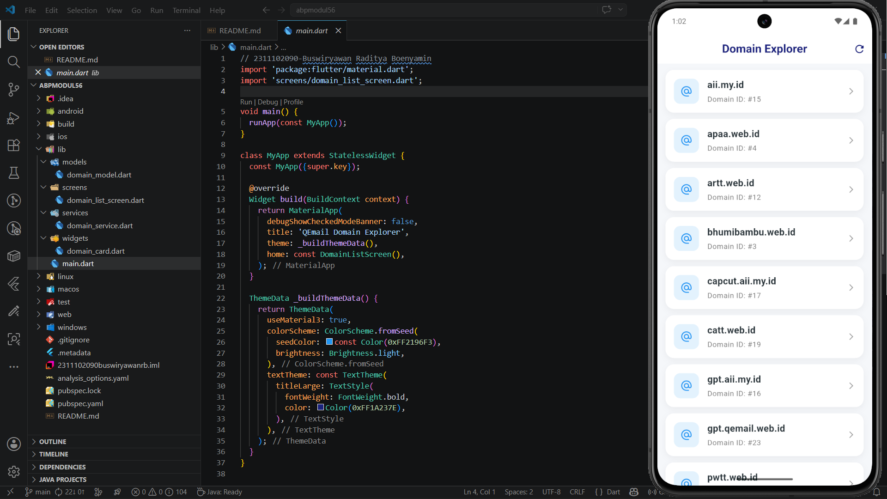

<div align="center">
  <br />
  <h1>LAPORAN PRAKTIKUM <br> APLIKASI BERBASIS PLATFORM </h1>
  <br />
  <h3>MODUL 5-6 <br> Flutter  </h3>
  <br />
  
  <br />
  <br />
  <br />
  <h3>Disusun Oleh :</h3>
  <p>
    <strong>Buswiryawan Raditya Boenyamin</strong>
    <br>
    <strong>2311102090</strong>
    <br>
    <strong>S1 IF-11-REG05</strong>
  </p>
  <br />
  <h3>Dosen Pengampu :</h3>
  <p>
    <strong>Dedi Agung Prabowo, S.Kom., M.Kom</strong>
  </p>
  <br />
  <h4>Asisten Praktikum :</h4>
  <strong>Apri Pandu Wicaksono </strong>
  <br>
  <strong>Hamka Zaenul Ardi</strong>
  <br />
  <h3>LABORATORIUM HIGH PERFORMANCE <br>FAKULTAS INFORMATIKA <br>UNIVERSITAS TELKOM PURWOKERTO <br>2026 </h3>
</div>

<hr>

# Dasar Teori


## Modul 5 — Antarmuka Pengguna Lanjutan

**Row** adalah widget untuk menyusun widget secara horizontal. Jika konten terlalu panjang dan menyebabkan overflow, gunakan `Expanded` agar widget mengisi sisa ruang yang tersedia secara otomatis.

**Column** bekerja seperti Row, namun susunannya vertikal. Alignment dapat diatur menggunakan `crossAxisAlignment` (sumbu horizontal) dan `mainAxisSize` (sumbu vertikal).

**Nested Rows & Columns** adalah teknik menyarangkan Row di dalam Column atau sebaliknya untuk membangun layout yang lebih kompleks. Misalnya, sebuah Row bisa memiliki Column di sisi kiri dan Image di sisi kanan.

**CustomScrollView** memungkinkan pembuatan scroll view yang menggabungkan AppBar, Grid, dan List sekaligus. Widget ini menggunakan komponen **Sliver** sebagai children-nya, yaitu `SliverAppBar`, `SliverGrid`, dan `SliverFixedExtentList`.

## Modul 6 — Interaksi Pengguna

**Packages** adalah library eksternal yang dapat ditambahkan ke proyek Flutter melalui file `pubspec.yaml`. Semua package publik tersedia di [pub.dev](https://pub.dev). Setelah ditambahkan dan disimpan, Flutter otomatis menjalankan `pub get` untuk mengunduhnya.

**StatelessWidget** bersifat statis dan tidak berubah setelah dibuat, cocok untuk komponen seperti `Text` dan `Icon`. **StatefulWidget** bersifat dinamis dan dapat memperbarui tampilannya sebagai respons terhadap interaksi pengguna, seperti `TextField`, `Checkbox`, dan `Slider`.

**Form** digunakan untuk menerima input dari pengguna. Flutter menyediakan `TextField` untuk input teks sederhana, dan `TextFormField` untuk input yang membutuhkan validasi.

**Tab Bar** adalah navigasi berbasis tab di bagian atas layar. Pembuatannya terdiri dari tiga langkah: membuat `DefaultTabController`, mendefinisikan tab dengan `TabBar`, lalu menampilkan konten tiap tab menggunakan `TabBarView`. Urutan konten harus sesuai dengan urutan tab.

**Bottom Navigation Bar** adalah navigasi ikon di bagian bawah layar. Karena perlu melacak tab aktif, widget ini membutuhkan `StatefulWidget`. Perpindahan tab diatur menggunakan `setState` melalui fungsi `onTap`.

**Buttons** — Flutter menyediakan tiga jenis tombol umum: `ElevatedButton` untuk aksi utama (submit, login), `TextButton` untuk aksi sekunder berbentuk teks, dan `DropdownButton` untuk memilih satu opsi dari daftar. `DropdownButton` membutuhkan `StatefulWidget` karena nilai pilihannya disimpan dalam state.

# Tugas 3 Flutter
buat tugas itu sederhana banget, kalian bikin tampilan boleh pada kolom boleh juga pake row yang penting implementasi salah satu nya abis itu install library http trus di dalem nya kalian lakuin fetch api dari url yang udah di kasih, buat dokumentasi lengkap nya bisa di liat di https://api.qemail.web.id/docs,

ketentuan:
- gunakan endpoint dari https://api.qemail.web.id/v1/email/domains
- data yang ditampilin berupa data dari response yaitu id sama name

## Source Code

### 1. main.dart
[lib/main.dart](lib/main.dart)
```dart
// 2311102090-Buswiryawan Raditya Boenyamin
import 'package:flutter/material.dart';
import 'screens/domain_list_screen.dart';

void main() {
  runApp(const MyApp());
}

class MyApp extends StatelessWidget {
  const MyApp({super.key});

  @override
  Widget build(BuildContext context) {
    return MaterialApp(
      debugShowCheckedModeBanner: false,
      title: 'QEmail Domain Explorer',
      theme: _buildThemeData(),
      home: const DomainListScreen(),
    );
  }

  ThemeData _buildThemeData() {
    return ThemeData(
      useMaterial3: true,
      colorScheme: ColorScheme.fromSeed(
        seedColor: const Color(0xFF2196F3),
        brightness: Brightness.light,
      ),
      textTheme: const TextTheme(
        titleLarge: TextStyle(
          fontWeight: FontWeight.bold,
          color: Color(0xFF1A237E),
        ),
      ),
    );
  }
}
```

### 2. domain_list_screen.dart
[lib/screens/domain_list_screen.dart](lib/screens/domain_list_screen.dart)
```dart
// 2311102090-Buswiryawan Raditya Boenyamin
import 'package:flutter/material.dart';
import '../models/domain_model.dart';
import '../services/domain_service.dart';
import '../widgets/domain_card.dart';

class DomainListScreen extends StatefulWidget {
  const DomainListScreen({super.key});

  @override
  State<DomainListScreen> createState() => _DomainListScreenState();
}

class _DomainListScreenState extends State<DomainListScreen> {
  final DomainService _domainService = DomainService();
  late Future<List<DomainModel>> _futureDomains;

  @override
  void initState() {
    super.initState();
    _loadData();
  }

  void _loadData() {
    setState(() {
      _futureDomains = _domainService.fetchDomains();
    });
  }

  @override
  Widget build(BuildContext context) {
    return Scaffold(
      backgroundColor: const Color(0xFFF5F7FA),
      appBar: _buildAppBar(),
      body: _buildBody(),
    );
  }

  PreferredSizeWidget _buildAppBar() {
    return AppBar(
      title: const Text('Domain Explorer'),
      centerTitle: true,
      elevation: 0,
      backgroundColor: Colors.white,
      foregroundColor: const Color(0xFF1A237E),
      actions: [
        IconButton(
          icon: const Icon(Icons.refresh_rounded),
          onPressed: _loadData,
        ),
      ],
    );
  }

  Widget _buildBody() {
    return FutureBuilder<List<DomainModel>>(
      future: _futureDomains,
      builder: (context, snapshot) {
        if (snapshot.connectionState == ConnectionState.waiting) {
          return const Center(child: CircularProgressIndicator(strokeWidth: 3));
        }

        if (snapshot.hasError) {
          return _buildErrorState(snapshot.error.toString());
        }

        if (!snapshot.hasData || snapshot.data!.isEmpty) {
          return const Center(child: Text('Tidak ada domain tersedia'));
        }

        return RefreshIndicator(
          onRefresh: () async => _loadData(),
          child: ListView.builder(
            padding: const EdgeInsets.symmetric(horizontal: 16, vertical: 12),
            itemCount: snapshot.data!.length,
            itemBuilder: (context, index) => DomainCard(domain: snapshot.data![index]),
          ),
        );
      },
    );
  }

  Widget _buildErrorState(String message) {
    return Center(
      child: Column(
        mainAxisAlignment: MainAxisAlignment.center,
        children: [
          const Icon(Icons.error_outline_rounded, size: 64, color: Colors.redAccent),
          const SizedBox(height: 16),
          Text(message, style: const TextStyle(fontSize: 16, color: Colors.grey)),
          const SizedBox(height: 24),
          ElevatedButton(onPressed: _loadData, child: const Text('Coba Lagi')),
        ],
      ),
    );
  }
}
```

### 3. domain_service.dart
[lib/services/domain_service.dart](lib/services/domain_service.dart)
```dart
// 2311102090-Buswiryawan Raditya Boenyamin
import 'dart:convert';
import 'package:http/http.dart' as http;
import '../models/domain_model.dart';

class DomainService {
  static const String _baseUrl = 'https://api.qemail.web.id/v1/email/domains';

  /// Fetches the list of domains from the API.
  Future<List<DomainModel>> fetchDomains() async {
    try {
      final response = await http.get(Uri.parse(_baseUrl));
      
      if (response.statusCode == 200) {
        final List<dynamic> data = jsonDecode(response.body);
        return data.map((json) => DomainModel.fromJson(json)).toList();
      } else {
        throw 'Gagal mengambil data: Kode ${response.statusCode}';
      }
    } catch (e) {
      throw 'Gagal terhubung ke server. Periksa koneksi internet Anda.';
    }
  }
}
```

### 4. domain_card.dart (Row & Column Implementation)
[lib/widgets/domain_card.dart](lib/widgets/domain_card.dart)
```dart
// 2311102090-Buswiryawan Raditya Boenyamin
import 'package:flutter/material.dart';
import '../models/domain_model.dart';

class DomainCard extends StatelessWidget {
  final DomainModel domain;
  final VoidCallback? onTap;

  const DomainCard({
    super.key,
    required this.domain,
    this.onTap,
  });

  @override
  Widget build(BuildContext context) {
    return Container(
      margin: const EdgeInsets.only(bottom: 12),
      decoration: _buildBoxDecoration(),
      child: Material(
        color: Colors.transparent,
        child: InkWell(
          borderRadius: BorderRadius.circular(16),
          onTap: onTap,
          child: Padding(
            padding: const EdgeInsets.all(16.0),
            child: Row( // IMPLEMENTASI ROW
              children: [
                _buildLeadingIcon(),
                const SizedBox(width: 16),
                _buildDomainInfo(),
                const Icon(Icons.arrow_forward_ios_rounded, size: 16, color: Colors.grey),
              ],
            ),
          ),
        ),
      ),
    );
  }

  BoxDecoration _buildBoxDecoration() {
    return BoxDecoration(
      color: Colors.white,
      borderRadius: BorderRadius.circular(16),
      boxShadow: [
        BoxShadow(
          color: Colors.black.withOpacity(0.05),
          blurRadius: 10,
          offset: const Offset(0, 4),
        ),
      ],
    );
  }

  Widget _buildLeadingIcon() {
    return Container(
      padding: const EdgeInsets.all(12),
      decoration: BoxDecoration(
        color: const Color(0xFFE3F2FD),
        borderRadius: BorderRadius.circular(12),
      ),
      child: const Icon(Icons.alternate_email_rounded, color: Color(0xFF2196F3)),
    );
  }

  Widget _buildDomainInfo() {
    return Expanded(
      child: Column( // IMPLEMENTASI COLUMN
        crossAxisAlignment: CrossAxisAlignment.start,
        children: [
          Text(
            domain.name,
            style: const TextStyle(
              fontSize: 18,
              fontWeight: FontWeight.bold,
              color: Color(0xFF263238),
            ),
          ),
          const SizedBox(height: 4),
          Text(
            'Domain ID: #${domain.id}',
            style: TextStyle(
              fontSize: 14,
              color: Colors.grey.shade600,
              letterSpacing: 0.5,
            ),
          ),
        ],
      ),
    );
  }
}
```

### 5. domain_model.dart
[lib/models/domain_model.dart](lib/models/domain_model.dart)
```dart
// 2311102090-Buswiryawan Raditya Boenyamin
class DomainModel {
  final int id;
  final String name;

  const DomainModel({
    required this.id,
    required this.name,
  });

  factory DomainModel.fromJson(Map<String, dynamic> json) {
    return DomainModel(
      id: json['id'] as int,
      name: json['name'] as String,
    );
  }
}
```

# Output :
## QEmail API
