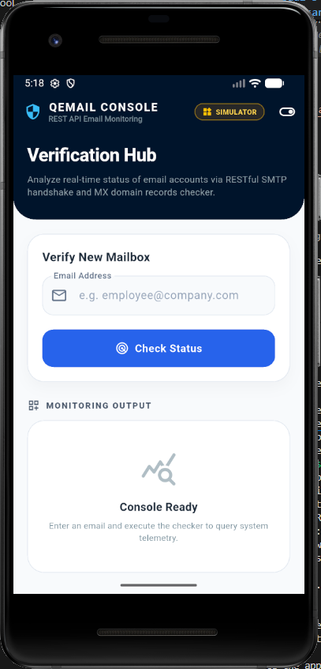
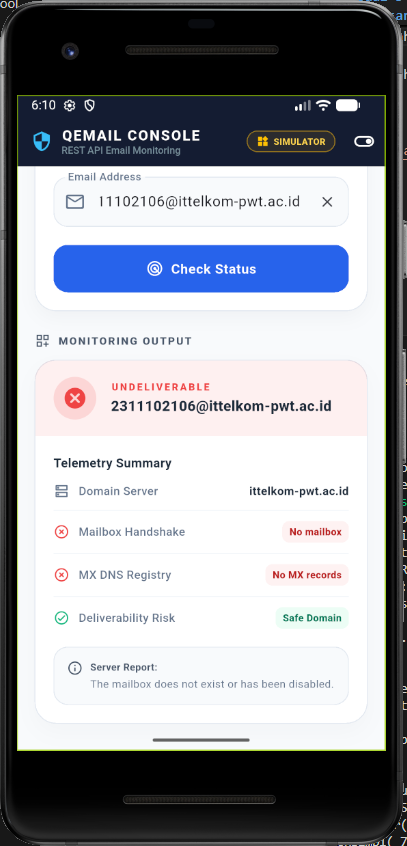

<div align="center">
    <br />
    <h1>LAPORAN PRAKTIKUM <br> APLIKASI BERBASIS PLATFORM </h1>
    <br />
    <h3>MODUL 5 & 6 <br> ANTARMUKA PENGGUNA & INTERAKSI PENGGUNA </h3>
    <br />
    
    <br />
    <br />
    <br />
    <h3>Disusun Oleh :</h3>
    <p>
        <strong>Syiva Qaila Natasa Sugama</strong>
        <br>
        <strong>2311102106</strong>
        <br>
        <strong>S1 IF-11-REG05</strong>
    </p>
    <br />
    <h3>Dosen Pengampu :</h3>
    <p>
        <strong>Dedi Agung Prabowo, S.Kom., M.Kom</strong>
    </p>
    <br />
    <br />
    <h4>Asisten Praktikum :</h4>
    <strong>Apri Pandu Wicaksono </strong>
    <br>
    <strong>Hamka Zaenul Ardi</strong>
    <br />
    <h3>LABORATORIUM HIGH PERFORMANCE <br>FAKULTAS INFORMATIKA <br>UNIVERSITAS TELKOM PURWOKERTO <br>2026 </h3>
</div>
<hr>

## Dasar Teori

## A. Taksonomi dan Karakteristik Antarmuka Pengguna (UI)
Dalam ranah rekayasa perangkat lunak, Antarmuka Pengguna atau User Interface (UI) didefinisikan sebagai lapisan arsitektur formal yang menghubungkan pengguna dengan logika internal suatu sistem. Di luar fungsi mekanisnya, UI modern mengadopsi prinsip Visual Hierarchies yang mengintegrasikan elemen-elemen grafis secara proporsional. Indikator kualitas dari perancangan antarmuka ini diukur berdasarkan tingkat konsistensi elemen visual, kontras warna yang memenuhi standar aksesibilitas, serta tipografi yang memiliki keterbacaan tinggi (readability). Melalui pendekatan representasi visual yang terstruktur, UI bertanggung jawab penuh untuk menyajikan ruang kerja digital yang bersih, komunikatif, dan memikat secara estetika.

## B. Dinamika dan Atribut Interaksi Pengguna (UX)
Sebagai pelengkap dari aspek visual, Interaksi Pengguna atau User Experience (UX) mencakup manifestasi psikologis dan perilaku pengguna terhadap efektivitas sistem. Kajian UX bertumpu pada lima pilar utama, yaitu kemudahan untuk dipelajari (learnability), efisiensi operasi, kemampuan retensi memori, tingkat kesalahan (error rate), dan kepuasan subjektif. Desain interaksi yang matang tidak sekadar berfokus pada apa yang dilihat pengguna, melainkan bagaimana pengguna merasa terbantu melalui feedback sistem yang instan, navigasi yang prediktif, serta penanganan kesalahan (error handling) yang solutif. Dengan demikian, UX memegang peranan krusial dalam menentukan nilai guna (usefulness) sebuah produk.

## C. Relasi Fungsional antara UI dan UX
Korelasi antara UI dan UX bersifat interdependen, di mana kegagalan pada salah satu aspek akan mendegradasi kualitas sistem secara keseluruhan. Secara konseptual, UI bertindak sebagai media penyampai pesan atau "wajah" dari sistem, sedangkan UX bertindak sebagai "otak" yang mengatur alur logika dan respons dari pesan tersebut. Produk teknologi yang optimal wajib mengawinkan estetika antarmuka dengan efisiensi interaksi guna menekan angka bounce rate dan meningkatkan retensi pengguna. Melalui sintesis yang seimbang antara keindahan visual UI dan kenyamanan fungsional UX, sebuah aplikasi dapat memberikan pengalaman digital yang bermakna, solutif, dan berkelanjutan.

## Tugas Modul 5 & 6

### 1. Source Code

```dart
// Syiva Qaila Natasa Sugama - 2311102106 - IF-11-05

import 'dart:convert';
import 'package:flutter/material.dart';
import 'package:http/http.dart' as http;

void main() {
  runApp(const MyApp());
}

class MyApp extends StatelessWidget {
  const MyApp({super.key});

  @override
  Widget build(BuildContext context) {
    return MaterialApp(
      debugShowCheckedModeBanner: false,
      title: 'QEmail Monitoring Console',
      theme: ThemeData(
        useMaterial3: true,
        fontFamily: 'Inter',
        colorScheme: ColorScheme.fromSeed(
          seedColor: const Color(0xFF1E3A8A), // Deep Royal Blue
          primary: const Color(0xFF0F172A),   // Dark Navy Blue
          secondary: const Color(0xFF2563EB), // Vibrant Blue
          surface: const Color(0xFFF8FAFC), // Slate White
        ),
        scaffoldBackgroundColor: const Color(0xFFF8FAFC),
      ),
      home: const EmailMonitorDashboard(),
    );
  }
}
```

**Kode Lengkap:** [lib/main.dart](lib/main.dart)

### 2. Penjelasan

Proyek ini adalah aplikasi konsol monitoring berbasis Flutter yang berfungsi untuk menganalisis dan memverifikasi status keaktifan serta validitas alamat email secara real-time melalui REST API. Aplikasi ini dilengkapi fitur pencarian data DNS MX serta simulasi jabat tangan SMTP (SMTP handshake) untuk mendeteksi apakah suatu email berstatus valid, palsu (disposable), atau tidak terdaftar.

### 3. Output


