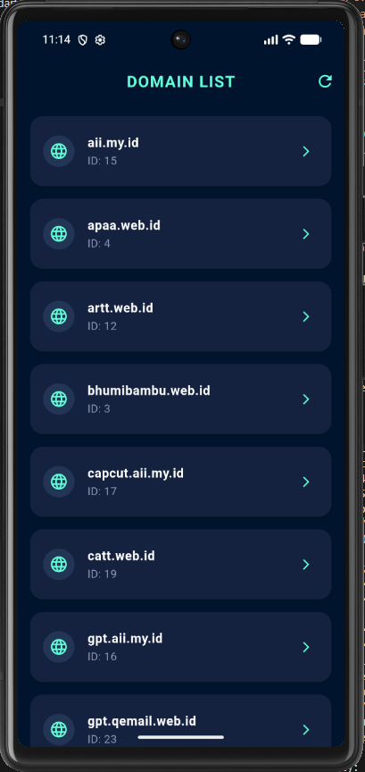

<div align="center">
    <br />
    <h1>LAPORAN PRAKTIKUM <br> APLIKASI BERBASIS PLATFORM </h1>
    <br />
    <h3>MODUL 5 & 6 <br> ANTARMUKA PENGGUNA & INTERAKSI PENGGUNA </h3>
    <br />
    
    <br />
    <br />
    <br />
    <h3>Disusun Oleh :</h3>
    <p>
        <strong>Wildan Fachri Dzulfikar</strong>
        <br>
        <strong>2311102107</strong>
        <br>
        <strong>S1 IF-11-REG05</strong>
    </p>
    <br />
    <h3>Dosen Pengampu :</h3>
    <p>
        <strong>Dedi Agung Prabowo, S.Kom., M.Kom</strong>
    </p>
    <br />
    <br />
    <h4>Asisten Praktikum :</h4>
    <strong>Apri Pandu Wicaksono </strong>
    <br>
    <strong>Hamka Zaenul Ardi</strong>
    <br />
    <h3>LABORATORIUM HIGH PERFORMANCE <br>FAKULTAS INFORMATIKA <br>UNIVERSITAS TELKOM PURWOKERTO <br>2026 </h3>
</div>
<hr>

## Dasar Teori

### 1. Antarmuka Pengguna (User Interface) dalam Flutter
Antarmuka Pengguna atau User Interface (UI) adalah bagian visual dari aplikasi yang menjembatani komunikasi antara pengguna dengan sistem komputer. Dalam ekosistem Flutter, UI dibangun menggunakan paradigma deklaratif, di mana tampilan aplikasi mencerminkan state atau kondisi data saat itu.

Komponen dasar pembentuk UI di Flutter disebut dengan Widget. Flutter menerapkan prinsip “Everything is a Widget”, mulai dari elemen struktural (seperti Scaffold, AppBar), elemen visual (Text, Icon, Image), hingga elemen tata letak atau layout (Column, Row, Card, Padding). Widget ini disusun secara hierarkis membentuk sebuah pohon komponen (Widget Tree). Untuk menjaga konsistensi visual, Flutter mengadopsi standar Material Design (untuk Android/Universal) dan Cupertino (untuk iOS) melalui penyediaan properti ThemeData yang mengatur skema warna (ColorScheme), tipografi (TextTheme), dan kecerahan (Brightness).

### 2. State Management: StatelessWidget vs StatefulWidget
Dalam merancang antarmuka yang dinamis, pemahaman mengenai manajemen state sangat krusial. Flutter membagi komponen UI menjadi dua jenis utama berdasarkan sifat perubahannya:

StatelessWidget: Widget statis yang tidak berubah setelah pertama kali dibangun (immutable). Komponen ini hanya bergantung pada data konfigurasi yang dioper dari parent widget-nya (misalnya komponen informasi statis atau detail layar yang datanya konstan).

StatefulWidget: Widget dinamis yang tampilannya dapat berubah secara real-time (mutable) merespons adanya interaksi pengguna atau perubahan data dari jaringan. Perubahan visual pada komponen ini dipicu oleh fungsi khusus bernama setState(), yang memerintahkan kerangka kerja (framework) Flutter untuk membangun ulang (rebuild) komponen UI terkait.

### 3. Asynchronous Data Handling (FutureBuilder)
Aplikasi modern umumnya mengandalkan data eksternal yang diambil melalui Application Programming Interface (API) melalui protokol HTTP. Karena proses pengambilan data ini membutuhkan waktu (latency) dan bersifat tidak langsung tersedia (asynchronous), Flutter menyediakan widget khusus bernama FutureBuilder.

FutureBuilder berfungsi untuk memantau status dari sebuah objek Future (proses latar belakang). Widget ini secara otomatis membaca snapshot koneksi dan membagi UI ke dalam tiga kondisi utama:

Waiting (Memuat): Menampilkan indikator loading (seperti CircularProgressIndicator) saat data sedang diunduh.

Error (Gagal): Menampilkan pesan kesalahan jika koneksi terputus atau API mengembalikan status kode kegagalan.

HasData (Berhasil): Menyusun data JSON yang telah dikonversi menjadi objek model (proses parsing menggunakan json.decode) ke dalam widget struktural seperti ListView.builder.

### 4. Interaksi Pengguna dan Navigasi Antar Halaman
Interaksi pengguna (User Interaction) mencakup bagaimana sistem merespons masukan fisik dari pengguna pada layar sentuh. Flutter menyediakan berbagai widget interaktif seperti InkWell atau GestureDetector untuk mendeteksi ketukan (onTap), sentuhan lama (onLongPress), maupun geseran. Widget InkWell memberikan efek visual berupa riak air (ripple effect) khas Material Design saat ditekan, memberikan umpan balik (feedback) instan bahwa sistem sedang memproses aksi pengguna.

Untuk menghubungkan interaksi tersebut dengan perpindahan halaman, digunakan komponen Navigator. Navigasi di Flutter memanfaatkan struktur tumpukan data (Struktur Stack):

Navigator.push() digunakan untuk menumpuk halaman baru (misalnya berpindah dari daftar utama ke halaman detail).

Navigator.pop() digunakan untuk menghancurkan halaman teratas dan kembali ke halaman sebelumnya.

Guna meningkatkan pengalaman pengguna (User Experience/UX), perpindahan ini dapat dipermanis menggunakan widget Hero. Widget ini memberikan efek animasi transisi elemen visual (seperti ikon atau gambar) yang seolah-olah terbang melintasi halaman lama menuju halaman baru berdasarkan kunci identitas (tag) yang unik.

## Tugas Modul 5 & 6 

### 1. Source Code

```dart
import 'dart:convert';
import 'package:flutter/material.dart';
import 'package:http/http.dart' as http;

// Wildan Fachri Dzulfikar 2311102107 IF-11-05
void main() {
  runApp(const DomainApp());
}

class DomainApp extends StatelessWidget {
  const DomainApp({super.key});

  @override
  Widget build(BuildContext context) {
    return MaterialApp(
      title: 'Domain Explorer',
      debugShowCheckedModeBanner: false,
      theme: ThemeData(
        brightness: Brightness.dark,
        primaryColor: const Color(0xFF0A192F), // Navy
        scaffoldBackgroundColor: const Color(0xFF0A192F),
        appBarTheme: const AppBarTheme(
          backgroundColor: Color(0xFF0A192F),
          elevation: 0,
          centerTitle: true,
          iconTheme: IconThemeData(color: Color(0xFF64FFDA)), // Cyan
          titleTextStyle: TextStyle(
            color: Color(0xFF64FFDA),
            fontSize: 20,
            fontWeight: FontWeight.bold,
            letterSpacing: 1.2,
          ),
        ),
        colorScheme: const ColorScheme.dark(
          primary: Color(0xFF64FFDA),
          secondary: Color(0xFF64FFDA),
          surface: Color(0xFF112240),
        ),
        textTheme: const TextTheme(
          bodyLarge: TextStyle(color: Colors.white),
          bodyMedium: TextStyle(color: Colors.white70),
        ),
      ),
      home: const DomainListScreen(),
    );
  }
}

class DomainModel {
  final int id;
  final String name;

  DomainModel({required this.id, required this.name});

  factory DomainModel.fromJson(Map<String, dynamic> json) {
    return DomainModel(
      id: json['id'],
      name: json['name'],
    );
  }
}

class ApiService {
  static const String baseUrl = 'https://api.qemail.web.id/v1/email/domains';

  static Future<List<DomainModel>> fetchDomains() async {
    try {
      final response = await http.get(Uri.parse(baseUrl));
      if (response.statusCode == 200) {
        // Parse response body (list of JSON objects)
        List<dynamic> jsonList = json.decode(response.body);
        return jsonList.map((json) => DomainModel.fromJson(json)).toList();
      } else {
        throw Exception('Gagal memuat data (Status Code: ${response.statusCode})');
      }
    } catch (e) {
      throw Exception('Terjadi kesalahan koneksi: $e');
    }
  }
}
```

**Kode Lengkap:** [lib/main.dart](lib/main.dart)

### 2. Penjelasan
Proyek Flutter bernama Domain Explorer ini berfungsi untuk menampilkan dan mengeksplorasi daftar nama domain yang diambil secara real-time dari sebuah API web service. Aplikasi ini menggunakan arsitektur minimalis yang memisahkan model data (DomainModel), layanan API (ApiService), serta antarmuka UI dengan transisi animasi Hero dan tema gelap bernuansa futuristik.

### 3. Output

