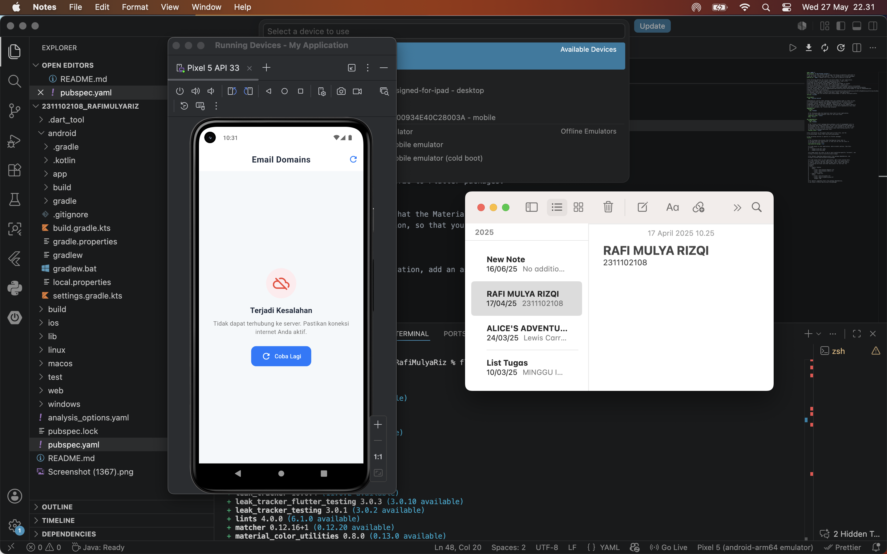

<div align="center">
    <br />
    <h1>LAPORAN PRAKTIKUM <br> APLIKASI BERBASIS PLATFORM </h1>
    <br />
    <h3>MODUL 5 & 6 <br> ANTARMUKA PENGGUNA & INTERAKSI PENGGUNA </h3>
    <br />
    
    <br />
    <br />
    <br />
    <h3>Disusun Oleh :</h3>
    <p>
        <strong>Rafi Mulya Rizqi</strong>
        <br>
        <strong>2311102108</strong>
        <br>
        <strong>S1 IF-11-REG05</strong>
    </p>
    <br />
    <h3>Dosen Pengampu :</h3>
    <p>
        <strong>Dedi Agung Prabowo, S.Kom., M.Kom</strong>
    </p>
    <br />
    <br />
    <h4>Asisten Praktikum :</h4>
    <strong>Apri Pandu Wicaksono </strong>
    <br>
    <strong>Hamka Zaenul Ardi</strong>
    <br />
    <h3>LABORATORIUM HIGH PERFORMANCE <br>FAKULTAS INFORMATIKA <br>UNIVERSITAS TELKOM PURWOKERTO <br>2026 </h3>
</div>
<hr>

## Dasar Teori

## 1. Antarmuka Pengguna (User Interface / UI)
Antarmuka Pengguna atau User Interface (UI) merupakan media komunikasi visual yang menghubungkan pengguna (user) dengan sistem operasi atau perangkat lunak. UI mencakup seluruh elemen yang dapat dilihat dan berinteraksi langsung dengan pengguna, seperti tata letak layar, tombol, ikon, tipografi, pemilihan warna, hingga animasi transisi. Dalam pengembangan aplikasi modern, desain UI tidak hanya berfokus pada estetika atau keindahan visual semata, melainkan juga pada kejelasan struktur informasi. Antarmuka yang dirancang dengan baik harus bersifat intuitif, sehingga pengguna dapat memahami fungsi setiap elemen di dalam aplikasi tanpa memerlukan pelatihan yang rumit.

## 2. Interaksi Pengguna (User Interaction / UX)
Interaksi Pengguna menjembatani tindakan manusia dengan respons yang diberikan oleh sistem komputer. Aspek ini berfokus pada bagaimana pengguna menjelajahi aplikasi, melakukan input data, dan menerima umpan balik (feedback) dari sistem, baik berupa getaran, perubahan warna tombol, maupun munculnya indikator pemuatan data (loading indicator). Prinsip utama dari interaksi yang efektif adalah efisiensi dan konsistensi, di mana setiap aksi pengguna harus menghasilkan reaksi sistem yang dapat diprediksi dan meminimalkan beban kognitif. Melalui perancangan interaksi yang matang, aplikasi dapat memberikan pengalaman yang mulus (seamless), sehingga pengguna merasa memegang kendali penuh atas sistem yang mereka gunakan.

## 3. Hubungan UI/UX dalam Pengembangan Aplikasi
Antarmuka Pengguna dan Interaksi Pengguna merupakan dua komponen yang saling terikat dan tidak dapat dipisahkan dalam menciptakan produk digital yang sukses. Desain UI yang menarik secara visual tidak akan berfungsi optimal jika tidak didukung oleh alur interaksi yang logis dan responsif. Sebaliknya, sistem dengan fungsi yang canggih akan sulit diadopsi oleh pengguna jika antarmukanya membingungkan dan tidak tertata dengan rapi. Oleh karena itu, sinergi antara visual yang bersih (clean) dan respons sistem yang cepat sangat krusial untuk membangun kenyamanan serta mempertahankan retensi pengguna dalam menggunakan sebuah aplikasi.

## Tugas Modul 5 & 6 - Email

### 1. Source Code

```dart
void main() {
  runApp(const QEmailApp());
}

class QEmailApp extends StatelessWidget {
  const QEmailApp({super.key});

  @override
  Widget build(BuildContext context) {
    return MaterialApp(
      ...
      ),
      home: const HomeScreen(),
    );
  }
}
```

**Kode Lengkap:** [lib/main.dart](lib/main.dart)

### 2. Penjelasan

Proyek Flutter ini dirancang sebagai panduan praktis untuk mempelajari cara mengambil data dari REST API secara real-time menggunakan package http dan menampilkannya langsung ke dalam UI menggunakan FutureBuilder. Dengan arsitektur yang sederhana dan tanpa state management kompleks, proyek ini berfokus pada pemahaman alur data dasar, mulai dari proses request ke server hingga penanganan kondisi loading dan error.

### 3. Output

