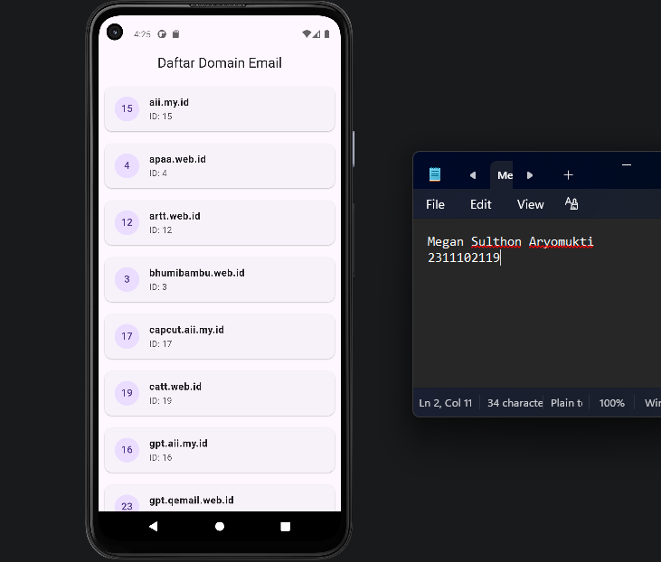

<div align="center">
  <br />
  <h1>LAPORAN PRAKTIKUM <br> APLIKASI BERBASIS PLATFORM </h1>
  <br />
  <h3>MODUL 5 & 6 <br> Flutter </h3>
  <br />
  
  <br />
  <br />
  <br />
  <h3>Disusun Oleh :</h3>
  <p>
    <strong>Megan Sulthon Aryomukti</strong>
    <br>
    <strong>2311102119</strong>
    <br>
    <strong>S1 IF-11-REG05</strong>
  </p>
  <br />
  <h3>Dosen Pengampu :</h3>
  <p>
    <strong>Dedi Agung Prabowo, S.Kom., M.Kom</strong>
  </p>
  <br />
  <br />
  <h4>Asisten Praktikum :</h4>
  <strong>Apri Pandu Wicaksono </strong>
  <br>
  <strong>Hamka Zaenul Ardi</strong>
  <br />
  <h3>LABORATORIUM HIGH PERFORMANCE <br>FAKULTAS INFORMATIKA <br>UNIVERSITAS TELKOM PURWOKERTO <br>2026 </h3>
</div>

<hr>

# Dasar Teori

<p align="justify">
Flutter merupakan framework open-source yang dikembangkan oleh Google Flutter untuk membangun aplikasi mobile menggunakan bahasa pemrograman Dart. Flutter menyediakan berbagai widget seperti Column dan Row untuk menyusun tampilan antarmuka aplikasi secara fleksibel. Dalam pengembangan aplikasi modern, API (Application Programming Interface) digunakan sebagai media pertukaran data antara aplikasi dan server melalui internet. Pada praktikum ini proses pengambilan data dilakukan menggunakan metode HTTP GET dengan bantuan library http package Flutter untuk melakukan fetch API dari QEmail API Documentation menggunakan endpoint Domains Endpoint. Data yang diterima dari server berupa format JSON berisi id dan name kemudian diubah menjadi object model pada Flutter agar dapat ditampilkan pada aplikasi secara dinamis dan real-time.
</p>

## Source Code 
```dart
import 'dart:convert';
import 'package:flutter/material.dart';
import 'package:http/http.dart' as http;

void main() {
  runApp(const MyApp());
}

class MyApp extends StatelessWidget {
  const MyApp({super.key});

  Future<List<dynamic>> fetchDomains() async {
    final response = await http.get(
      Uri.parse('https://api.qemail.web.id/v1/email/domains'),
    );

    if (response.statusCode == 200) {
      return jsonDecode(response.body);
    } else {
      throw Exception('Gagal mengambil data dari API');
    }
  }

  @override
  Widget build(BuildContext context) {
    return MaterialApp(
      debugShowCheckedModeBanner: false,
      home: Scaffold(
        appBar: AppBar(
          title: const Text('Daftar Domain Email'),
          centerTitle: true,
        ),
        body: FutureBuilder<List<dynamic>>(
          future: fetchDomains(),
          builder: (context, snapshot) {
            if (snapshot.connectionState == ConnectionState.waiting) {
              return const Center(
                child: CircularProgressIndicator(),
              );
            }

            if (snapshot.hasError) {
              return Center(
                child: Text('Terjadi error: ${snapshot.error}'),
              );
            }

            final domains = snapshot.data ?? [];

            return SingleChildScrollView(
              child: Column(
                children: domains.map((domain) {
                  return Card(
                    margin: const EdgeInsets.all(10),
                    child: ListTile(
                      leading: CircleAvatar(
                        child: Text(domain['id'].toString()),
                      ),
                      title: Text(
                        domain['name'].toString(),
                        style: const TextStyle(
                          fontWeight: FontWeight.bold,
                        ),
                      ),
                      subtitle: Text('ID: ${domain['id']}'),
                    ),
                  );
                }).toList(),
              ),
            );
          },
        ),
      ),
    );
  }
}
```
# Screenshots Output

# Penjelasan
<p align="justify">
Output aplikasi menampilkan daftar domain email yang berhasil diambil dari endpoint QEmail API. Data yang ditampilkan berupa id dan name sesuai dengan response dari API. Pada tampilan emulator, setiap data domain ditampilkan dalam bentuk card. Bagian kiri menampilkan id domain, sedangkan bagian kanan menampilkan nama domain seperti aii.my.id, apaa.web.id, artt.web.id, dan bhumibambu.web.id. </p> <p align="justify"> Tampilan data disusun secara vertikal sehingga pengguna dapat melihat daftar domain dengan rapi. Aplikasi berhasil melakukan fetch API menggunakan library http dan menampilkan data secara dinamis pada emulator Android
</p>