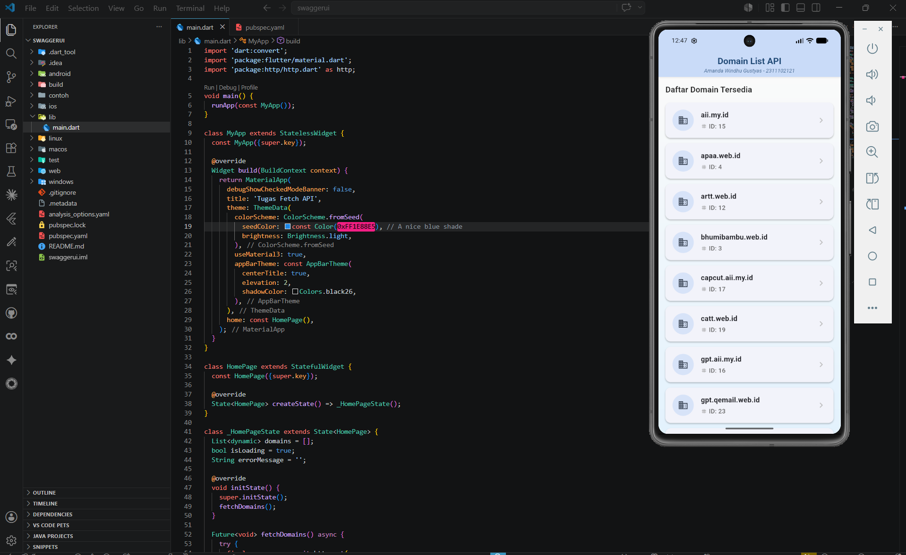

<div align="center">
  <br />
  <h1>LAPORAN PRAKTIKUM <br> APLIKASI BERBASIS PLATFORM </h1>
  <br />
  <h3>MODUL 5 - 6 <br> Flutter API</h3>
  <br />
  
  <br />
  <br />
  <br />
  <h3>Disusun Oleh :</h3>
  <p>
    <strong>Amanda Windhu Gustyas</strong>
    <br>
    <strong>2311102121</strong>
    <br>
    <strong>S1 IF-11-REG05</strong>
  </p>
  <br />
  <h3>Dosen Pengampu :</h3>
  <p>
    <strong>Dedi Agung Prabowo, S.Kom., M.Kom</strong>
  </p>
  <br />
  <br />
  <h4>Asisten Praktikum :</h4>
  <strong>Apri Pandu Wicaksono</strong>
  <br>
  <strong>Hamka Zaenul Ardi</strong>
  <br />
  <h3>LABORATORIUM HIGH PERFORMANCE <br>FAKULTAS INFORMATIKA <br>UNIVERSITAS TELKOM PURWOKERTO <br>2026 </h3>
</div>

<hr>

---

# Dasar Teori

## 1. Flutter

Flutter adalah framework open-source buatan Google yang digunakan untuk membangun aplikasi mobile, web, dan desktop dari satu basis kode (codebase). Flutter menggunakan bahasa pemrograman Dart dan menyediakan banyak widget bawaan yang mempermudah proses pembuatan antarmuka pengguna (UI).

---

## 2. API (Application Programming Interface) & HTTP Package

API adalah sekumpulan aturan dan protokol yang memungkinkan berbagai perangkat lunak saling berkomunikasi. Dalam pengembangan aplikasi mobile, API sering digunakan untuk mengambil data dari server secara dinamis.

Pada Flutter, package `http` adalah library standar yang sangat populer digunakan untuk melakukan HTTP request seperti GET, POST, PUT, dan DELETE. Package ini mempermudah proses integrasi aplikasi dengan web service atau RESTful API.

---

## 3. Asynchronous Programming di Dart

Pengambilan data dari internet (API) memerlukan waktu (delay), sehingga Dart menggunakan pendekatan asynchronous (non-blocking). Dengan menggunakan `Future`, `async`, dan `await`, aplikasi dapat menunggu data selesai diunduh tanpa membuat UI terhenti (freeze). 

Dalam praktikum ini, penggunaan `Future<void>` dan `await http.get()` memastikan bahwa proses render UI tetap lancar sementara data sedang diambil di latar belakang.

---

## 4. Column dan SingleChildScrollView

Column adalah widget tata letak yang menyusun anak-anaknya secara vertikal. Ketika konten di dalam Column melebihi tinggi layar, maka perlu dibungkus dengan SingleChildScrollView agar konten dapat di-scroll oleh pengguna. 

Membungkus `SingleChildScrollView` dengan `ScrollConfiguration` dan mengatur `overscroll: false` dapat membantu mematikan efek pantulan (bounce) atau tarikan (stretch) yang biasanya terjadi ketika _scroll_ sudah mencapai ujung layar, memberikan kontrol penuh pada animasi _scroll_.

---

# Soal:

Aplikasi ini ditugaskan untuk melakukan _fetch API_ dari endpoint yang telah ditentukan yaitu `https://api.qemail.web.id/v1/email/domains`. Aplikasi harus dibuat menggunakan framework Flutter dan menampilkan data *response* (berupa `id` dan `name`) ke dalam bentuk baris atau kolom yang rapi (menggunakan `Row` atau `Column`).

Terdapat ketentuan khusus untuk mendesain layout senyaman mungkin (rapi), mematikan efek memantul/stretch saat *scroll* mencapai batas layar, serta menambahkan *watermark* berupa Nama dan NIM pada AppBar.

---

# Tugas — Flutter API

## Source Code Utama

### a. File `main.dart`

```dart
import 'dart:convert';
import 'package:flutter/material.dart';
import 'package:http/http.dart' as http;

void main() {
  runApp(const MyApp());
}

class MyApp extends StatelessWidget {
  const MyApp({super.key});

  @override
  Widget build(BuildContext context) {
    return MaterialApp(
      debugShowCheckedModeBanner: false,
      title: 'Tugas Fetch API',
      theme: ThemeData(
        colorScheme: ColorScheme.fromSeed(
          seedColor: const Color(0xFF1E88E5), // A nice blue shade
          brightness: Brightness.light,
        ),
        useMaterial3: true,
        appBarTheme: const AppBarTheme(
          centerTitle: true,
          elevation: 2,
          shadowColor: Colors.black26,
        ),
      ),
      home: const HomePage(),
    );
  }
}

class HomePage extends StatefulWidget {
  const HomePage({super.key});

  @override
  State<HomePage> createState() => _HomePageState();
}

class _HomePageState extends State<HomePage> {
  List<dynamic> domains = [];
  bool isLoading = true;
  String errorMessage = '';

  @override
  void initState() {
    super.initState();
    fetchDomains();
  }

  Future<void> fetchDomains() async {
    try {
      final response = await http.get(
        Uri.parse('https://api.qemail.web.id/v1/email/domains'),
      );
      if (response.statusCode == 200) {
        final data = json.decode(response.body);
        setState(() {
          if (data is List) {
            domains = data;
          } else {
            domains = [];
            errorMessage = 'Format data tidak sesuai.';
          }
          isLoading = false;
        });
      } else {
        setState(() {
          errorMessage = 'Gagal memuat data: ${response.statusCode}';
          isLoading = false;
        });
      }
    } catch (e) {
      setState(() {
        errorMessage = 'Terjadi kesalahan saat memuat data.';
        isLoading = false;
      });
    }
  }

  @override
  Widget build(BuildContext context) {
    return Scaffold(
      appBar: AppBar(
        title: Column(
          children: [
            const Text(
              'Domain List API',
              style: TextStyle(fontWeight: FontWeight.bold, fontSize: 20),
            ),
            const SizedBox(height: 2),
            Text(
              'Amanda Windhu Gustyas - 2311102121',
              style: TextStyle(
                fontSize: 12,
                color: Theme.of(
                  context,
                ).colorScheme.onPrimaryContainer.withOpacity(0.8),
                fontStyle: FontStyle.italic,
              ),
            ),
          ],
        ),
        backgroundColor: Theme.of(context).colorScheme.primaryContainer,
        foregroundColor: Theme.of(context).colorScheme.onPrimaryContainer,
      ),
      body: Container(
        decoration: BoxDecoration(
          gradient: LinearGradient(
            colors: [Colors.grey[50]!, Colors.blue[50]!],
            begin: Alignment.topCenter,
            end: Alignment.bottomCenter,
          ),
        ),
        child: isLoading
            ? const Center(child: CircularProgressIndicator())
            : errorMessage.isNotEmpty
            ? Center(
                child: Padding(
                  padding: const EdgeInsets.all(16.0),
                  child: Column(
                    mainAxisAlignment: MainAxisAlignment.center,
                    children: [
                      const Icon(
                        Icons.error_outline,
                        color: Colors.red,
                        size: 48,
                      ),
                      const SizedBox(height: 16),
                      Text(
                        errorMessage,
                        style: const TextStyle(fontSize: 16, color: Colors.red),
                        textAlign: TextAlign.center,
                      ),
                      const SizedBox(height: 16),
                      ElevatedButton.icon(
                        onPressed: () {
                          setState(() {
                            isLoading = true;
                            errorMessage = '';
                          });
                          fetchDomains();
                        },
                        icon: const Icon(Icons.refresh),
                        label: const Text('Coba Lagi'),
                      ),
                    ],
                  ),
                ),
              )
            : domains.isEmpty
            ? const Center(child: Text('Tidak ada data domain.'))
            : ScrollConfiguration(
                behavior: ScrollConfiguration.of(context).copyWith(overscroll: false),
                child: SingleChildScrollView(
                  physics: const ClampingScrollPhysics(),
                  child: Padding(
                    padding: const EdgeInsets.all(16.0),
                    child: Column(
                      crossAxisAlignment: CrossAxisAlignment.stretch,
                    children: [
                      const Padding(
                        padding: EdgeInsets.only(bottom: 16.0),
                        child: Text(
                          'Daftar Domain Tersedia',
                          style: TextStyle(
                            fontSize: 18,
                            fontWeight: FontWeight.w600,
                            color: Colors.black87,
                          ),
                        ),
                      ),
                      // Disini mengimplementasikan Column yang berisi baris-baris data dari API
                      Column(
                        children: domains.map((domain) {
                          return Card(
                            elevation: 2,
                            margin: const EdgeInsets.only(bottom: 12),
                            shape: RoundedRectangleBorder(
                              borderRadius: BorderRadius.circular(12),
                            ),
                            child: Padding(
                              padding: const EdgeInsets.all(16.0),
                              child: Row(
                                children: [
                                  Container(
                                    padding: const EdgeInsets.all(12),
                                    decoration: BoxDecoration(
                                      color: Theme.of(
                                        context,
                                      ).colorScheme.secondaryContainer,
                                      shape: BoxShape.circle,
                                    ),
                                    child: Icon(
                                      Icons.domain,
                                      color: Theme.of(
                                        context,
                                      ).colorScheme.onSecondaryContainer,
                                    ),
                                  ),
                                  const SizedBox(width: 16),
                                  Expanded(
                                    child: Column(
                                      crossAxisAlignment:
                                          CrossAxisAlignment.start,
                                      children: [
                                        Text(
                                          domain['name'] ?? 'Unknown Name',
                                          style: const TextStyle(
                                            fontSize: 16,
                                            fontWeight: FontWeight.bold,
                                          ),
                                        ),
                                        const SizedBox(height: 4),
                                        Row(
                                          children: [
                                            const Icon(
                                              Icons.tag,
                                              size: 14,
                                              color: Colors.grey,
                                            ),
                                            const SizedBox(width: 4),
                                            Text(
                                              'ID: ${domain['id'] ?? '-'}',
                                              style: TextStyle(
                                                fontSize: 14,
                                                color: Colors.grey[700],
                                                fontWeight: FontWeight.w500,
                                              ),
                                            ),
                                          ],
                                        ),
                                      ],
                                    ),
                                  ),
                                  Icon(
                                    Icons.chevron_right,
                                    color: Colors.grey[400],
                                  ),
                                ],
                              ),
                            ),
                          );
                        }).toList(),
                      ),
                    ],
                  ),
                ),
              ),
            ),
      ),
    );
  }
}
```

---

# Penjelasan Program

Program ini dibuat menggunakan Flutter untuk mendemonstrasikan proses _Fetching API_ menggunakan metode HTTP GET. 

Pada saat aplikasi dijalankan, layar utama (`HomePage`) akan menampilkan indikator _loading_ (`CircularProgressIndicator`). Di latar belakang, fungsi `fetchDomains()` dipanggil pada _lifecycle_ `initState()`. Fungsi ini akan melakukan request ke endpoint API `https://api.qemail.web.id/v1/email/domains` menggunakan library `http`. Data JSON yang diterima kemudian di-decode dan dimasukkan ke dalam List `domains`. Apabila terjadi _error_ atau koneksi gagal, aplikasi akan menampilkan pesan peringatan beserta tombol "Coba Lagi" (`Refresh`).

Setelah data berhasil di-_fetch_, UI akan di-render ulang menggunakan `setState()`. Data domain ditampilkan dengan memanfaatkan widget `Column` dan perulangan `.map()` untuk mengubah setiap item menjadi `Card`. Setiap kartu memuat ikon yang dibungkus `Container` bulat, serta susunan `Row` dan `Column` untuk menata ID dan nama domain agar rapi.

Untuk layarnya sendiri, dibungkus menggunakan `SingleChildScrollView` dengan _physics_ `ClampingScrollPhysics()`. Selain itu, saya menggunakan trik _wrapping_ dengan `ScrollConfiguration` yang di set `overscroll: false` untuk memastikan pergerakan *scroll* berhenti seketika di akhir daftar tanpa adanya efek memantul (_bounce_) ataupun melonjong (_stretch_). Terakhir, saya juga membuat *watermark* berupa Nama (Amanda Windhu Gustyas) dan NIM (2311102121) pada bagian *AppBar*.

---

# Output

