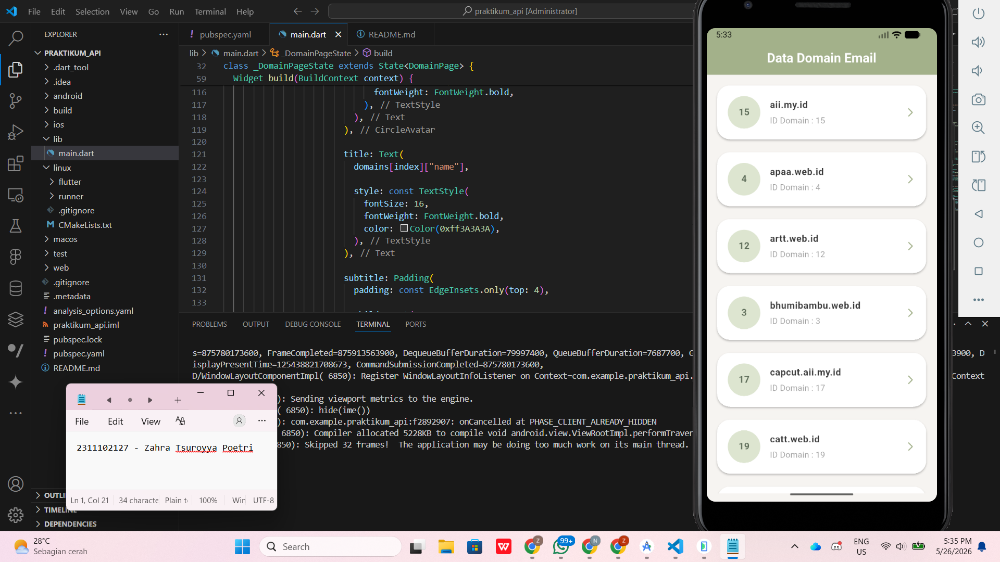

<div align="center">
  <br />
  <h1>LAPORAN PRAKTIKUM <br> APLIKASI BERBASIS PLATFORM </h1>
  <br />
  <h3>MODUL 5 & 6 <br> ANTARMUKA PENGGUNA & INTERAKSI PENGGUNA </h3>
  <br />
  
  <br />
  <br />
  <br />
  <h3>Disusun Oleh :</h3>
  <p>
    <strong>Zahra Tsuroyya Poetri</strong>
    <br>
    <strong>2311102127</strong>
    <br>
    <strong>S1 IF-11-REG05</strong>
  </p>
  <br />
  <h3>Dosen Pengampu :</h3>
  <p>
    <strong>Dedi Agung Prabowo, S.Kom., M.Kom</strong>
  </p>
  <br />
  <br />
  <h4>Asisten Praktikum :</h4>
  <strong>Apri Pandu Wicaksono </strong>
  <br>
  <strong>Hamka Zaenul Ardi</strong>
  <br />
  <h3>LABORATORIUM HIGH PERFORMANCE <br>FAKULTAS INFORMATIKA <br>UNIVERSITAS TELKOM PURWOKERTO <br>2026</h3>
</div>

<hr>

### Dasar Teori
### 1. Antarmuka Pengguna (User Interface / UI)
Antarmuka Pengguna atau User Interface (UI) merupakan tampilan visual yang digunakan sebagai media interaksi antara pengguna dengan aplikasi. UI mencakup berbagai elemen visual seperti teks, tombol, ikon, warna, layout, dan navigasi yang dirancang agar aplikasi mudah digunakan dan dipahami oleh pengguna.

Dalam pengembangan aplikasi mobile, desain UI memiliki peran penting untuk menciptakan tampilan yang menarik, rapi, dan nyaman digunakan. Tampilan antarmuka yang baik dapat membantu pengguna memahami fungsi aplikasi dengan lebih mudah serta meningkatkan pengalaman pengguna saat menggunakan aplikasi.

### 2. Interaksi Pengguna (User Interaction / UX)
Interaksi Pengguna atau User Experience (UX) merupakan proses komunikasi antara pengguna dengan sistem melalui tindakan dan respons yang diberikan aplikasi. Interaksi ini meliputi proses pengguna menekan tombol, melakukan navigasi, scrolling, hingga menerima umpan balik dari sistem seperti loading indicator atau perubahan tampilan.

Perancangan interaksi yang baik bertujuan untuk memberikan pengalaman penggunaan yang efisien, konsisten, dan mudah dipahami. Dengan UX yang baik, pengguna dapat menggunakan aplikasi secara lebih nyaman tanpa mengalami kebingungan saat menjalankan fitur-fitur yang tersedia.

### 3. Flutter
Flutter merupakan framework open-source yang dikembangkan oleh Google untuk membangun aplikasi mobile, web, dan desktop menggunakan satu basis kode (single codebase). Flutter menggunakan bahasa pemrograman Dart dan menerapkan konsep widget sebagai dasar pembentukan antarmuka aplikasi.

Flutter memiliki keunggulan dalam pengembangan antarmuka karena mendukung fitur hot reload, sehingga perubahan tampilan dapat langsung terlihat tanpa perlu menjalankan ulang aplikasi secara penuh.

### 4. Widget pada Flutter
Widget merupakan komponen utama pada Flutter yang digunakan untuk membangun tampilan aplikasi. Seluruh elemen antarmuka seperti teks, gambar, tombol, maupun layout dibangun menggunakan widget. Setiap widget memiliki fungsi dan konfigurasi tersendiri untuk mengatur tampilan aplikasi.

Flutter membagi widget menjadi dua jenis utama, yaitu StatelessWidget dan StatefulWidget. StatelessWidget digunakan untuk tampilan yang bersifat tetap, sedangkan StatefulWidget digunakan ketika tampilan dapat berubah sesuai kondisi tertentu.

### 5. Container
Container merupakan widget pada Flutter yang digunakan untuk membuat elemen visual berbentuk kotak. Widget ini dapat diberikan warna, margin, padding, border, maupun dekorasi lainnya untuk mempercantik tampilan antarmuka aplikasi.

Container sering digunakan dalam pembuatan layout aplikasi karena membantu mengatur posisi dan jarak antar komponen agar tampilan menjadi lebih rapi dan terstruktur.

### 6. ListView.builder
ListView merupakan widget yang digunakan untuk menampilkan kumpulan data secara vertikal dan dapat di-scroll. Salah satu jenis ListView yang umum digunakan adalah ListView.builder, yaitu widget yang membangun item secara dinamis berdasarkan jumlah data yang tersedia.

Penggunaan ListView.builder lebih efisien untuk menampilkan data dalam jumlah banyak karena item hanya dibuat ketika diperlukan. Widget ini memerlukan parameter itemBuilder dan itemCount untuk menentukan isi dan jumlah data yang akan ditampilkan.

## Tugas 5 & 6 - Email

### Source Code - main.dart

```dart
import 'dart:convert';
import 'package:flutter/material.dart';
import 'package:http/http.dart' as http;

void main() {
  runApp(const MyApp());
}

class MyApp extends StatelessWidget {
  const MyApp({super.key});

  @override
  Widget build(BuildContext context) {
    return MaterialApp(
      debugShowCheckedModeBanner: false,
      title: 'Domain Email',
      theme: ThemeData(
        fontFamily: 'Roboto',
      ),
      home: const DomainPage(),
    );
  }
}

class DomainPage extends StatefulWidget {
  const DomainPage({super.key});

  @override
  State<DomainPage> createState() => _DomainPageState();
}

class _DomainPageState extends State<DomainPage> {
  List domains = [];
  bool isLoading = true;

  @override
  void initState() {
    super.initState();
    fetchDomains();
  }

  Future<void> fetchDomains() async {
    final url =
        Uri.parse('https://api.qemail.web.id/v1/email/domains');

    final response = await http.get(url);

    if (response.statusCode == 200) {
      final data = jsonDecode(response.body);

      setState(() {
        domains = data;
        isLoading = false;
      });
    }
  }

  @override
  Widget build(BuildContext context) {
    return Scaffold(
      backgroundColor: const Color(0xffF6F4F1),

      appBar: AppBar(
        backgroundColor: const Color(0xffA3B18A),
        elevation: 0,
        centerTitle: true,

        title: const Text(
          "Data Domain Email",
          style: TextStyle(
            color: Colors.white,
            fontWeight: FontWeight.bold,
          ),
        ),
      ),

      body: isLoading
          ? const Center(
              child: CircularProgressIndicator(),
            )
          : Padding(
              padding: const EdgeInsets.all(14),

              child: ListView.builder(
                itemCount: domains.length,

                itemBuilder: (context, index) {
                  return Container(
                    margin: const EdgeInsets.only(bottom: 14),

                    child: Card(
                      color: Colors.white,
                      elevation: 2,

                      shape: RoundedRectangleBorder(
                        borderRadius: BorderRadius.circular(22),
                      ),

                      child: ListTile(
                        contentPadding:
                            const EdgeInsets.symmetric(
                          horizontal: 18,
                          vertical: 10,
                        ),

                        leading: CircleAvatar(
                          radius: 28,
                          backgroundColor:
                              const Color(0xffDDE5D0),

                          child: Text(
                            domains[index]["id"].toString(),

                            style: const TextStyle(
                              color: Color(0xff5C6B57),
                              fontWeight: FontWeight.bold,
                            ),
                          ),
                        ),

                        title: Text(
                          domains[index]["name"],

                          style: const TextStyle(
                            fontSize: 16,
                            fontWeight: FontWeight.bold,
                            color: Color(0xff3A3A3A),
                          ),
                        ),

                        subtitle: Padding(
                          padding: const EdgeInsets.only(top: 4),

                          child: Text(
                            "ID Domain : ${domains[index]["id"]}",

                            style: const TextStyle(
                              color: Colors.grey,
                            ),
                          ),
                        ),

                        trailing: const Icon(
                          Icons.arrow_forward_ios_rounded,
                          color: Color(0xffA3B18A),
                          size: 18,
                        ),
                      ),
                    ),
                  );
                },
              ),
            ),
    );
  }
}
```

### Hasil Output



### Deskripsi Kode

Kode tersebut merupakan aplikasi mobile sederhana berbasis Flutter yang digunakan untuk menampilkan data domain email dari API. Aplikasi memanfaatkan library http untuk melakukan fetch data dari endpoint https://api.qemail.web.id/v1/email/domains. Data yang ditampilkan berupa id dan name dari setiap domain email.

Cara kerjanya, aplikasi dijalankan melalui fungsi main() yang memanggil widget utama MyApp. Selanjutnya, halaman DomainPage menggunakan StatefulWidget agar tampilan dapat diperbarui ketika data berhasil diambil dari API. Proses pengambilan data dilakukan pada fungsi fetchDomains() menggunakan method http.get(), kemudian data yang diterima disimpan ke dalam variabel domains untuk ditampilkan pada halaman aplikasi.

Hasil output berupa aplikasi mobile dengan tampilan antarmuka sederhana dan modern menggunakan widget seperti AppBar, Card, dan ListView.builder. Data domain email ditampilkan secara vertikal dalam bentuk card yang berisi ID domain dan nama domain.
