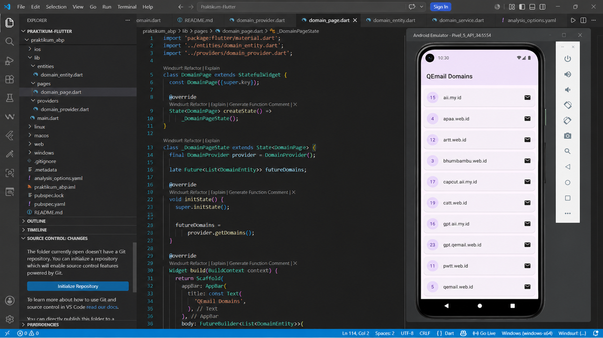
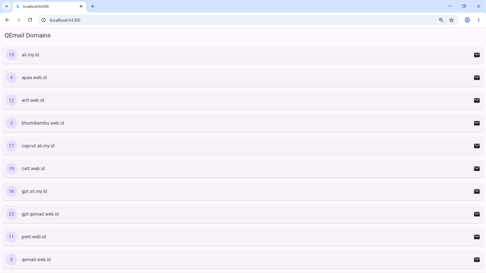

<div align="center">
    <br />
    <h1>LAPORAN PRAKTIKUM <br> APLIKASI BERBASIS PLATFORM </h1>
    <br />
    <h3>MODUL 5 & 6 <br> ANTARMUKA PENGGUNA & INTERAKSI PENGGUNA </h3>
    <br />
    
    <br />
    <br />
    <br />
    <h3>Disusun Oleh :</h3>
    <p>
        <strong>Arsya Fathiha Rahman</strong>
        <br>
        <strong>2311102152</strong>
        <br>
        <strong>S1 IF-11-REG05</strong>
    </p>
    <br />
    <h3>Dosen Pengampu :</h3>
    <p>
        <strong>Dedi Agung Prabowo, S.Kom., M.Kom</strong>
    </p>
    <br />
    <br />
    <h4>Asisten Praktikum :</h4>
    <strong>Apri Pandu Wicaksono </strong>
    <br>
    <strong>Hamka Zaenul Ardi</strong>
    <br />
    <h3>LABORATORIUM HIGH PERFORMANCE <br>FAKULTAS INFORMATIKA <br>UNIVERSITAS TELKOM PURWOKERTO <br>2026 </h3>
</div>
<hr>

## Dasar Teori

1. Antarmuka Pengguna pada Flutter
Flutter merupakan framework pengembangan aplikasi lintas platform buatan Google yang menggunakan bahasa pemrograman Dart. Dalam Flutter, seluruh tampilan dibangun menggunakan widget sebagai unit terkecil antarmuka. Widget bersifat immutable dan membentuk sebuah pohon hierarki yang disebut widget tree. Flutter membedakan dua jenis widget utama, yaitu StatelessWidget untuk widget yang tidak memiliki state yang berubah, dan StatefulWidget untuk widget yang tampilannya dapat berubah mengikuti perubahan data atau interaksi pengguna.
2. Tata Letak (Layout) — Row, Column, dan Expanded
Dalam menyusun antarmuka pengguna, Flutter menyediakan widget tata letak (layout) seperti Row dan Column. Widget Row menyusun sekumpulan widget secara horizontal (mendatar), sedangkan Column menyusun widget secara vertikal (menurun). Kedua widget ini memiliki properti mainAxisAlignment dan crossAxisAlignment untuk mengatur posisi dan distribusi child widget di sepanjang sumbu utama maupun sumbu silangnya.
Permasalahan umum yang sering muncul saat menggunakan Row atau Column adalah overflow, yaitu kondisi ketika total ukuran child widget melebihi ruang yang tersedia pada layar, yang ditandai dengan peringatan bergaris kuning-hitam. Untuk mengatasi hal ini, Flutter menyediakan widget Expanded yang membungkus salah satu child dan memaksanya untuk mengisi sisa ruang yang tersedia secara fleksibel. Widget Expanded merupakan shorthand dari Flexible dengan fit: FlexFit.tight, yang memastikan child mengambil seluruh ruang sisa tanpa melebihi batas kontainer induknya.
3. Widget ListView dan Rendering Daftar Data
Untuk menampilkan data dalam jumlah besar atau data yang didapat dari API, Flutter menyediakan widget ListView. Konstruktor ListView.builder digunakan untuk merender item secara lazy (hanya merender item yang terlihat di layar), sehingga lebih efisien dari sisi memori dibandingkan ListView biasa. ListView.builder membutuhkan dua parameter utama: itemCount yang menentukan jumlah item, dan itemBuilder yang merupakan fungsi callback untuk membangun tampilan setiap item berdasarkan indeksnya.
4. Interaksi Pengguna — Button dan Gesture
Flutter menyediakan beragam widget interaktif untuk menangani aksi dari pengguna. Widget ElevatedButton digunakan untuk tombol dengan efek elevasi (bayangan), TextButton untuk tombol berbasis teks tanpa elevasi, dan IconButton untuk tombol berbentuk ikon. Setiap tombol menerima parameter onPressed berupa fungsi callback yang dipanggil ketika tombol ditekan. Untuk interaksi yang lebih kompleks seperti tap, double tap, atau swipe, Flutter menyediakan widget GestureDetector sebagai pembungkus widget biasa agar menjadi interaktif.
5. HTTP Request dan Package http
Komunikasi dengan server eksternal pada Flutter dilakukan melalui protokol HTTP (Hypertext Transfer Protocol). Flutter tidak menyertakan kemampuan HTTP secara bawaan pada lapisan Dart murni, sehingga diperlukan package tambahan bernama http. Package ini menyediakan fungsi-fungsi tingkat tinggi seperti http.get(), http.post(), http.put(), dan http.delete() yang masing-masing berkorespondensi dengan metode HTTP standar.

Dalam pengembangan antarmuka pengguna pada Flutter, penataan tata letak (_layout_) yang terstruktur sangat penting untuk memberikan pengalaman pengguna yang baik. Salah satu widget dasar tata letak adalah `Column`, yang digunakan untuk menyusun sekumpulan elemen (widget) secara bertumpuk vertikal. Penggunaan `Column` maupun `Row` seringkali memicu masalah _overflow_ jika konten di dalamnya, seperti teks atau daftar item, terlalu panjang atau melebihi batas layar.

Untuk mengatasi permasalahan tersebut, widget `Expanded` digunakan untuk mendistribusikan sisa ruang kosong secara dinamis kepada _child_ widget yang dibungkusnya, sehingga elemen dapat menyesuaikan ukuran secara otomatis tanpa keluar dari batas layar. Selain penataan tata letak, aplikasi modern pada Flutter juga memanfaatkan pola manajemen _state_ berbasis `Provider` untuk memisahkan logika bisnis dari tampilan, serta _package_ `http` untuk melakukan komunikasi dengan API eksternal secara asinkron.

---

## Tugas Modul 5 & 6 - Qemail Domains

### 1. Source Code

#### a. Domain Entity (`lib/models/domain_entity.dart`)

File ini mendefinisikan struktur data `DomainEntity` sebagai representasi objek domain yang diterima dari API.

```dart
class DomainEntity {
  final int id;
  final String name;

  const DomainEntity({
    required this.id,
    required this.name,
  });

  factory DomainEntity.fromJson(Map<String, dynamic> json) {
    return DomainEntity(
      id: json['id'] as int,
      name: json['name'] as String,
    );
  }

  @override
  String toString() => 'DomainEntity(id: $id, name: $name)';
}
```

**Kode Lengkap:** [lib/models/domain_entity.dart](lib/models/domain_entity.dart)

---

#### b. Domain Page (`lib/pages/domain_page.dart`)

File ini berisi widget halaman utama yang menampilkan daftar domain menggunakan `ListView.builder` dan `Column` untuk menyusun elemen secara vertikal.

```dart
import 'package:flutter/material.dart';
import 'package:provider/provider.dart';
import '../providers/domain_provider.dart';

class DomainPage extends StatefulWidget {
  const DomainPage({super.key});

  @override
  State<DomainPage> createState() => _DomainPageState();
}

class _DomainPageState extends State<DomainPage> {
  @override
  void initState() {
    super.initState();
    WidgetsBinding.instance.addPostFrameCallback((_) {
      context.read<DomainProvider>().fetchDomains();
    });
  }

  @override
  Widget build(BuildContext context) {
    return Scaffold(
      appBar: AppBar(
        title: const Text('QEmail Domains'),
        centerTitle: true,
        backgroundColor: Colors.blue,
        foregroundColor: Colors.white,
      ),
      body: Consumer<DomainProvider>(
        builder: (context, provider, child) {
          if (provider.isLoading) {
            return const Center(child: CircularProgressIndicator());
          }

          if (provider.errorMessage != null) {
            return Center(
              child: Column(
                mainAxisAlignment: MainAxisAlignment.center,
                children: [
                  const Icon(Icons.error_outline, color: Colors.red, size: 48),
                  const SizedBox(height: 16),
                  Text(
                    provider.errorMessage!,
                    textAlign: TextAlign.center,
                    style: const TextStyle(color: Colors.red),
                  ),
                  const SizedBox(height: 16),
                  ElevatedButton(
                    onPressed: () => provider.fetchDomains(),
                    child: const Text('Coba Lagi'),
                  ),
                ],
              ),
            );
          }

          if (provider.domains.isEmpty) {
            return const Center(child: Text('Tidak ada data domain.'));
          }

          return ListView.builder(
            padding: const EdgeInsets.all(12),
            itemCount: provider.domains.length,
            itemBuilder: (context, index) {
              final domain = provider.domains[index];
              return Card(
                margin: const EdgeInsets.symmetric(vertical: 6),
                elevation: 2,
                child: Padding(
                  padding: const EdgeInsets.all(12),
                  child: Row(
                    children: [
                      Container(
                        padding: const EdgeInsets.symmetric(
                            horizontal: 10, vertical: 6),
                        decoration: BoxDecoration(
                          color: Colors.blue,
                          borderRadius: BorderRadius.circular(8),
                        ),
                        child: Text(
                          '#${domain.id}',
                          style: const TextStyle(
                            color: Colors.white,
                            fontWeight: FontWeight.bold,
                          ),
                        ),
                      ),
                      const SizedBox(width: 12),
                      Expanded(
                        child: Text(
                          domain.name,
                          style: const TextStyle(fontSize: 16),
                          overflow: TextOverflow.ellipsis,
                        ),
                      ),
                      const Icon(Icons.email_outlined, color: Colors.blue),
                    ],
                  ),
                ),
              );
            },
          );
        },
      ),
    );
  }
}
```

**Kode Lengkap:** [lib/pages/domain_page.dart](lib/pages/domain_page.dart)

---

#### c. Domain Provider (`lib/providers/domain_provider.dart`)

File ini berisi logika pengambilan data dari API menggunakan `ChangeNotifier` dan _package_ `http`. Provider memisahkan logika bisnis dari tampilan sehingga kode lebih terstruktur dan mudah diuji.

```dart
import 'dart:convert';
import 'package:flutter/material.dart';
import 'package:http/http.dart' as http;
import '../models/domain_entity.dart';

class DomainProvider extends ChangeNotifier {
  static const String _baseUrl =
      'https://api.qemail.web.id/v1/email/domains';

  List<DomainEntity> _domains = [];
  bool _isLoading = false;
  String? _errorMessage;

  List<DomainEntity> get domains => _domains;
  bool get isLoading => _isLoading;
  String? get errorMessage => _errorMessage;

  Future<void> fetchDomains() async {
    _isLoading = true;
    _errorMessage = null;
    notifyListeners();

    try {
      final response = await http.get(Uri.parse(_baseUrl));

      if (response.statusCode == 200) {
        final List<dynamic> jsonResponse = json.decode(response.body);
        final domains =
            jsonResponse.map((data) => DomainEntity.fromJson(data)).toList();
        domains.sort((a, b) => a.id.compareTo(b.id));
        _domains = domains;
      } else {
        _errorMessage =
            'Gagal memuat data. Status: ${response.statusCode}';
      }
    } catch (e) {
      _errorMessage = 'Terjadi kesalahan: ${e.toString()}';
    } finally {
      _isLoading = false;
      notifyListeners();
    }
  }
}
```

**Kode Lengkap:** [lib/providers/domain_provider.dart](lib/providers/domain_provider.dart)

---

#### d. Main (`lib/main.dart`)

File ini merupakan titik masuk aplikasi Flutter. `MultiProvider` digunakan untuk mendaftarkan `DomainProvider` agar dapat diakses oleh seluruh widget dalam pohon widget.

```dart
import 'package:flutter/material.dart';
import 'package:provider/provider.dart';
import 'providers/domain_provider.dart';
import 'pages/domain_page.dart';

void main() {
  runApp(const QEmailApp());
}

class QEmailApp extends StatelessWidget {
  const QEmailApp({super.key});

  @override
  Widget build(BuildContext context) {
    return MultiProvider(
      providers: [
        ChangeNotifierProvider(create: (_) => DomainProvider()),
      ],
      child: MaterialApp(
        title: 'QEmail Domains',
        debugShowCheckedModeBanner: false,
        theme: ThemeData(
          colorScheme: ColorScheme.fromSeed(seedColor: Colors.blue),
          useMaterial3: true,
        ),
        home: const DomainPage(),
      ),
    );
  }
}
```

**Kode Lengkap:** [lib/main.dart](lib/main.dart)

---

### 2. Penjelasan

Aplikasi ini mengimplementasikan proses pengambilan data (_fetch_) dari endpoint API QEmail (`https://api.qemail.web.id/v1/email/domains`) menggunakan _package_ `http`. Respons JSON yang diterima kemudian di-_parsing_ dan dipetakan ke dalam objek Dart bernama `DomainEntity`, yang memiliki dua properti utama yaitu `id` dan `name`.

Untuk manajemen _state_, aplikasi memanfaatkan pola **Provider** dengan kelas `DomainProvider` yang mewarisi `ChangeNotifier`. Kelas ini bertanggung jawab untuk mengelola tiga kondisi utama: status _loading_ (`isLoading`), data domain (`domains`), dan pesan kesalahan (`errorMessage`). Setiap kali kondisi berubah, metode `notifyListeners()` dipanggil agar UI ikut memperbarui tampilannya secara reaktif.

Pada sisi antarmuka, `DomainPage` menggunakan widget `Consumer<DomainProvider>` untuk mendengarkan perubahan _state_ dari provider. Ketika data berhasil dimuat, `ListView.builder` merender setiap item domain menggunakan widget `Row`. Di dalam `Row`, sebuah _badge_ berwarna biru menampilkan ID domain, diikuti oleh nama domain yang dibungkus `Expanded` agar teks tidak meluber keluar layar (_overflow_), dan diakhiri dengan ikon email di sisi kanan. Selain itu, terdapat penanganan kondisi _error_ yang menampilkan tombol **"Coba Lagi"** menggunakan `ElevatedButton` untuk memungkinkan pengguna melakukan _retry_ pemanggilan API.

### 3. Output







---
