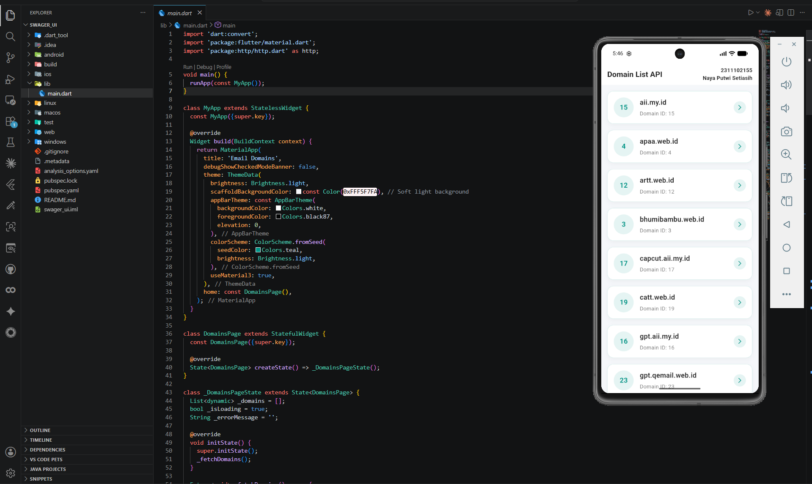

<div align="center">
  <br />
  <h1>LAPORAN PRAKTIKUM <br> PEMROGRAMAN PERANGKAT BERGERAK</h1>
  <br />
  <h3>MODUL 5 - 6 <br> Flutter</h3>
  <br />
  
  <br />
  <br />
  <br />
  <h3>Disusun Oleh :</h3>
  <p>
    <strong>Naya Putwi Setiasih</strong>
    <br>
    <strong>2311102155</strong>
    <br>
    <strong>S1 IF-11-REG05</strong>
  </p>
  <br />
  <h3>Dosen Pengampu :</h3>
  <p>
    <strong>Dedi Agung Prabowo, S.Kom., M.Kom</strong>
  </p>
  <br />
  <br />
  <h4>Asisten Praktikum :</h4>
  <strong>Apri Pandu Wicaksono</strong>
  <br>
  <strong>Hamka Zaenul Ardi</strong>
  <br />
  <h3>LABORATORIUM HIGH PERFORMANCE <br>FAKULTAS INFORMATIKA <br>UNIVERSITAS TELKOM PURWOKERTO <br>2026</h3>
</div>

<hr>

---

# Landasan Teori

## 1. Dart sebagai Bahasa Pemrograman Flutter

Dart adalah bahasa pemrograman yang dikembangkan oleh Google, dirancang khusus untuk membangun aplikasi client-side yang cepat dan responsif. Dart merupakan bahasa yang bersifat strongly-typed, mendukung pemrograman berorientasi objek (OOP), serta mendukung pemrograman asinkron menggunakan `async` dan `await`.

Dart dikompilasi menjadi kode mesin native (AOT compilation) untuk rilis produksi, dan dikompilasi JIT (Just-In-Time) saat pengembangan agar mendukung fitur hot reload. Bahasa ini menjadi fondasi utama pengembangan aplikasi dengan Flutter karena seluruh logika bisnis dan tampilan UI ditulis menggunakan Dart.

---

## 2. StatefulWidget dan State Management Dasar

Di Flutter, widget dibagi menjadi dua jenis utama: `StatelessWidget` dan `StatefulWidget`. Perbedaan mendasarnya terletak pada kemampuan widget untuk menyimpan dan memperbarui data selama siklus hidup aplikasi.

`StatefulWidget` memiliki objek `State` yang terpisah, di mana semua data yang dapat berubah disimpan. Ketika data berubah dan perlu memperbarui tampilan, metode `setState()` dipanggil untuk memberitahu Flutter agar merender ulang widget yang bersangkutan. Pola ini sangat penting dalam membangun fitur-fitur interaktif seperti pengambilan data dari internet (Fetch API) dan loading state.

---

## 3. Komunikasi HTTP dan Fetch API

Dalam pengembangan aplikasi modern, aplikasi klien sering kali perlu bertukar data dengan server atau layanan web melalui protokol HTTP. Flutter memfasilitasi hal ini melalui package eksternal seperti `http`. Package ini menyediakan fungsi-fungsi bawaan untuk melakukan HTTP request (seperti GET, POST, PUT, DELETE) secara asynchronous, dan menangani response dalam format JSON yang kemudian dapat di-decode ke dalam objek Dart.

---

## 4. ListView dan Card Widget

`ListView` adalah widget scroll yang menampilkan daftar item secara vertikal maupun horizontal. Konstruktor `ListView.builder` sangat efisien karena hanya merender item yang saat ini terlihat di layar, cocok untuk menampilkan data dalam jumlah besar hasil response API.

`Card` atau `Container` dengan dekorasi adalah elemen desain Material atau Custom yang membungkus konten dengan tampilan berupa kotak dengan bayangan (elevation), sudut melengkung, dan latar belakang tertentu untuk menghasilkan tampilan daftar yang rapi dan informatif.

---

# Deskripsi Soal

buat tugas itu sederhana banget, kalian bikin tampilan boleh pada kolom boleh juga pake row yang penting implementasi salah satu nya abis itu install library http trus di dalem nya kalian lakuin fetch api dari url yang udah di kasih, buat dokumentasi lengkap nya bisa di liat di https://api.qemail.web.id/docs,

ketentuan:

- gunakan endpoint dari https://api.qemail.web.id/v1/email/domains
- data yang ditampilin berupa data dari response yaitu id sama name

---

# Tugas Praktikum

## Source Code

### a. File `main.dart`

```dart
import 'dart:convert';
import 'package:flutter/material.dart';
import 'package:http/http.dart' as http;

void main() {
  runApp(const MyApp());
}

class MyApp extends StatelessWidget {
  const MyApp({super.key});

  @override
  Widget build(BuildContext context) {
    return MaterialApp(
      title: 'Email Domains',
      debugShowCheckedModeBanner: false,
      theme: ThemeData(
        brightness: Brightness.light,
        scaffoldBackgroundColor: const Color(0xFFF5F7FA), // Soft light background
        appBarTheme: const AppBarTheme(
          backgroundColor: Colors.white,
          foregroundColor: Colors.black87,
          elevation: 0,
        ),
        colorScheme: ColorScheme.fromSeed(
          seedColor: Colors.teal,
          brightness: Brightness.light,
        ),
        useMaterial3: true,
      ),
      home: const DomainsPage(),
    );
  }
}

class DomainsPage extends StatefulWidget {
  const DomainsPage({super.key});

  @override
  State<DomainsPage> createState() => _DomainsPageState();
}

class _DomainsPageState extends State<DomainsPage> {
  List<dynamic> _domains = [];
  bool _isLoading = true;
  String _errorMessage = '';

  @override
  void initState() {
    super.initState();
    _fetchDomains();
  }

  Future<void> _fetchDomains() async {
    try {
      final response = await http.get(Uri.parse('https://api.qemail.web.id/v1/email/domains'));
      if (response.statusCode == 200) {
        final data = json.decode(response.body);
        setState(() {
          if (data is List) {
             _domains = data;
          } else if (data is Map && data.containsKey('data')) {
             _domains = data['data'];
          } else {
             _domains = [data]; 
          }
          _isLoading = false;
        });
      } else {
        setState(() {
          _errorMessage = 'Failed to load domains (Status: ${response.statusCode})';
          _isLoading = false;
        });
      }
    } catch (e) {
      setState(() {
        _errorMessage = 'Error: $e';
        _isLoading = false;
      });
    }
  }

  @override
  Widget build(BuildContext context) {
    return Scaffold(
      appBar: AppBar(
        title: const Text('Domain List API', style: TextStyle(fontWeight: FontWeight.bold, fontSize: 20)),
        centerTitle: false,
        actions: [
          Padding(
            padding: const EdgeInsets.only(right: 16.0),
            child: Column(
              mainAxisAlignment: MainAxisAlignment.center,
              crossAxisAlignment: CrossAxisAlignment.end,
              children: const [
                Text(
                  '2311102155',
                  style: TextStyle(fontSize: 14, color: Colors.black87, fontWeight: FontWeight.bold),
                ),
                Text(
                  'Naya Putwi Setiasih',
                  style: TextStyle(fontSize: 14, color: Colors.black87, fontWeight: FontWeight.bold),
                ),
              ],
            ),
          ),
        ],
      ),
      body: _buildBody(),
    );
  }

  Widget _buildBody() {
    if (_isLoading) {
      return const Center(
        child: CircularProgressIndicator(color: Colors.teal),
      );
    }

    if (_errorMessage.isNotEmpty) {
      return Center(
        child: Padding(
          padding: const EdgeInsets.all(16.0),
          child: Text(
            _errorMessage,
            style: const TextStyle(color: Colors.redAccent, fontSize: 16),
            textAlign: TextAlign.center,
          ),
        ),
      );
    }

    if (_domains.isEmpty) {
      return const Center(
        child: Text(
          'No domains available.',
          style: TextStyle(color: Colors.black54, fontSize: 16),
        ),
      );
    }

    return ScrollConfiguration(
      behavior: ScrollConfiguration.of(context).copyWith(overscroll: false),
      child: ListView.builder(
        physics: const ClampingScrollPhysics(),
        padding: const EdgeInsets.all(16),
        itemCount: _domains.length,
        itemBuilder: (context, index) {
          final domain = _domains[index];
          final id = domain['id']?.toString() ?? 'N/A';
          final name = domain['name']?.toString() ?? 'Unknown';

          return Container(
            margin: const EdgeInsets.only(bottom: 16),
            padding: const EdgeInsets.all(16),
            decoration: BoxDecoration(
              color: Colors.white,
              borderRadius: BorderRadius.circular(16),
              border: Border.all(
                color: Colors.teal.withOpacity(0.15),
              ),
              boxShadow: [
                BoxShadow(
                  color: Colors.black.withOpacity(0.04),
                  blurRadius: 10,
                  offset: const Offset(0, 4),
                ),
              ],
            ),
            child: Row(
              crossAxisAlignment: CrossAxisAlignment.center,
              children: [
                Container(
                  height: 52,
                  width: 52,
                  decoration: BoxDecoration(
                    color: Colors.teal.withOpacity(0.1),
                    shape: BoxShape.circle,
                  ),
                  child: Center(
                    child: Text(
                      id,
                      style: const TextStyle(
                        color: Colors.teal,
                        fontWeight: FontWeight.bold,
                        fontSize: 18,
                      ),
                    ),
                  ),
                ),
                const SizedBox(width: 16),
                Expanded(
                  child: Column(
                    crossAxisAlignment: CrossAxisAlignment.start,
                    children: [
                      Text(
                        name,
                        style: const TextStyle(
                          color: Colors.black87,
                          fontSize: 18,
                          fontWeight: FontWeight.w600,
                        ),
                      ),
                      const SizedBox(height: 6),
                      Text(
                        'Domain ID: $id',
                        style: const TextStyle(
                          color: Colors.black54,
                          fontSize: 14,
                        ),
                      ),
                    ],
                  ),
                ),
                Container(
                  padding: const EdgeInsets.all(8),
                  decoration: BoxDecoration(
                    color: Colors.teal.withOpacity(0.1),
                    shape: BoxShape.circle,
                  ),
                  child: const Icon(
                    Icons.arrow_forward_ios,
                    color: Colors.teal,
                    size: 16,
                  ),
                )
              ],
            ),
          );
        },
      ),
    );
  }
}
```

---

# Penjelasan Program

Program ini dibuat menggunakan framework Flutter dengan fokus utama untuk melakukan operasi pengambilan data dari internet (Fetch API) dan menampilkannya secara dinamis ke dalam antarmuka aplikasi. Pada tahap pertama, program mengimplementasikan package eksternal `http` untuk mengirimkan HTTP request dengan metode GET secara *asynchronous* menuju endpoint publik yang disediakan, yaitu `https://api.qemail.web.id/v1/email/domains`. Proses pengambilan data ini dibungkus dalam blok `try-catch` untuk memastikan bahwa aplikasi dapat menangani potensi *error* jika koneksi internet terputus atau server gagal merespons.

Setelah *response* dari server berhasil diterima dengan status *success* (kode 200), payload berupa teks berformat JSON akan diproses lebih lanjut. Menggunakan pustaka `dart:convert`, data JSON tersebut di-*decode* dan diekstrak menjadi bentuk struktur data *List* atau *Map* pada Dart agar nilai spesifik yang dibutuhkan oleh soal—yakni atribut `id` dan `name`—bisa ditarik untuk ditampilkan.

Aplikasi ini dibangun menggunakan arsitektur `StatefulWidget` karena membutuhkan pembaruan tampilan antarmuka (UI). State digunakan untuk menampung *list* data domain yang didapat, status indikator *loading* (dimana `CircularProgressIndicator` akan aktif selama proses *fetch* berlangsung), serta pesan *error* apabila proses gagal. Ketika proses pengambilan data selesai, fungsi `setState()` dipanggil agar Flutter mengetahui ada pembaruan data dan merender ulang tampilan sesuai dengan hasil response dari API.

Untuk tata letak antarmuka (UI), hasil *parsing* data dirender menggunakan `ListView.builder`. Widget ini bertugas menampilkan item *list* secara dinamis sesuai dengan jumlah data domain yang ada di dalam variabel *state*. Setiap baris data pada *list* dibentuk strukturnya dengan memanfaatkan kombinasi widget *layout* dasar yaitu `Row` dan `Column`. Penggunaan `Row` mengatur komponen agar berjajar menyamping secara horizontal, sedangkan widget `Column` digunakan untuk menata teks `name` dan `id` berurutan secara vertikal agar rapi dan mematuhi implementasi komponen *layout* yang diminta oleh soal.

---

# Output


