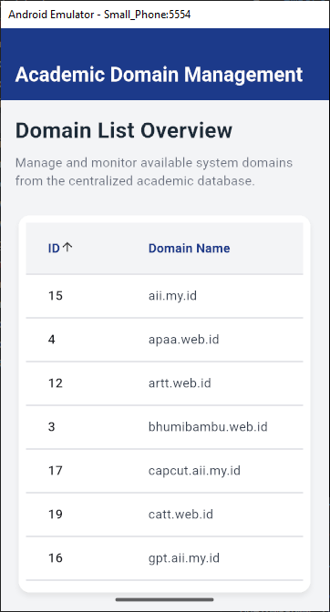

<div align="center">
    <br />
    <h1>LAPORAN PRAKTIKUM <br> APLIKASI BERBASIS PLATFORM </h1>
    <br />
    <h3>MODUL 5 & 6 <br> ANTARMUKA PENGGUNA & INTERAKSI PENGGUNA </h3>
    <br />
    
    <br />
    <br />
    <br />
    <h3>Disusun Oleh :</h3>
    <p>
        <strong>Ben Waiz Pintus W.</strong>
        <br>
        <strong>2311102169 </strong>
        <br>
        <strong>S1 IF-11-REG05</strong>
    </p>
    <br />
    <h3>Dosen Pengampu :</h3>
    <p>
        <strong>Dedi Agung Prabowo, S.Kom., M.Kom</strong>
    </p>
    <br />
    <br />
    <h4>Asisten Praktikum :</h4>
    <strong>Apri Pandu Wicaksono </strong>
    <br>
    <strong>Hamka Zaenul Ardi</strong>
    <br />
    <h3>LABORATORIUM HIGH PERFORMANCE <br>FAKULTAS INFORMATIKA <br>UNIVERSITAS TELKOM PURWOKERTO <br>2026 </h3>
</div>
<hr>

## Dasar Teori

## 1. Arsitektur Antarmuka Pengguna (User Interface) dalam Flutter
Antarmuka Pengguna (User Interface) merupakan representasi visual yang menghubungkan fungsionalitas sistem dengan pengguna akhir. Flutter menerapkan Declarative UI Approach, di mana tampilan aplikasi didefinisikan sebagai fungsi dari status data saat ini (state). Seluruh elemen visual di dalam Flutter dibentuk oleh komponen bernama Widget.

Widget tersebut disusun secara hierarkis dalam struktur pohon (Widget Tree) yang menggabungkan widget struktural (seperti Scaffold, AppBar, dan Card) dengan widget tata letak (seperti Column dan Padding). Untuk memastikan visualisasi data yang rapi dan terstruktur dalam bentuk baris dan kolom, Flutter menyediakan widget khusus bernama DataTable, yang mempermudah penyajian data tabular berskala besar secara terorganisasi.

## 2. Manajemen Status Aplikasi (State Lifecycle)
Pengelolaan state lokal sangat penting untuk mengontrol bagaimana komponen UI merespons perubahan data secara dinamis sepanjang aplikasi berjalan.

StatefulWidget: Digunakan pada halaman yang komponen visualnya dapat berubah bentuk atau nilainya selama runtime. Kelas ini memiliki siklus hidup (lifecycle) mandiri, salah satunya melalui metode initState() yang otomatis dieksekusi pertama kali untuk melakukan inisialisasi awal, seperti memicu fungsi pengunduhan data jaringan.

Fungsi setState(): Berperan sebagai trigger internal yang memberitahu framework Flutter bahwa konfigurasi data di dalam objek State telah berubah. Pemanggilan metode ini akan memaksa Flutter untuk menggambar ulang (rebuild) widget yang terdampak agar perubahan data langsung terlihat di layar pengguna secara instan.

## 3. Integrasi HTTP REST API dan Pemetaan Objek (Data Parsing)
Aplikasi modern umumnya tidak menyimpan data secara statis, melainkan melakukan pertukaran data secara asinkronus (Asynchronous Programming) dengan peladen melalui arsitektur REST API menggunakan protokol HTTP.

Future dan async/await: Digunakan untuk menangani proses komputasi latar belakang (seperti http.get) agar aplikasi tidak mengalami freeze saat menunggu respons jaringan (network latency).

Model Data & Serialization: Respons mentah dari peladen yang berformat JSON (JavaScript Object Notation) diurai terlebih dahulu menggunakan fungsi json.decode. Setelah itu, data dipetakan ke dalam bentuk objek kelas lokal memanfaatkan fungsi konstruktor factory Constructor (.fromJson). Pendekatan ini mengubah tipe data dinamis menjadi objek beraliran type-safe yang meminimalisasi potensi galat (error runtime).

## 4. Interaksi Pengguna Berbasis Data (Sorting & Kontrol Scroll)
Interaksi pengguna (User Interaction) pada komponen tabel tidak hanya terbatas pada penekanan tombol biasa, melainkan mencakup kontrol manipulasi data dan adaptasi layar:

Fitur Pengurutan Kolom (Column Sorting): Elemen DataColumn dalam Flutter dilengkapi dengan parameter onSort. Fitur ini menangani interaksi ketukan pada judul kolom untuk mengurutkan kumpulan data secara dua arah (Menaik/Ascending atau Menurun/Descending) menggunakan komparator bawaan Dart (Comparable.compare).

Sifat Responsif via SingleChildScrollView: Layar perangkat mobile memiliki keterbatasan dimensi fisik. Untuk menghindari masalah luapan konten (overflow bug) akibat dimensi tabel yang melebihi batas layar, digunakan widget SingleChildScrollView dengan arah sumbu vertikal maupun horizontal (Axis.horizontal). Elemen ini mendeteksi interaksi usapan sentuh (scroll/swipe gesture) guna memastikan seluruh data tabular tetap dapat diakses secara fleksibel.

## Tugas Modul 5 & 6 

### 1. Source Code

```dart
// Ben Waiz Pintus W. 2311102169 
import 'dart:convert';
import 'package:flutter/material.dart';
import 'package:http/http.dart' as http;

void main() {
  runApp(const MyApp());
}

class MyApp extends StatelessWidget {
  const MyApp({super.key});

  @override
  Widget build(BuildContext context) {
    return MaterialApp(
      title: 'Domain Management',
      debugShowCheckedModeBanner: false,
      theme: ThemeData(
        colorScheme: ColorScheme.fromSeed(
          seedColor: const Color(0xFF1E3A8A), // Dark blue
          background: const Color(0xFFF3F4F6), // Light gray background
        ),
        scaffoldBackgroundColor: const Color(0xFFF3F4F6),
        useMaterial3: true,
      ),
      home: const DomainTableView(),
    );
  }
}

class Domain {
  final int id;
  final String name;

  Domain({required this.id, required this.name});

  factory Domain.fromJson(Map<String, dynamic> json) {
    return Domain(
      id: json['id'],
      name: json['name'],
    );
  }
}
```

**Kode Lengkap:** [lib/main.dart](lib/main.dart)

### 2. Penjelasan

Proyek Flutter bernama Academic Domain Management ini merupakan aplikasi pengelolaan data yang menampilkan daftar domain akademik dari sebuah API dalam bentuk tabel interaktif (DataTable). Aplikasi ini mengimplementasikan manipulasi state lokal untuk menangani siklus asinkronus (memuat data, galat, dan sukses) sekaligus menyediakan fitur pengurutan data (sorting) berbasis kolom secara dua arah (ascending dan descending).

### 3. Output

