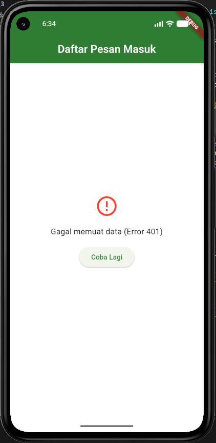

<div align="center">
    <br />
    <h1>LAPORAN PRAKTIKUM <br> APLIKASI BERBASIS PLATFORM </h1>
    <br />
    <h3>MODUL 5 & 6 <br> ANTARMUKA PENGGUNA & INTERAKSI PENGGUNA </h3>
    <br />
    
    <br />
    <br />
    <br />
    <h3>Disusun Oleh :</h3>
    <p>
        <strong>Kartika Pringgo Hutomo</strong>
        <br>
        <strong>2311102196</strong>
        <br>
        <strong>S1 IF-11-REG05</strong>
    </p>
    <br />
    <h3>Dosen Pengampu :</h3>
    <p>
        <strong>Dedi Agung Prabowo, S.Kom., M.Kom</strong>
    </p>
    <br />
    <br />
    <h4>Asisten Praktikum :</h4>
    <strong>Apri Pandu Wicaksono </strong>
    <br>
    <strong>Hamka Zaenul Ardi</strong>
    <br />
    <h3>LABORATORIUM HIGH PERFORMANCE <br>FAKULTAS INFORMATIKA <br>UNIVERSITAS TELKOM PURWOKERTO <br>2026 </h3>
</div>
<hr>

## Dasar Teori

Antarmuka Pengguna (User Interface atau UI) adalah media fisik dan visual yang menjembatani hubungan antara manusia sebagai pengguna dengan sistem komputer atau aplikasi. UI mencakup semua elemen yang dapat dilihat, didengar, dan disentuh oleh pengguna, seperti tata letak layar, tombol, ikon, tipografi, warna, hingga bentuk pesan kesalahan (error message). Dalam pengembangan aplikasi modern seperti Flutter, UI dirancang menggunakan berbagai komponen widget terstruktur yang bertujuan untuk menyajikan informasi dari sistem backend ke layar gawai pengguna secara estetis, konsisten, dan mudah dipahami.

Sementara itu, Interaksi Pengguna (User Interaction atau UX/IX) berfokus pada dinamika hubungan dan jalinan komunikasi dua arah antara pengguna dan sistem tersebut. Interaksi ini melibatkan aksi nyata dari pengguna—seperti menyentuh tombol, menggeser layar (swiping), atau menarik layar ke bawah (pull-to-refresh)—yang kemudian direspons secara langsung oleh sistem melalui perubahan status (state). Tujuan utama dari perancangan interaksi yang baik adalah memastikan bahwa setiap umpan balik (feedback) dari aplikasi terasa intuitif, cepat, serta meminimalkan beban kognitif pengguna saat mengeksekusi sebuah fungsi.

Hubungan antara UI dan Interaksi Pengguna sangat erat dan saling melengkapi dalam membentuk pengalaman pengguna secara menyeluruh. UI menyediakan komponen visual sebagai "alat", sedangkan aturan interaksi menentukan bagaimana alat tersebut "bekerja" saat dioperasikan. Sebagai contoh, ketika sebuah aplikasi menampilkan indikator pemuatan (loading indicator) atau pesan Error 404, UI bertugas menyusun tampilan visual teks dan ikon di layar, sedangkan aspek interaksi memastikan pengguna memahami apa yang sedang terjadi pada sistem dan tahu tindakan apa yang harus dilakukan selanjutnya (seperti menekan tombol "Coba Lagi").

## Tugas Modul 5 & 6 

### 1. Source Code

```dart
//kartika pringgo hutomo
//2311102196
import 'package:flutter/material.dart';
import 'package:http/http.dart' as http;
import 'dart:convert';

void main() {
  runApp(const EmailApp());
}

class EmailApp extends StatelessWidget {
  const EmailApp({super.key});

  @override
  Widget build(BuildContext context) {
    return MaterialApp(
      title: 'Email REST API',
      theme: ThemeData(
        primaryColor: const Color(0xFF2E7D32), 
        scaffoldBackgroundColor: Colors.white,
        appBarTheme: const AppBarTheme(
          backgroundColor: Color(0xFF2E7D32),
          foregroundColor: Colors.white,
          elevation: 0,
        ),
        colorScheme: ColorScheme.fromSeed(
          seedColor: const Color(0xFF2E7D32),
          primary: const Color(0xFF2E7D32),
          secondary: const Color(0xFF81C784), 
        ),
        useMaterial3: true,
      ),
      home: const EmailListScreen(),
    );
  }
}

```

**Kode Lengkap:** [lib/main.dart](lib/main.dart)

### 2. Penjelasan

Secara keseluruhan, proyek ini adalah aplikasi Email Client REST API berbasis Flutter yang mengambil dan menampilkan data kotak masuk (inbox) secara asynchronous dari server pihak ketiga berdasarkan ID pengguna.

Tampilan Error 404 muncul ketika aplikasi berhasil terhubung ke server, namun server tidak dapat menemukan data atau alamat spesifik yang diminta, yang biasanya disebabkan karena token belum terdaftar pada jalur URL endpoint API.

### 3. Output

