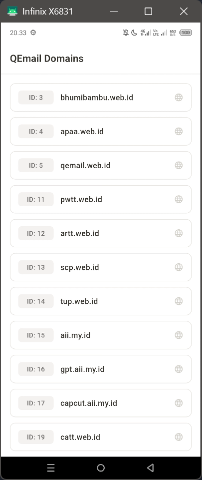

<div align="center">
    <br />
    <h1>LAPORAN PRAKTIKUM <br> APLIKASI BERBASIS PLATFORM </h1>
    <br />
    <h3>MODUL 5 & 6 <br> ANTARMUKA PENGGUNA & INTERAKSI PENGGUNA </h3>
    <br />
    
    <br />
    <br />
    <br />
    <h3>Disusun Oleh :</h3>
    <p>
        <strong>Rozhak</strong>
        <br>
        <strong>2311102293</strong>
        <br>
        <strong>S1 IF-11-REG05</strong>
    </p>
    <br />
    <h3>Dosen Pengampu :</h3>
    <p>
        <strong>Dedi Agung Prabowo, S.Kom., M.Kom</strong>
    </p>
    <br />
    <br />
    <h4>Asisten Praktikum :</h4>
    <strong>Apri Pandu Wicaksono </strong>
    <br>
    <strong>Hamka Zaenul Ardi</strong>
    <br />
    <h3>LABORATORIUM HIGH PERFORMANCE <br>FAKULTAS INFORMATIKA <br>UNIVERSITAS TELKOM PURWOKERTO <br>2026 </h3>
</div>
<hr>

## Dasar Teori

Dalam pengembangan antarmuka pengguna pada Flutter, penataan tata letak (_layout_) yang terstruktur sangat penting untuk memberikan pengalaman pengguna yang baik. Salah satu widget dasar tata letak adalah `Row`, yang digunakan untuk menyusun sekumoulan elemen (widget) secara berjajar mendatar (horicontal). Namun, penggunaan `Row` seringkali memicu masalah _overflow_ (kelebihan batas layar atau yellow/black warning) jika konten didalamnya, seperti teks, terlalu panjang atau melebihi lebar layar.

Untuk mengatasi permasalahan visual tersebut, widget `Expanded` digunakan. `Expanded` berfungsi untuk mendistribusikan sisa tuang kosong secara dinamis kepada _child_ widget yang dibungkusnya, sehingga elemen dapat menyesuaikan ukuran secara otomatis tanpa keluar dari batas layar. Selain penataan tata letak, aplikasi juga sering membutuhkan komponen interakfif seperti aneka ragam tombol (`ElevatedButton`, `TextButton`) dan sistem navigasi pendukung untuk interaksi aksi dari pengguna.

## Tugas Modul 5 & 6 - Qemail Domains

### 1. Source Code

```dart
class DomainModel {
  final int id;
  final String name;

  const DomainModel({
    required this.id,
    required this.name,
  });

  factory DomainModel.fromJson(Map<String, dynamic> json) {
    return DomainModel(
      ...
    );
  }
}
```

**Kode Lengkap:** [lib/models/domain_model.dart](lib/models/domain_model.dart)

```dart
class ApiService {
  static const String _baseUrl = '...';

  Future<List<DomainModel>> fetchDomains() async {
    try {
      final response = await http.get(Uri.parse(_baseUrl));

      if (response.statusCode == 200) {
        final List<dynamic> jsonResponse = json.decode(response.body);
        final domains = jsonResponse.map((data) => DomainModel.fromJson(data)).toList();
        domains.sort((a, b) => a.id.compareTo(b.id));

        return domains;
      } else {
        ...
      }
    } catch (e) {
      ...
    }
  }
}
```

**Kode Lengkap:** [lib/services/api_service.dart](lib/services/api_service.dart)

```dart
class HomeScreen extends StatefulWidget {
  const HomeScreen({super.key});

  @override
  State<HomeScreen> createState() => _HomeScreenState();
}

class _HomeScreenState extends State<HomeScreen> {
  final ApiService _apiService = ApiService();
  late Future<List<DomainModel>> _futureDomains;

  @override
  void initState() {
    super.initState();
    _futureDomains = _apiService.fetchDomains();
  }

  @override
  Widget build(BuildContext context) {
    ...
  }
}
```

**Kode Lengkap:** [lib/screens/home_screen.dart](lib/screens/home_screen.dart)

```dart
void main() {
  runApp(const QEmailApp());
}

class QEmailApp extends StatelessWidget {
  const QEmailApp({super.key});

  @override
  Widget build(BuildContext context) {
    return MaterialApp(
      ...
      ),
      home: const HomeScreen(),
    );
  }
}
```

**Kode Lengkap:** [lib/main.dart](lib/main.dart)

### 2. Penjelasan

Aplikasi ini mengimplementasikan proses pengambilan data (_fetch_) dengan memanfaatkan _package_ `http` menuju _endpoint_ API QEmail (`/v1/email/domains`). Respons JSON dari API tersebut di-_parsing_ dan dipetakan ke dalam objek dart bernama `DomainModel`.

Pada sisi antarmuka, halaman utama menggunakan widget FutureBuilder untuk menangani status asinkron dari pemanggilan API tersebut, menampilkan indikator _loading_, pesan _error_ atau merender data menggunakan `ListView.builder` jika data berhasil dimuat.

Setiap item di dalam daftar direpresentasikan menggunakan `Row` yang menyusun _badge_ ID, Nama Domain, dan ikon secara horizontal. Untuk menghindari masalah _overflow_, teks Nama Domain dibungkus menggunakan widget `Expanded`. Hal ini memaksa teks tersebut untuk mengambil sisa ruang ada di antara _badge_ ID dan ikon, sehingga tata letak tetap proposional.

### 3. Output



## Kesimpulan

Praktikum ini menunjukkan bahwa `Row` dan `Expanded` sangat penting untuk menyusun elemen secara horizontal tanpa menimbulkan _overflow_. Selain itu, Flutter dapat dengan mudah mengintegrasikan tata letak dinamis tersebut dengan pemanggilan HTTP asinkron, memungkinkan data dari API dirender secara responsif pada layar.